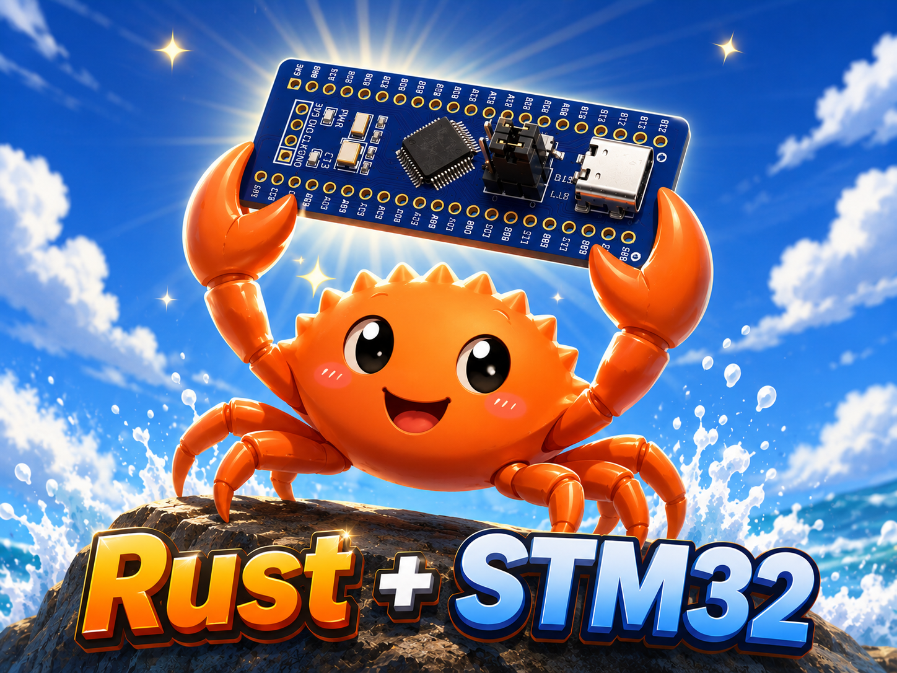


[简体中文](README.md) / [English](README_en.md) / [Русский](README_ru.md)

# Rust+STM32F103


# Declaration
This project uses the CC BY-NC 4.0 license. Commercial use requires authorization from the copyright holder pycx0@qq.com. Commercial products developed based on this project must obtain authorization. Non-commercial use is free!

# Note: If Images Fail to Load
Download this project and open it with an MD reader! (VSCode works)

# Table of Contents

- [Basic Environment Setup](#basic-environment-setup)
  - [Install probe-rs](#install-probe-rs)
  - [Install Compiler](#install-compiler)
  - [Detect with probe-rs](#detect-with-probe-rs)
  - [Install Package](#install-package)
- [Compilation Test](#compilation-test)
  - [Function Cannot Jump](#function-cannot-jump)
- [Debugging](#debugging)
- [Project Download (Flashing)](#project-downloading-flashing)
  - [HEX File](#hex-file)
  - [BIN File](#bin-file)
- [Release JTAG Port - Cannot Download](#release-jtag-port---cannot-download)
- [Learning Resources](#learning-resources)
- [Basic Learning](#basic-learning)
  - [Light Up First LED](#light-up-first-led)
  - [Hello World](#hello-world)
  - [LED Blink](#led-blink)
    - [SYST Mode Delay Blink](#syst-mode-delay-blink)
    - [LED Blink - TIM2 Timer Delay](#led-blink---tim2-timer-delay)
    - [Delay Explanation](#delay-explanation)
  - [Button LED Control](#button-led-control)
  - [Dynamic GPIO Switching (Port Multiplexing)](#dynamic-gpio-switching-port-multiplexing)
  - [External Interrupt EXTI](#external-interrupt-exti)
    - [EXTI Interrupt Line to Pin Mapping](#exti-interrupt-line-to-pin-mapping)
    - [Key Steps Summary](#key-steps-summary)
  - [Timer Interrupt](#timer-interrupt)
    - [Timer Interrupt LED Blink](#timer-interrupt-led-blink)
    - [RTIC Timer Interrupt Mode](#rtic-timer-interrupt-mode)
  - [RTIC2 Async Tasks](#rtic2-async-tasks)
  - [Serial Communication](#serial-communication)
  - [ADC Acquisition](#adc-acquisition)
    - [External Voltage Acquisition](#external-voltage-acquisition)
    - [Internal ADC Temperature Acquisition](#internal-adc-temperature-acquisition)
    - [ADC DMA Circular Acquisition](#adc-dma-circular-acquisition)
  - [SPI Protocol](#spi-protocol)
    - [Light Up ST7789 Screen](#light-up-st7789-screen)
  - [I2C Communication](#i2c-communication)
  - [PWM Signal](#pwm-signal)
    - [Output](#output)
    - [Input](#input)
    - [EC11 Encoder Reading](#ec11-encoder-reading)
  - [CRC Check](#crc-check)
  - [DAC Digital-to-Analog Conversion](#dac-digital-to-analog-conversion)
  - [CAN Bus](#can-bus)
  - [USB Serial](#usb-serial)
- [Practical Projects](#practical-projects)
  - [DHT11](#dht11)
  - [DHT11+ST7789 LCD Thermometer](#dht11st7789-lcd-thermometer)
  - [DHT20+ST7789 LCD Thermometer](#dht20st7789-lcd-thermometer)

# Basic Environment Setup
## Install probe-rs
```bash
cargo install probe-rs-tools --locked
```


## Install Compiler
```bash
rustup target install thumbv7m-none-eabi
```

## Detect with probe-rs
DAP mode!

```bash
probe-rs info --protocol swd
```

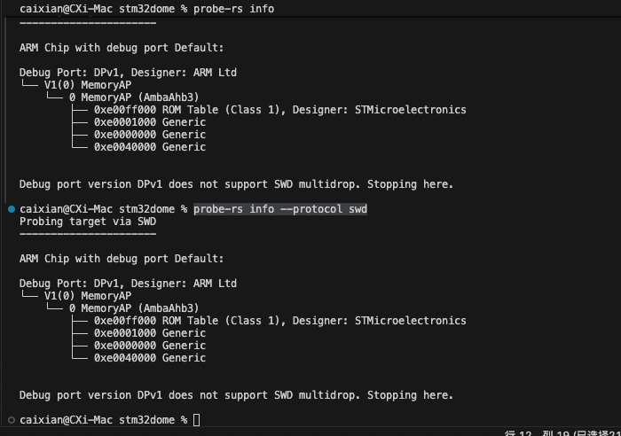


## Install Package
Main purpose is to fix infinite loop bugs

```bash
cargo add panic-halt
```

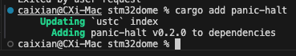

Check FLASH usage

```json
cargo install st-mem
```

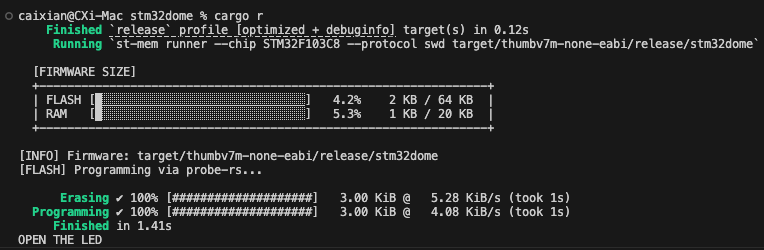


# Compilation Test
Project Structure

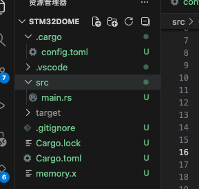

memory.x

```bash
/* Linker script for the STM32F103C8T6 */
MEMORY
{
  FLASH : ORIGIN = 0x08000000, LENGTH = 64K
  RAM : ORIGIN = 0x20000000, LENGTH = 20K
}
```

cargo.toml

```rust
# [package] section: Define package metadata
[package]
# Package name, used for identification when publishing on crates.io or referenced by other projects
name = "stm32dome"
# Package version number, following Semantic Versioning
version = "0.1.0"
# Rust edition convention, 2024 is the latest version with newest language features
edition = "2024"

# [dependencies] section: Define project dependencies
[dependencies]
# embedded-hal: Embedded hardware abstraction layer standard interface
# Version "1.0" means use the latest 1.0.x version
# Defines common traits for GPIO, I2C, SPI, UART, etc., making driver code portable across different MCUs
embedded-hal = "1.0"

# nb: non-blocking operation library
# Provides Result and block! macros for handling operations that may need retries (e.g., UART transmission)
nb = "1"

# cortex-m: Low-level support library for ARM Cortex-M processors
# Provides system register access, interrupt management, system timer, etc.
cortex-m = "0.7.7"

# cortex-m-rt: Cortex-M runtime library
# Provides startup code, interrupt vector table, memory initialization, and other runtime support
# Required to use the #[entry] macro to define program entry point
cortex-m-rt = "0.7.5"
panic-halt = "1.0.0"
rtt-target = "0.6.2"
rtic = { version = "2", features = ["thumbv7-backend"] }
rtic-monotonics = { version = "2", features = ["cortex-m-systick"] }


# [dependencies.stm32f1xx-hal]: Detailed configuration for specific dependency
# Uses table syntax to provide more detailed configuration for stm32f1xx-hal
[dependencies.stm32f1xx-hal]
# Specify version number
version = "0.11.0"
# features: Enable compile-time features
# "stm32f103": Select STM32F103 series chip support code
# "medium": Medium density chip configuration (64-128KB Flash), C8T6 belongs to this category
# Other options include "low" (low density, 16-32KB) and "high" (high density, 256KB+)
features = ["stm32f103", "medium"]


[profile.dev]
incremental = false   # Disable incremental compilation, ensure embedded build consistency
codegen-units = 1     # Single codegen unit, lets compiler do more optimization
opt-level = 1         # Light optimization, avoid slow interrupt handling in debug mode
panic = "abort"       # Abort on panic, no stack unwinding (embedded has no stack unwinding support)

[profile.release]
codegen-units = 1
debug = true          # Keep debug info (no performance impact, useful for debugging)
lto = true            # Link-time optimization, cross-crate optimization to reduce size
panic = "abort"
```

.cargo/cargo.toml

```rust
[target.thumbv7m-none-eabi]
# ============================================================
# Runner — st-mem runner (cross-platform, analyze memory then flash)
# ============================================================
# st-mem runner: Analyze FLASH/RAM usage → probe-rs flash
runner = "st-mem runner --chip STM32F103C8 --protocol swd"
# ============================================================
# Without memory analysis, use probe-rs directly:
# runner = "probe-rs run --chip STM32F103C8 --protocol swd"
# ============================================================
rustflags = [
  "-C", "link-arg=-Tlink.x",
#   "-C", "link-arg=-Tdefmt.x",
]

[build]
target = "thumbv7m-none-eabi"

[env]
DEFMT_LOG = "info"

[alias]
r = "run --release"
```


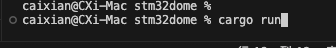

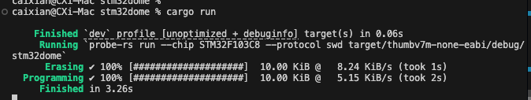

<font style="color:#DF2A3F;">main.rs See Light Up First LED</font>

## Function Cannot Jump
Solution!

.vscode/settings.json

```json
{
  "rust.all_targets": false,
  "rust.target": "thumbv7m-none-eabi",
  "rust.all_features": false,
  "rust.features": [],
  "rust-analyzer.checkOnSave.allTargets": false,
  "rust-analyzer.checkOnSave.extraArgs": ["--target", "thumbv7m-none-eabi"],
  "rust-analyzer.cargo.features": []
}
```

# Debugging
Create configuration task file! Use probe-rs official website! Search

[https://probe.rs/docs/tools/debugger/](https://probe.rs/docs/tools/debugger/)


Supported chip types:[https://probe.rs/targets/?q=&p=0](https://probe.rs/targets/?q=&p=0)


.vscode/launch.json

```plain
{
    "version": "0.2.0",
    "configurations": [
        {
            "type": "probe-rs-debug",
            "request": "launch",
            "name": "STM Debug",
            "cwd": "${workspaceFolder}",
            //!MODIFY (or remove)
            "speed": 24000,
            //!MODIFY (or remove)
            //   "probe": "VID:PID:<Serial>",
            "runtimeExecutable": "probe-rs",
            "runtimeArgs": [
                "dap-server"
            ],
            //!MODIFY
            "chip": "STM32F103C8", // Chip model, change according to your chip!
            "flashingConfig": {
                "flashingEnabled": true,
                "haltAfterReset": false,
                "formatOptions": {
                    //!MODIFY (or remove). Valid values are: 'bin', 'hex', 'elf'(default), 'idf'
                    "binaryFormat": "elf"
                }
            },
            "coreConfigs": [
                {
                    "coreIndex": 0,
                    //!MODIFY
                    "programBinary": "target/thumbv7m-none-eabi/debug/${workspaceFolderBasename}",
                    //!MODIFY
                    // "svdFile": "Relative or fully qualified path to the CMSIS-SVD file for your target core"
                    // Enable RTT
                    "rttEnabled": true
                }
            ],
            "env": {
                //!MODIFY (or remove)
                // If you set this variable, check the VSCode console log window for the location of the log file.
                "RUST_LOG": "info"
            },
            // Info, Debug
            "consoleLogLevel": "Console"
        }
    ]
}
```


~~Currently macOS RTT debugging has issues, cannot output to terminal!~~ Resolved!

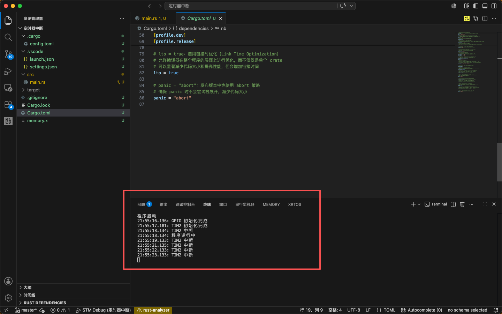

Current solution is: set breakpoint at main() entry, add this line at the beginning: rtt_init_print!();

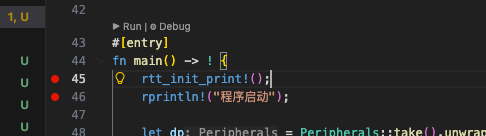


# Project Download (Flashing)
Basic Rust compilation environment

```plain
cargo install cargo-binutils
rustup component add llvm-tools
```

## HEX File
Compile ELF file

```rust
cargo build --release
```

Compile HEX file

```rust
cargo objcopy --release -- -O ihex ccc.hex
cargo objcopy --release -- -O ihex <firmware_name>.hex
```

Download directly

```rust
probe-rs download --binary-format hex --chip STM32F103C8 ccc.hex
probe-rs download --binary-format hex --chip <chip_name>	<firmware_name>.hex
```

Chip name lookup URL:[https://probe.rs/targets/?q=&p=0](https://probe.rs/targets/?q=&p=0)

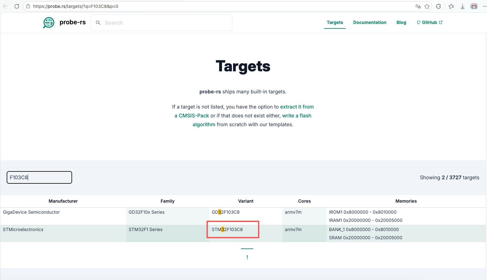

## BIN File
Compile ELF file

```rust
cargo build --release
```

Compile HEX file

```rust
cargo objcopy --release -- -O binary ccc.bin
cargo objcopy --release -- -O binary <firmware_name>.bin
```

Download directly

```rust
probe-rs download --chip STM32F103C8 --base-address 0x08000000 --binary-format bin ccc.bin
probe-rs download --chip <chip_name> --base-address <offset_address> --binary-format bin <firmware_name>.bin
```


# Release JTAG Port - Cannot Download
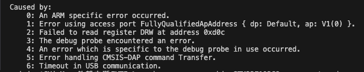

Or if run fails -- full chip erase command

```rust
probe-rs erase --chip STM32F103C8 --speed 100 --protocol swd
probe-rs erase --chip <chip_name> --speed 100 --protocol <interface_type-optional>
probe-rs erase --chip STM32F103C8 --speed 100
```

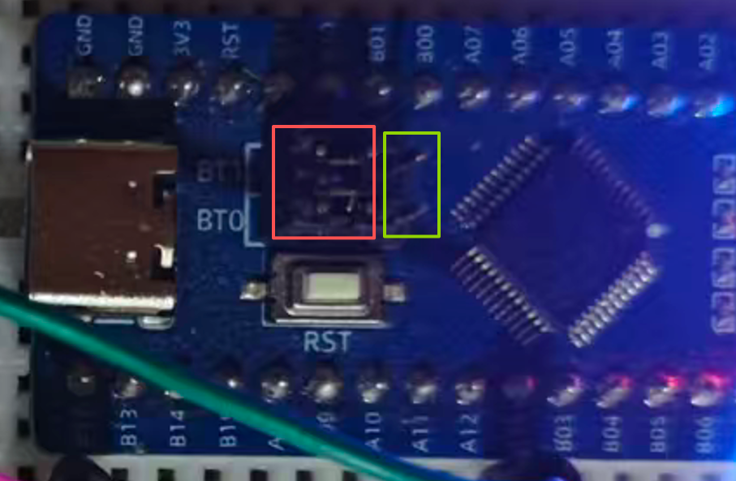

That is boot0-boot1 --> both set to 0

After executing the command, press the reset button and release quickly! It will auto-erase. If it doesn't work, hold the reset button, execute the command, then release immediately!


# Learning Resources
Textbook:[https://xxchang.github.io/book/](https://xxchang.github.io/book/)

Project URL:[https://github.com/stm32-rs/stm32f1xx-hal/tree/master/examples](https://github.com/stm32-rs/stm32f1xx-hal/tree/master/examples)


# Basic Learning

---

## Clock System Details

> **Why learn clocks first?** Because almost all peripherals depend on clocks to work. Clock configuration is the most fundamental and important step in embedded development. Incorrect configuration leads to peripheral malfunctions, inaccurate UART baud rates, USB enumeration failures, etc.

### STM32F1 Clock Tree Overview

STM32F103's clock system is very flexible, with multiple clock sources and dividers. Here is a simplified clock tree:

```
                          ┌─────────────┐
                          │   HSE       │  External high-speed crystal (DKX board: 8MHz)
                          │  8 MHz      │
                          └──────┬──────┘
                                 │
                          ┌──────▼──────┐
                          │   HSI       │  Internal RC oscillator
                          │  8 MHz      │  (poor accuracy, ±1%, fast startup)
                          └──────┬──────┘
                                 │
                 ┌───────────────┼───────────────┐
                 │               │               │
                 │         ┌─────▼─────┐         │
                 │         │   PLL     │  Phase-Locked Loop
                 │         │  Multiplier│  ×2~×16 │
                 │         └─────┬─────┘         │
                 │               │               │
          ┌──────▼──────┐ ┌──────▼──────┐        │
          │ SYSCLK      │ │  USBCLK     │        │
          │ System Clock │ │  USB Clock  │        │
          │ Max 72MHz    │ │  Must 48MHz │        │
          └──────┬──────┘ └─────────────┘        │
                 │                                │
        ┌────────┼────────┐                      │
        │        │        │                      │
   ┌────▼───┐ ┌──▼───┐ ┌──▼────┐          ┌─────▼─────┐
   │ AHB    │ │ APB1 │ │ APB2  │          │  SYSCLK   │
   │ Bus    │ │ Bus  │ │ Bus   │          │  Source    │
   │≤72MHz  │ │≤36MHz│ │≤72MHz │          │ HSI/HSE/PLL
   └───┬────┘ └──┬───┘ └──┬────┘          └───────────┘
       │         │        │
  ┌────▼───┐ ┌───▼────┐ ┌─▼──────┐
  │ Cortex │ │USART2/3│ │USART1  │
  │ SysTick│ │TIM2-4  │ │SPI1    │
  │ DMA    │ │I2C1/2  │ │ADC1/2  │
  │ Flash  │ │SPI2    │ │TIM1    │
  └────────┘ │USB     │ │GPIO    │
             └────────┘ └────────┘
```

**Core Concept: PLL (Phase-Locked Loop)**
```
PLL Clock = PLL Input Clock × PLL Multiplier

If HSE is selected as PLL input:
  PLLCLK = HSE × Multiplier (×2 ~ ×16)

Example (DKX board 8MHz crystal):
  HSE × 9  = 8 × 9  = 72 MHz ← Maximum system clock
  HSE × 6  = 8 × 6  = 48 MHz ← USB required
  HSE × 4  = 8 × 4  = 32 MHz

If HSI is selected as PLL input:
  PLLCLK = HSI × 2 × Multiplier / 2
  PLLCLK = HSI × Multiplier (×2 ~ ×16)
  But HSI must be divided by 2 before entering PLL
```

---

### Clock Source Details

#### HSI (High Speed Internal) — Internal High-Speed Clock

```
Features:
├── Frequency: 8 MHz (RC oscillator, has thermal drift)
├── Accuracy: ±1% (factory calibrated), drifts with temperature
├── Advantages: No external components needed, available at power-on
├── Disadvantages: Poor accuracy, not suitable for USB, CAN, precise baud rates
└── Default: Automatically used as system clock source at power-on
```

**When to use HSI?**
- Simple LED blinking, button detection, scenarios not requiring precise clocks
- Backup when external crystal is damaged
- Fast startup scenarios (HSI starts faster than HSE)

#### HSE (High Speed External) — External High-Speed Clock

```
Features:
├── Frequency: 4-16 MHz (DKX board uses 8MHz crystal)
├── Accuracy: ±0.005% (depends on crystal quality)
├── Advantages: High accuracy, suitable for USB, CAN, precise UART baud rates
├── Disadvantages: Requires external crystal, startup takes time (hundreds of µs ~ ms)
└── DKX board: 8MHz passive crystal + 2x 20pF load capacitors
```

**When to use HSE?**
- USB functionality (**must** use HSE or HSE via PLL)
- CAN bus (requires precise clock)
- Precise UART baud rates
- System running at full 72MHz

#### LSE (Low Speed External) — External Low-Speed Clock

```
Features:
├── Frequency: 32.768 kHz (used for RTC)
├── Accuracy: Very high (small crystal thermal drift)
├── Usage: Real-Time Clock (RTC), watchdog
└── DKX board: May not have LSE crystal soldered (check schematic)
```

#### LSI (Low Speed Internal) — Internal Low-Speed Clock

```
Features:
├── Frequency: ~40 kHz (inaccurate)
├── Usage: Independent Watchdog (IWDG), RTC backup clock
└── Accuracy: Poor (±30%)
```

#### PLL (Phase Locked Loop) — Phase-Locked Loop

PLL is the core of the clock system, used to multiply low-frequency clocks to high frequencies.

```
┌─────────────────────────────────────────────────┐
│                    PLL Details                   │
├─────────────────────────────────────────────────┤
│                                                  │
│  Input Source Selection:                         │
│  ┌──────┐    ┌─────────┐                         │
│  │ HSI/2│───►│         │    ┌───────────┐        │
│  └──────┘    │ PLL MUX │───►│  ÷ PLLMUL │──► PLLCLK
│  ┌──────┐───►│         │    │  (×2~×16) │        │
│  │ HSE  │    └─────────┘    └───────────┘        │
│  └──────┘                                        │
│                                                  │
│  Common Configurations:                          │
│  ┌──────────┬──────────┬──────────────┐          │
│  │ Input    │ Multiply │ Output Freq  │          │
│  ├──────────┼──────────┼──────────────┤          │
│  │ HSI 8MHz │ ×9       │ 36 MHz*     │          │
│  │ HSE 8MHz │ ×9       │ 72 MHz ✓    │          │
│  │ HSE 8MHz │ ×6       │ 48 MHz ✓    │          │
│  │ HSE 8MHz │ ×4       │ 32 MHz ✓    │          │
│  └──────────┴──────────┴──────────────┘          │
│                                                  │
│  * HSI is first divided by 2 (=4MHz), then ×9 = 36MHz │
│                                                  │
└─────────────────────────────────────────────────┘
```

---

### Bus Clock Details

```
                         SYSCLK (System Clock)
                              │
                ┌─────────────┼─────────────┐
                │             │             │
           ┌────▼────┐  ┌────▼────┐  ┌─────▼─────┐
           │  AHB    │  │  APB1   │  │   APB2    │
           │  Bus    │  │  Bus    │  │   Bus     │
           │ ÷HPRE  │  │ ÷PPRE1 │  │  ÷PPRE2  │
           │(1/2/4..)│  │(1/2/4..)│  │ (1/2/4..) │
           └────┬────┘  └────┬────┘  └─────┬─────┘
                │            │              │
                │            │              │
          ┌─────▼─────┐ ┌────▼────┐  ┌──────▼──────┐
          │Core, DMA  │ │USART2/3 │  │  USART1     │
          │SysTick    │ │I2C1/2   │  │  SPI1       │
          │Flash      │ │SPI2     │  │  ADC1/2     │
          │GPIO A~D   │ │TIM2-4   │  │  TIM1       │
          │           │ │USB      │  │  EXTI       │
          │           │ │CAN      │  │  AFIO       │
          └───────────┘ └─────────┘  └─────────────┘
```

#### AHB Bus — High-Speed Bus

| Parameter | Description |
|-----------|-------------|
| Max Frequency | 72 MHz |
| Prescaler | SYSCLK ÷ 1/2/4/8/16/64/128/256/512 |
| Connected Devices | Cortex-M3 core, DMA, Flash, GPIO, SysTick |
| Configuration | `rcc::Config::hsi().hclk(72.MHz())` |

**Note:** SysTick clock comes from AHB (if SysTick configured to use processor clock), or AHB/8.

#### APB1 Bus — Low-Speed Peripheral Bus

| Parameter | Description |
|-----------|-------------|
| Max Frequency | **36 MHz** (hard limit, exceeding may damage chip) |
| Prescaler | AHB ÷ 1/2/4/8/16 |
| Connected Devices | USART2, USART3, I2C1/2, SPI2, TIM2-4, USB, CAN |
| Configuration | `rcc::Config::hsi().pclk1(36.MHz())` |

**Important:** If APB1 prescaler > 1, then timer clock = APB1 × 2.

#### APB2 Bus — High-Speed Peripheral Bus

| Parameter | Description |
|-----------|-------------|
| Max Frequency | **72 MHz** |
| Prescaler | AHB ÷ 1/2/4/8/16 |
| Connected Devices | USART1, SPI1, ADC1/2, TIM1, GPIOA~D, EXTI, AFIO |
| Configuration | `rcc::Config::hsi().sysclk(72.MHz()).pclk2(72.MHz())` |

#### ADC Clock

| Parameter | Description |
|-----------|-------------|
| Max Frequency | **14 MHz** |
| Clock Source | APB2 ÷ 2/4/6/8 |
| Configuration | `rcc::Config::hsi().adcclk(14.MHz())` |

#### USB Clock

| Parameter | Description |
|-----------|-------------|
| Required Frequency | **48 MHz** (must be precise) |
| Clock Source | PLL output (PLLCLK ÷ 1 or 1.5) |
| Configuration Requirement | SYSCLK must be 48MHz or 72MHz |

---

### Clock Configuration in stm32f1xx-hal

HAL library uses **Builder pattern** for clock configuration, very intuitive:

#### Basic Usage

```rust
use stm32f1xx_hal::{pac, prelude::*, rcc};

fn main() {
    let dp = pac::Peripherals::take().unwrap();
    let mut flash = dp.FLASH.constrain();  // Flash wait cycle configuration

    // Method 1: Concise configuration
    let mut rcc = dp.RCC.freeze(
        rcc::Config::hsi()           // Use internal 8MHz RC
            .sysclk(64.MHz())        // System clock 64MHz
            .pclk1(32.MHz())         // APB1 clock 32MHz
            .pclk2(64.MHz())         // APB2 clock 64MHz
            .adcclk(8.MHz()),        // ADC clock 8MHz
        &mut flash.acr,
    );

    // Method 2: External crystal + PLL
    let mut rcc = dp.RCC.freeze(
        rcc::Config::hse(8.MHz())    // Use 8MHz external crystal
            .sysclk(72.MHz())        // PLL multiply to 72MHz
            .pclk1(36.MHz())         // APB1 divide to 36MHz
            .pclk2(72.MHz())         // APB2 no divide
            .adcclk(14.MHz()),       // ADC 14MHz
        &mut flash.acr,
    );
}
```

#### `rcc::Config` Builder Methods

```rust
// All available configuration methods (* = commonly used)
rcc::Config::hsi()                    // Select HSI as clock source
rcc::Config::hse(8.MHz())            // Select HSE as clock source with frequency

.sysclk(72.MHz())    *               // Set target system clock frequency
.pclk1(36.MHz())    *                // Set APB1 target frequency
.pclk2(72.MHz())    *                // Set APB2 target frequency
.adcclk(14.MHz())   *                // Set ADC clock frequency
.hclk(72.MHz())                       // Set AHB clock (usually = SYSCLK)

// PLL automatically calculates multiplier based on target frequency
// No manual setting needed!
```

#### Getting Clock Info After Freeze

```rust
let rcc = dp.RCC.freeze(
    rcc::Config::hse(8.MHz()).sysclk(72.MHz()),
    &mut flash.acr,
);

// Get actual clock frequencies
rprintln!("SYSCLK: {}", rcc.clocks.sysclk());   // System clock
rprintln!("HCLK:   {}", rcc.clocks.hclk());     // AHB clock
rprintln!("PCLK1:  {}", rcc.clocks.pclk1());    // APB1 clock
rprintln!("PCLK2:  {}", rcc.clocks.pclk2());    // APB2 clock
rprintln!("ADCCLK: {}", rcc.clocks.adcclk());   // ADC clock
rprintln!("USBCLK valid: {}", rcc.clocks.usbclk_valid()); // USB clock valid?
```

#### Why `flash.acr`?

Flash read speed is limited. When system clock exceeds 24MHz, wait states must be inserted:

| System Clock | Flash Wait States |
|-------------|-------------------|
| 0-24 MHz | 0 wait states |
| 24-48 MHz | 1 wait state |
| 48-72 MHz | 2 wait states |

`freeze()` automatically sets correct wait states based on system clock frequency.

#### `constrain()` vs `freeze()`

```rust
// constrain() — Constrain RCC, returns configurable object
// For manual configuration of each peripheral clock
let mut rcc = dp.RCC.constrain();

// freeze() — Complete clock configuration in one step and freeze
// Automatically calculates all divider/multiplier parameters
let rcc = dp.RCC.freeze(
    rcc::Config::hse(8.MHz()).sysclk(72.MHz()),
    &mut flash.acr,
);
```

Generally recommended to use `freeze()`, simpler and less error-prone.

#### Advanced: Direct Divider/Multiplier Specification

```rust
// If you need full control over clock configuration, use RawConfig
let rcc = dp.RCC.freeze(
    rcc::RawConfig {
        hse: Some(8_000_000),       // HSE frequency
        pllmul: Some(7),            // PLL multiplier (×9, index from 0)
        hpre: rcc::HPre::Div1,     // AHB prescaler = no divide
        ppre1: rcc::PPre::Div2,    // APB1 prescaler = AHB ÷ 2
        ppre2: rcc::PPre::Div1,    // APB2 prescaler = no divide
        usbpre: rcc::UsbPre::Div1_5, // USB prescaler
        adcpre: rcc::AdcPre::Div2,  // ADC prescaler = APB2 ÷ 2
        ..Default::default()
    },
    &mut flash.acr,
);
```

---

### Common Clock Configuration Recipes

#### Recipe 1: Simplest (HSI Default)

```rust
// Power-on default: HSI 8MHz, no PLL
// SYSCLK = 8MHz, APB1 = 8MHz, APB2 = 8MHz
let mut rcc = dp.RCC.constrain();

// Or use freeze
let rcc = dp.RCC.freeze(rcc::Config::hsi(), &mut flash.acr);
```

**Suitable for:** LED blinking, button detection, GPIO testing, simple scenarios
**Not suitable for:** USB, CAN, high baud rate UART

---

#### Recipe 2: HSI Multiply to 64MHz

```rust
let mut rcc = dp.RCC.freeze(
    rcc::Config::hsi()
        .sysclk(64.MHz())         // HSI × 8 = 64MHz
        .pclk1(32.MHz())          // APB1 = AHB ÷ 2
        .pclk2(64.MHz())          // APB2 = AHB (no divide)
        .adcclk(8.MHz()),         // ADC = APB2 ÷ 8
    &mut flash.acr,
);
// Note: HSI can only multiply up to 64MHz, not 72MHz
// Because HSI is divided by 2 before entering PLL, 8/2=4, 4×16=64
```

**Suitable for:** No external crystal but need higher performance
**Not suitable for:** USB (needs precise 48MHz)

---

#### Recipe 3: HSE Multiply to 72MHz (**Recommended! DKX Board First Choice**)

```rust
let mut rcc = dp.RCC.freeze(
    rcc::Config::hse(8.MHz())     // Use DKX board's 8MHz crystal
        .sysclk(72.MHz())         // PLL: 8 × 9 = 72MHz
        .pclk1(36.MHz())          // APB1 = 72 ÷ 2 = 36MHz (max)
        .pclk2(72.MHz())          // APB2 = 72MHz (no divide)
        .adcclk(14.MHz()),        // ADC = 72 ÷ 6 ≈ 12MHz
    &mut flash.acr,
);
```

**Suitable for:** Almost all scenarios, highest performance configuration
**Clocks:**
- SYSCLK = 72 MHz
- AHB = 72 MHz
- APB1 = 36 MHz
- APB2 = 72 MHz
- ADC = 12 MHz
- Flash wait states = 2

---

#### Recipe 4: HSE Multiply to 48MHz (USB Dedicated)

```rust
let mut rcc = dp.RCC.freeze(
    rcc::Config::hse(8.MHz())     // 8MHz crystal
        .sysclk(48.MHz())         // PLL: 8 × 6 = 48MHz
        .pclk1(24.MHz())          // APB1 = 48 ÷ 2 = 24MHz
        .pclk2(48.MHz()),         // APB2 = 48MHz
    &mut flash.acr,
);

// Verify USB clock
assert!(rcc.clocks.usbclk_valid());  // USB needs precise 48MHz
```

**Suitable for:** USB applications
**Clocks:**
- SYSCLK = 48 MHz
- USBCLK = 48 MHz ✓ (precise)
- APB1 = 24 MHz
- APB2 = 48 MHz
- Flash wait states = 1

---

#### Recipe 5: 72MHz + USB (Advanced)

```rust
let mut rcc = dp.RCC.freeze(
    rcc::Config::hse(8.MHz())
        .sysclk(72.MHz())         // PLL: 8 × 9 = 72MHz
        .pclk1(36.MHz())          // APB1 = 36MHz
        .pclk2(72.MHz()),         // APB2 = 72MHz
    &mut flash.acr,
);

// USB clock = PLLCLK ÷ 1.5 = 72 ÷ 1.5 = 48MHz ✓
assert!(rcc.clocks.usbclk_valid());
```

**Suitable for:** Scenarios needing both highest performance and USB

---

### Common Clock Configuration Errors

#### Error 1: APB1 Exceeds 36MHz

```rust
// ❌ Wrong! APB1 max 36MHz
let mut rcc = dp.RCC.freeze(
    rcc::Config::hse(8.MHz())
        .sysclk(72.MHz())
        .pclk1(72.MHz()),  // Wrong! Exceeds 36MHz
    &mut flash.acr,
);

// ✓ Correct
let mut rcc = dp.RCC.freeze(
    rcc::Config::hse(8.MHz())
        .sysclk(72.MHz())
        .pclk1(36.MHz()),  // Correct
    &mut flash.acr,
);
```

#### Error 2: Imprecise USB Clock

```rust
// ❌ HSI not suitable for USB
let mut rcc = dp.RCC.freeze(
    rcc::Config::hsi().sysclk(48.MHz()),
    &mut flash.acr,
);
// HSI accuracy ±1%, USB needs ±0.25%, causes enumeration failure

// ✓ Must use HSE
let mut rcc = dp.RCC.freeze(
    rcc::Config::hse(8.MHz()).sysclk(48.MHz()),
    &mut flash.acr,
);
```

#### Error 3: Forgetting `flash.acr`

```rust
// ❌ Missing flash.acr parameter
let rcc = dp.RCC.freeze(rcc::Config::hse(8.MHz()).sysclk(72.MHz()));
// Compile error! freeze needs two parameters

// ✓ Correct
let mut flash = dp.FLASH.constrain();
let rcc = dp.RCC.freeze(
    rcc::Config::hse(8.MHz()).sysclk(72.MHz()),
    &mut flash.acr,  // Must pass!
);
```

#### Error 4: SYSCLK Exceeds 72MHz

```rust
// ❌ STM32F103 max 72MHz
let mut rcc = dp.RCC.freeze(
    rcc::Config::hse(8.MHz())
        .sysclk(80.MHz()),  // Wrong!
    &mut flash.acr,
);
// freeze will automatically select frequency close to but not exceeding 72MHz
```

#### Error 5: ADC Clock Exceeds 14MHz

```rust
// ❌ ADC clock max 14MHz
// If pclk2 = 72MHz, and no ADC prescaler, ADC clock = 72/6 = 12MHz ✓
// If pclk2 = 72MHz, and ADC no divide, ADC clock = 72MHz ✗

// HAL library handles this automatically, but understanding the principle is important
```

---

### Clock Configuration Quick Reference

| Scenario | Configuration | SYSCLK | APB1 | APB2 | USB |
|----------|--------------|--------|------|------|-----|
| LED/Button | `Config::hsi()` | 8 MHz | 8 MHz | 8 MHz | ✗ |
| General | `hse(8).sysclk(72)` | 72 MHz | 36 MHz | 72 MHz | ✓ |
| USB | `hse(8).sysclk(48)` | 48 MHz | 24 MHz | 48 MHz | ✓ |
| Low Power | `hsi().sysclk(8)` | 8 MHz | 8 MHz | 8 MHz | ✗ |
| No External Crystal | `hsi().sysclk(64)` | 64 MHz | 32 MHz | 64 MHz | ✗ |

---

## Light Up First LED
```rust
//! Blink LED using PC13 pin on STM32F103C8T6
//!
//! This example assumes the LED is connected to PC13 pin, like on the Blue Pill development board.
//!
//! Note: Without additional hardware, PC13 should not be used directly to drive an LED,
//! see reference manual section 5.1.2 for details. However, this is not an issue on the Blue Pill board.

// Forbid unsafe code, ensure code safety
#![deny(unsafe_code)]
// Tell Rust compiler not to use std library (required for embedded)
#![no_std]
// Tell Rust compiler no traditional main, use entry point from cortex-m-rt
#![no_main]

// Import panic handler: halt CPU on unrecoverable error
use panic_halt as _;

// Import non-blocking operation utility module
use nb::block;

// Import entry point macro from cortex-m runtime
use cortex_m_rt::entry;
// Import core modules of HAL library
// pac: Peripheral Access Crate, provides register-level access
// prelude: Pre-import common traits to simplify code
// timer: Timer module
use stm32f1xx_hal::{pac, prelude::*, timer::Timer};

use rtt_target::{rprintln,rtt_init_print};

// Define program entry point, replacing standard main function
#[entry]
fn main() -> ! {

    rtt_init_print!();

    // Get Cortex-M core peripherals (e.g., SysTick timer, NVIC)
    // take() ensures peripherals are obtained only once, preventing reuse
    let cp = cortex_m::Peripherals::take().unwrap();
    // Get STM32F103 device-specific peripherals (GPIO, timers, UART, etc.)
    let dp = pac::Peripherals::take().unwrap();

    // Get and configure Reset and Clock Controller (RCC)
    // constrain() converts raw RCC to high-level HAL abstraction
    let mut rcc = dp.RCC.constrain();

    // Get GPIOC port and split into individual pins
    // split() ensures unique pin ownership, preventing multiple functions from controlling same pin
    let mut gpioc = dp.GPIOC.split(&mut rcc);

    // Configure PC13 pin as push-pull output mode
    // crh register configures high 8 pins (PC8-PC15)
    // For low 8 pins (PC0-PC7), use crl register
    let mut led = gpioc.pc13.into_push_pull_output(&mut gpioc.crh);
    
    // Configure SysTick timer as counter, trigger at specified frequency
    // counter_hz() configures SysTick as frequency-based counter
    let mut timer = Timer::syst(cp.SYST, &rcc.clocks).counter_hz();
    
    // Start timer at 1Hz (once per second)
    timer.start(4.Hz()).unwrap();

    // Main loop: wait for timer trigger and toggle LED
    loop {
        // Block until first timer trigger (after 1 second)
        block!(timer.wait()).unwrap();
        // Set PC13 high, turn off LED (Blue Pill LED is active low)
        led.set_high();
        rprintln!("OPEN THE LED");
        
        // Block until second timer trigger (another 1 second)
        block!(timer.wait()).unwrap();
        // Set PC13 low, turn on LED
        led.set_low();
        rprintln!("LOW THE LED");
    }
}
```

Second version -- auto-detect chip

```rust
#![allow(clippy::empty_loop)]
#![deny(unsafe_code)]
#![no_main]
#![no_std]

use panic_halt as _;

use cortex_m_rt::entry;
use stm32f1xx_hal::{pac, prelude::*}; // pac = Peripheral Access Crate

#[entry]
fn main() -> ! {
    // Get peripheral ownership (call once only, subsequent calls return None)
    let p = pac::Peripherals::take().unwrap();

    // Constrain RCC registers
    // constrain() returns object with all configurable clocks
    let mut rcc = p.RCC.constrain();

    // Split GPIOC port into individual pin objects
    // split() returns independent handle for each pin
    let mut gpioc = p.GPIOC.split(&mut rcc);

    // Select different pins and levels based on chip model
    cfg_select! {
        feature = "stm32f100" => {
            // STM32F100: PC9 active high
            gpioc.pc9.into_push_pull_output(&mut gpioc.crh).set_high();
        }
        feature = "stm32f101" => {
            // STM32F101: PC9 active high
            gpioc.pc9.into_push_pull_output(&mut gpioc.crh).set_high();
        }
        _ => {
            // STM32F103 (including your DKX board): PC13 active low
            // PC13 on Blue Pill/DKX is common anode, low = on
            gpioc.pc13.into_push_pull_output(&mut gpioc.crh).set_high(); // Actually JLCPCB board sets high to turn on
        }
    }

    loop {} // Keep LED state unchanged
}
```


## Hello World
```rust
#![allow(clippy::empty_loop)]
// #![deny(unsafe_code)]
#![no_std]
#![no_main]

use nb::block;
use panic_halt as _;
use rtt_target::{rprintln, rtt_init_print};
use stm32f1xx_hal::{flash, pac, prelude::*, rcc, timer::Timer};
use cortex_m_rt::{entry, exception, ExceptionFrame}; 

#[entry]
fn main() -> ! {
    rtt_init_print!();
    let dp = pac::Peripherals::take().unwrap();
    let mut flash = dp.FLASH.constrain(); // Flash wait cycle config


    // External crystal
    let mut rcc = dp.RCC.freeze(
        rcc::Config::hse(8.MHz()) // Use 8MHz external crystal
            .sysclk(72.MHz()) // PLL multiply to 72MHz
            .pclk1(36.MHz()) // APB1 divide to 36MHz
            .pclk2(72.MHz()) // APB2 no divide
            .adcclk(14.MHz()), // ADC 14MHz
        &mut flash.acr,
    );

    // Hello World
    rprintln!("Hello World!");

    loop {}
}

// HardFault handler: called on hardware error
// Common causes: illegal memory access, illegal instruction, stack overflow
#[exception]
unsafe fn HardFault(ef: &ExceptionFrame) -> ! {
    // ExceptionFrame contains CPU register state at fault time
    panic!("{:#?}", ef);
}

// Default handler: exceptions not caught by other handlers
#[exception]
unsafe fn DefaultHandler(irqn: i16) {
    // irqn is interrupt number, negative=system exception, positive=external interrupt
    panic!("Unhandled exception (IRQn = {})", irqn);
}
```

****

**Key Concept Details:**

+ `cortex_m::Peripherals` — Cortex-M core peripherals:
    - `SYST` — SysTick timer
    - `NVIC` — Interrupt controller
    - `DCB` — Debug Control Block
    - `DWT` — Data Watchpoint and Trace
+ `pac::Peripherals` — Chip-specific peripherals:
    - `RCC` — Clock control
    - `GPIOA/B/C/D` — GPIO ports
    - `USART1/2/3` — UART
    - `TIM1/2/3/4` — Timers
    - `SPI1/2` — SPI interfaces
    - `I2C1/2` — I2C interfaces
    - `ADC1/2` — ADC
    - `USB` — USB peripheral
    - `CAN` — CAN controller
+ `Timer::syst()` — Create timer object using SysTick timer
+ `counter_hz()` — Create frequency counter in Hz
+ `block!()` — Convert non-blocking operation to blocking (poll until complete)
+ `1.Hz()` — Frequency unit using fugit library

---

## LED Blink
### SYST Mode Delay Blink
```rust
#![allow(clippy::empty_loop)]
#![deny(unsafe_code)]
#![no_std]
#![no_main]

use cortex_m::delay;
use nb::block;
use panic_halt as _;
use rtt_target::{rprintln, rtt_init_print};
use stm32f1xx_hal::{flash, pac, prelude::*, rcc, timer::Timer};
use cortex_m_rt::{entry, exception, ExceptionFrame}; 

#[entry]
fn main() -> ! {
    rtt_init_print!();
    let dp = pac::Peripherals::take().unwrap();
    let mut flash = dp.FLASH.constrain(); // Flash wait cycle config

    // External crystal
    let mut rcc = dp.RCC.freeze(
        rcc::Config::hse(8.MHz()) // Use 8MHz external crystal
            .sysclk(72.MHz()) // PLL multiply to 72MHz
            .pclk1(36.MHz()) // APB1 divide to 36MHz
            .pclk2(72.MHz()) // APB2 no divide
            .adcclk(14.MHz()), // ADC 14MHz
        &mut flash.acr,
    );

    let mut gpioc = dp.GPIOC.split(&mut rcc);
    let mut led = gpioc.pc13.into_push_pull_output(&mut gpioc.crh);

    let cp = cortex_m::Peripherals::take().unwrap();
    let mut delay = cp.SYST.delay(&rcc.clocks);

    loop {
        rprintln!("Set high");
        led.set_high();
        delay.delay_ms(1_800_u16);

        rprintln!("Set low");
        led.set_low();
        delay.delay(1.secs());
    }
}
```

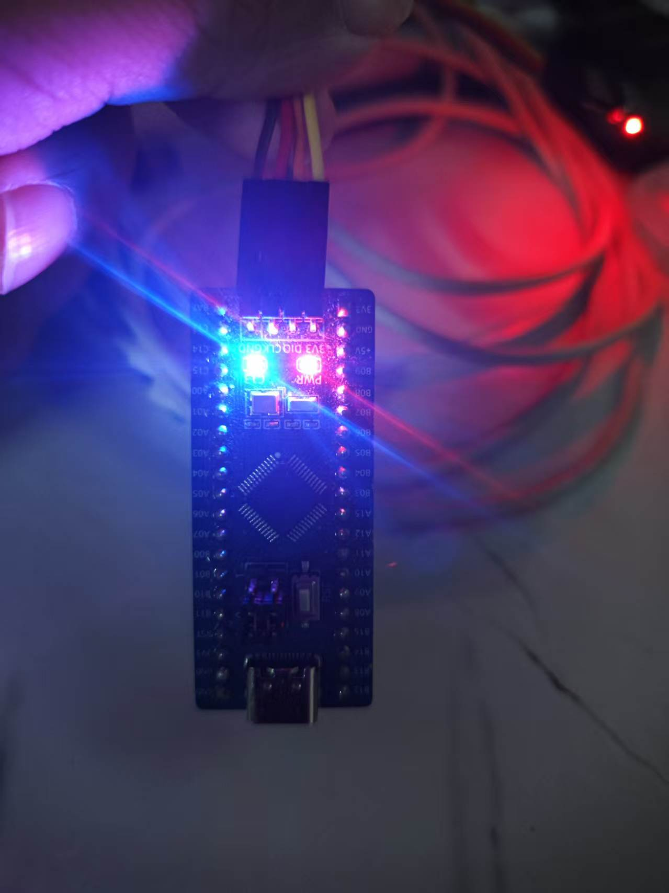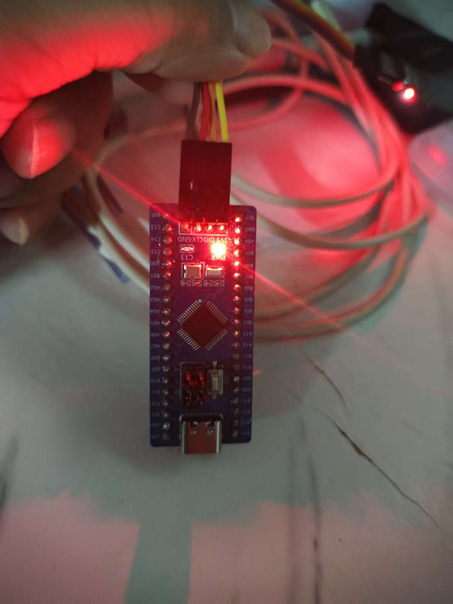

LED blinking as shown above

### LED Blink - TIM2 Timer Delay
```rust
#![allow(clippy::empty_loop)]
#![deny(unsafe_code)]
#![no_std]
#![no_main]

use panic_halt as _;
use rtt_target::{rprintln, rtt_init_print};
use stm32f1xx_hal::{pac, prelude::*, rcc};
use cortex_m_rt::{entry}; 

#[entry]
fn main() -> ! {
    rtt_init_print!();
    let dp = pac::Peripherals::take().unwrap();
    let mut flash = dp.FLASH.constrain(); // Flash wait cycle config

    // External crystal
    let mut rcc = dp.RCC.freeze(
        rcc::Config::hse(8.MHz()) // Use 8MHz external crystal
            .sysclk(72.MHz()) // PLL multiply to 72MHz
            .pclk1(36.MHz()) // APB1 divide to 36MHz
            .pclk2(72.MHz()) // APB2 no divide
            .adcclk(14.MHz()), // ADC 14MHz
        &mut flash.acr,
    );

    let mut gpioc = dp.GPIOC.split(&mut rcc);
    let mut led = gpioc.pc13.into_push_pull_output(&mut gpioc.crh);

    let mut delay = dp.TIM2.delay_us(&mut rcc); // Implemented using TIM2

    loop {
        rprintln!("TIM2 timer");
        led.set_high();
        delay.delay_ms(1_800_u16);

        led.set_low();
        delay.delay(1.secs());
    }
}
```

**Key Concepts:**

+ `rcc::Config::hse(8.MHz())` — Use 8MHz external high-speed crystal (crystal on DKX board)
+ `.sysclk(48.MHz())` — Set system clock to 48MHz
+ `rcc.freeze()` — Freeze clock configuration, return an immutable clock state
+ `dp.TIM2.delay_us()` — Create microsecond-level delay using TIM2
+ **Advantage**: More flexible than SysTick, higher precision, does not affect other SysTick uses


### Delay Explanation
This is the delay function. In simple terms, just use delay.delay(20.millis());

+ nanos() nanoseconds; 
+ micros() microseconds;
+ millis() milliseconds; 
+ secs() seconds; 
+ millis() milliseconds; 
+ minutes() minutes; 
+ hours() hours


## Button LED Control
```rust
#![allow(clippy::empty_loop)]
#![deny(unsafe_code)]
#![no_std]
#![no_main]

use cortex_m_rt::entry;
use panic_halt as _;
use rtt_target::{rprintln, rtt_init_print};
use stm32f1xx_hal::{gpio::PinState, pac, prelude::*, rcc};

#[entry]
fn main() -> ! {
    rtt_init_print!();
    let dp = pac::Peripherals::take().unwrap();
    let mut flash = dp.FLASH.constrain(); // Flash wait cycle config

    // External crystal
    let mut rcc = dp.RCC.freeze(
        rcc::Config::hse(8.MHz()) // Use 8MHz external crystal
            .sysclk(72.MHz()) // PLL multiply to 72MHz
            .pclk1(36.MHz()) // APB1 divide to 36MHz
            .pclk2(72.MHz()) // APB2 no divide
            .adcclk(14.MHz()), // ADC 14MHz
        &mut flash.acr,
    );

    let mut gpioa = dp.GPIOA.split(&mut rcc);
    let mut gpiob = dp.GPIOB.split(&mut rcc);
    let mut gpioc = dp.GPIOC.split(&mut rcc);

    let (mut led1, mut led2) = (
        gpioc
            .pc13
            .into_push_pull_output_with_state(&mut gpioc.crh, PinState::High),
        gpioc
            .pc14
            .into_push_pull_output_with_state(&mut gpioc.crh, PinState::Low),
    );

    // Disable JTAG, release PA15, PB3, PB4 as normal GPIO
    // STM32F1 defaults PA13/PA14/PA15/PB3/PB4 as JTAG/SWD pins
    // Must release before using as normal GPIO
    let mut afio = dp.AFIO.constrain(&mut rcc);
    let (gpioa_pa15, _gpiob_pb3, _gpiob_pb4) =
        afio.mapr.disable_jtag(gpioa.pa15, gpiob.pb3, gpiob.pb4);

    let key_0 = gpiob.pb12.into_pull_up_input(&mut gpiob.crh);
    let key_1 = gpioa_pa15.into_pull_up_input(&mut gpioa.crh);

    let mut key_up: bool = true;
    let cp = cortex_m::Peripherals::take().unwrap();
    let mut delay = cp.SYST.delay(&rcc.clocks);
    loop {
        let key_result = (key_0.is_low(), key_1.is_low());
        if key_up && (key_result.0 || key_result.1) {
            key_up = false;
            delay.delay_ms(20_u8);
            rprintln!(
                "{}",
                if key_result.0 {
                    "按下了按键0"
                } else {
                    "按下了按键1"
                }
            );
            match key_result {
                (true, _) => led1.toggle(),
                (_, true) => led2.toggle(),
                (_, _) => (),
            }
        } else if !key_result.0 && !key_result.1 {
            key_up = true;
            // nanos() ns; micros() us; millis() ms; secs() s; minutes() min; hours() hr
            delay.delay(20.millis());
        } else {
            // rprintln!("出错！");
            // delay.delay(2.secs());
        }
    }
}
```

****

**JTAG Pin Notes:**

+ STM32F1 uses JTAG/SWD debug interface by default
+ PA13(SWDIO), PA14(SWCLK), PA15(JTDI), PB3(JTDO), PB4(JNTRST) are occupied by JTAG by default
+ To use these pins as normal GPIO, JTAG must be disabled first
+ Note: PA13/PA14 are SWD interface, generally not recommended to disable (otherwise debugging is impossible)


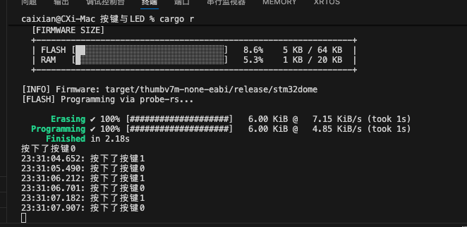

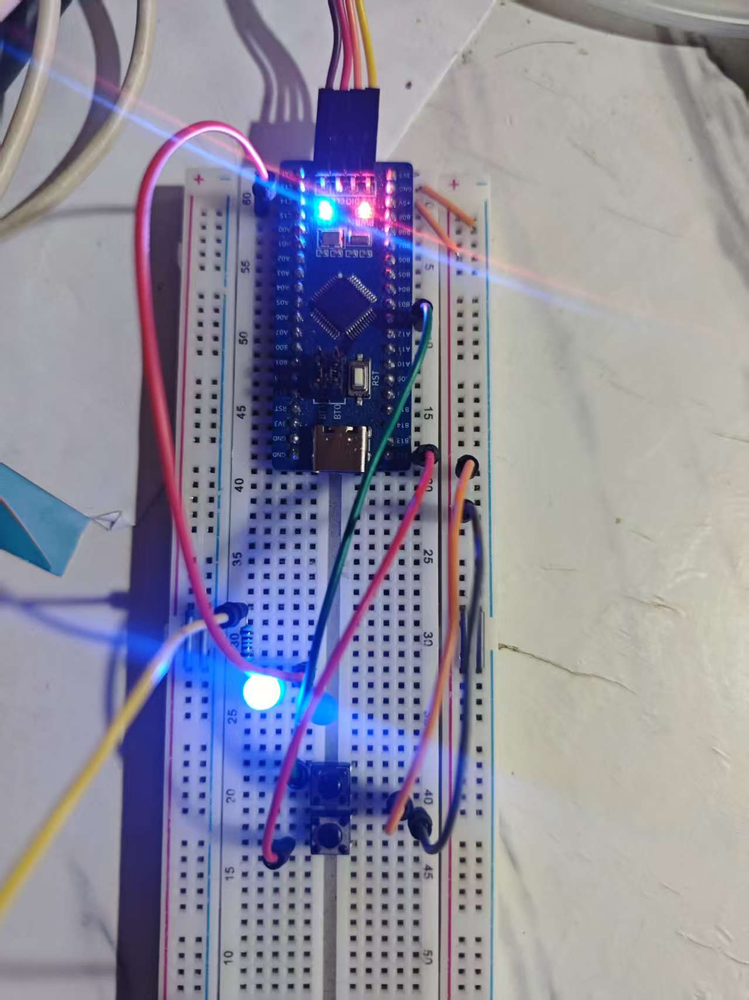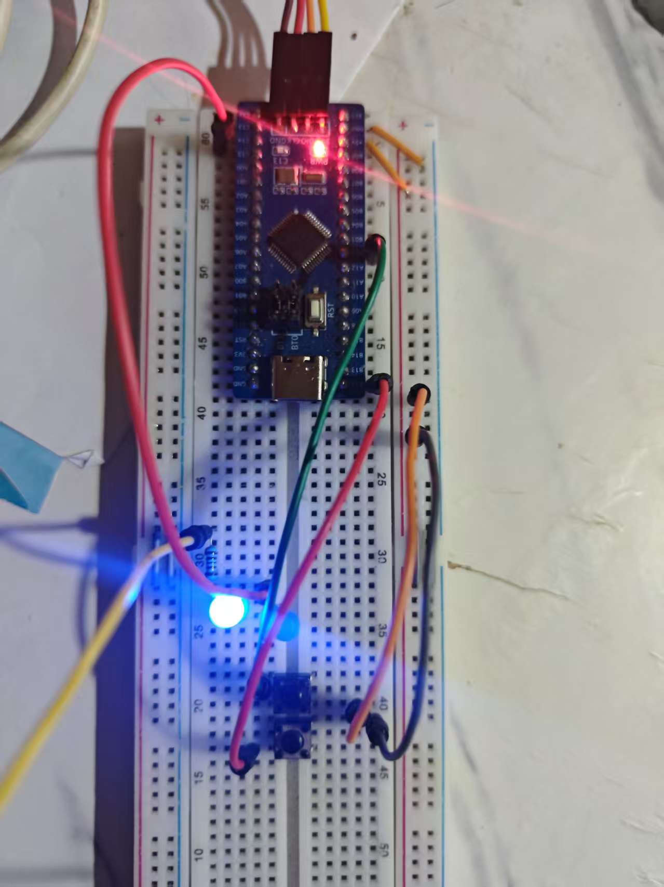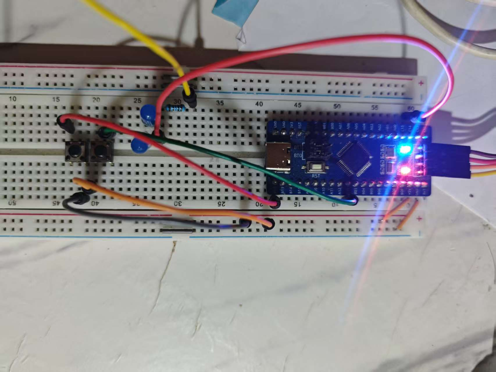


## Dynamic GPIO Switching (Port Multiplexing)
In actual development, ports may be multiplexed, so you need to use the following template

**Dynamic GPIO Uses:**

+ Some protocols (like One-Wire, I2C bit-bang) need to switch pin direction at runtime
+ Multiplexing limited pins

```rust
#![allow(clippy::empty_loop)]
#![deny(unsafe_code)]
#![no_std]
#![no_main]

use cortex_m_rt::entry;
use embedded_hal::digital::{InputPin, OutputPin};
use nb::block;
use panic_halt as _;
use rtt_target::{rprintln, rtt_init_print};
use stm32f1xx_hal::{pac, prelude::*, rcc, timer::Timer};

#[entry]
fn main() -> ! {
    rtt_init_print!();
    let dp = pac::Peripherals::take().unwrap();
    let mut flash = dp.FLASH.constrain(); // Flash wait cycle config

    // External crystal
    let mut rcc = dp.RCC.freeze(
        rcc::Config::hse(8.MHz()) // Use 8MHz external crystal
            .sysclk(72.MHz()) // PLL multiply to 72MHz
            .pclk1(36.MHz()) // APB1 divide to 36MHz
            .pclk2(72.MHz()) // APB2 no divide
            .adcclk(14.MHz()), // ADC 14MHz
        &mut flash.acr,
    );
    let mut gpioc = dp.GPIOC.split(&mut rcc);

    // Create dynamic pin (can switch input/output mode at runtime)
    let mut pin = gpioc.pc13.into_dynamic(&mut gpioc.crh);

    let cp = cortex_m::Peripherals::take().unwrap();

    // TOOD:1
    let mut timer = Timer::syst(cp.SYST, &rcc.clocks).counter_hz();
    timer.start(6.Hz()).unwrap();

    // TOOD:2
    // let mut timer = cp.SYST.counter_hz(&rcc.clocks);
    // timer.start(5.Hz()).unwrap();

    // TOOD:3
    // let mut timer: stm32f1xx_hal::timer::SysCounter<72000000> = cp.SYST.counter(&mut rcc.clocks);
    // timer.start(200.millis()).unwrap();

    loop {
        pin.make_floating_input(&mut gpioc.crh);
        block!(timer.wait()).unwrap();
        rprintln!("{}", pin.is_high().unwrap());

        pin.make_push_pull_output(&mut gpioc.crh);
        pin.set_high().unwrap();
        block!(timer.wait()).unwrap();
        pin.set_low().unwrap();
        block!(timer.wait()).unwrap();
    }
}
```


## External Interrupt EXTI
### EXTI Interrupt Line to Pin Mapping
Each EXTI line can only be connected to one pin at a time, but pins with the same number (e.g., PA0, PB0, PC0) share the same interrupt line, so **pins with the same number from different ports cannot be used as interrupt sources simultaneously**.

| EXTI Line | Available Pins | Handler Name |
| :--- | :--- | :--- |
| EXTI0 | PA0, PB0, PC0, PD0, PE0 | `EXTI0` |
| EXTI1 | PA1, PB1, PC1, PD1, PE1 | `EXTI1` |
| EXTI2 | PA2, PB2, PC2, PD2, PE2 | `EXTI2` |
| EXTI3 | PA3, PB3, PC3, PD3, PE3 | `EXTI3` |
| EXTI4 | PA4, PB4, PC4, PD4, PE4 | `EXTI4` |
| EXTI5 | PA5, PB5, PC5, PD5, PE5 | `EXTI9_5` |
| EXTI6 | PA6, PB6, PC6, PD6, PE6 | `EXTI9_5` |
| EXTI7 | PA7, PB7, PC7, PD7, PE7 | `EXTI9_5` |
| EXTI8 | PA8, PB8, PC8, PD8, PE8 | `EXTI9_5` |
| EXTI9 | PA9, PB9, PC9, PD9, PE9 | `EXTI9_5` |
| EXTI10 | PA10, PB10, PC10, PD10, PE10 | `EXTI15_10` |
| EXTI11 | PA11, PB11, PC11, PD11, PE11 | `EXTI15_10` |
| EXTI12 | PA12, PB12, PC12, PD12, PE12 | `EXTI15_10` |
| EXTI13 | PA13, PB13, PC13, PD13, PE13 | `EXTI15_10` |
| EXTI14 | PA14, PB14, PC14, PD14, PE14 | `EXTI15_10` |
| EXTI15 | PA15, PB15, PC15, PD15, PE15 | `EXTI15_10` |


---

### Key Steps Summary
Five core steps to configure external interrupts with STM32F1xx-HAL:

| Step | Operation | Code Method | Description |
| :--- | :--- | :--- | :--- |
| 1 | **Configure pin as input** | `into_pull_up_input()` etc. | Select pull-up/pull-down/floating based on circuit |
| 2 | **Connect to EXTI line** | <code>make_interrupt_source(&mut syscfg)</code> | Connect pin to EXTI interrupt line |
| 3 | **Set trigger edge** | <code>trigger_on_edge(&mut exti, Edge::RISING)</code> | Select rising, falling, or both edges |
| 4 | **Enable EXTI interrupt** | <code>enable_interrupt(&mut exti)</code> | Enable interrupt line in EXTI peripheral |
| 5 | **NVIC unmask** | `NVIC::unmask(pac::Interrupt::EXTI0)` | Enable interrupt channel in NVIC |


---

```rust
#![allow(clippy::empty_loop)]
// #![deny(unsafe_code)]
#![no_std]
#![no_main]

use core::mem::MaybeUninit;

use cortex_m::asm::delay; // Import instruction delay (for debouncing)
use cortex_m_rt::entry;
use pac::interrupt;
use panic_halt as _;
use rtt_target::{rprintln, rtt_init_print};
use stm32f1xx_hal::{
    gpio::{Edge, ExtiPin, GpioExt, Input, Output, PullUp},
    pac,
    prelude::*,
    rcc,
};

// Use MaybeUninit for uninitialized global variables
static mut LED: MaybeUninit<stm32f1xx_hal::gpio::gpioc::PC13<Output>> = MaybeUninit::uninit();
// static mut INT_PIN: MaybeUninit<stm32f1xx_hal::gpio::gpioa::PA7<Input>> = MaybeUninit::uninit(); // Floating
static mut INT_PIN: MaybeUninit<stm32f1xx_hal::gpio::gpioa::PA7<Input<PullUp>>> =
    MaybeUninit::uninit();

/// EXTI9_5 interrupt handler (covers EXTI7 for PA7, PB7, PC7, etc.)
#[interrupt]
fn EXTI9_5() {
    // 2021 -- Rust
    // let led = unsafe { &mut *LED.as_mut_ptr() };
    // let int_pin = unsafe { &mut *INT_PIN.as_mut_ptr() };

    // 2024 -- Rust
    let led = unsafe {
        &mut *(*(&raw mut LED)).as_mut_ptr()
        // Author explanation --- simply put, returning permissions to yourself
        // &mut borrowing itself
        // 2024 edition cannot directly &mut static mut, needs &raw
        // *(&raw mut LED) <==> 2021's LED --> dereferencing back to LED itself
        // *(*(&raw mut LED)).as_mut_ptr() <==> *LED
        // ---------- GPT explanation follows -------------
        // &raw mut LED
        // Get raw pointer to static mut LED
        // Type:
        // *mut MaybeUninit<PC13<Output>>

        // *(&raw mut LED)
        // Dereference raw pointer
        // Get memory location of LED
        // Note:
        // 这里不是“取值复制”
        // But returning to the object's memory location

        // .as_mut_ptr()
        // Convert MaybeUninit<T>
        // to *mut T

        // *ptr
        // Dereference *mut T
        // Get memory location of T

        // &mut *ptr
        // Finally create:
        // &mut T

        // Note:
        // Still fundamentally a mutable reference
        // Just bypasses:
        // &mut STATIC
        // the direct syntax
    };
    let int_pin = unsafe { &mut *(*(&raw mut INT_PIN)).as_mut_ptr() };

    if int_pin.check_interrupt() {
        rprintln!("进入中断加+1");
        // ====================== Debounce Core Code ======================
        delay(72_000_000 / 1000 * 40); // 72MHz clock → 40ms delay
        // ==========================================================
        led.toggle();
        int_pin.clear_interrupt_pending_bit();
    }
}

#[entry]
fn main() -> ! {
    // Initialize RTT debug output
    rtt_init_print!();
    rprintln!("程序启动...");

    let mut dp = pac::Peripherals::take().unwrap();
    let mut flash = dp.FLASH.constrain(); // Flash wait cycle config

    // External crystal
    let mut rcc = dp.RCC.freeze(
        rcc::Config::hse(8.MHz()) // Use 8MHz external crystal
            .sysclk(72.MHz()) // PLL multiply to 72MHz
            .pclk1(36.MHz()) // APB1 divide to 36MHz
            .pclk2(72.MHz()) // APB2 no divide
            .adcclk(14.MHz()), // ADC 14MHz
        &mut flash.acr,
    );

    rprintln!("开始配置");
    // Scope -- initialize interrupt configuration
    {
        let mut gpioa = dp.GPIOA.split(&mut rcc);
        let mut gpioc = dp.GPIOC.split(&mut rcc);
        let _afio = dp.AFIO.constrain(&mut rcc);

        // LED
        let led = unsafe { &mut *(*(&raw mut LED)).as_mut_ptr() };
        *led = gpioc.pc13.into_push_pull_output(&mut gpioc.crh);

        // Button
        let int_pin = unsafe { &mut *(*(&raw mut INT_PIN)).as_mut_ptr() };
        // *int_pin = gpioa.pa7.into_floating_input(&mut gpioa.crl); // Floating input, minimum dev board hardware doesn't support, needs external capacitor + pull-up/pull-down resistor
        *int_pin = gpioa.pa7.into_pull_up_input(&mut gpioa.crl);

        // Link to interrupt, set trigger: rising and falling edge
        int_pin.trigger_on_edge(&mut dp.EXTI, Edge::Rising); // Press connects to GND
        // Enable interrupt for this pin
        int_pin.enable_interrupt(&mut dp.EXTI);
    }

    rprintln!("结束配置！设置NVIC！");
    // Unmask EXTI9_5 interrupt in NVIC
    // This must be done after initialization!
    unsafe {
        pac::NVIC::unmask(pac::Interrupt::EXTI9_5);
    }
    rprintln!("设置完成！");
    loop {}
}
```

The difficulty is the syntax format between 2021 and 2024 editions, although 

```rust
#![deny(unsafe_code)] 
```

that can also solve it, but my approach is also a valid idea!


Also, auto-matching compiler syntax updates

```rust
#[interrupt]
fn EXTI9_5() {
    // 2021 -- Rust
    #[cfg(edition = "2021")]
    let (led, int_pin) = (&mut *LED.as_mut_ptr(), &mut *INT_PIN.as_mut_ptr());

    // 2024 -- Rust
    let (led, int_pin) = (unsafe { &mut *(*(&raw mut LED)).as_mut_ptr() }, unsafe {
        &mut *(*(&raw mut INT_PIN)).as_mut_ptr()
    });

    if int_pin.check_interrupt() {
        rprintln!("进入中断加+1");
        // ====================== Debounce Core Code ======================
        delay(72_000_000 / 1000 * 40); // 72MHz clock → 40ms delay
        // ==========================================================
        led.toggle();
        int_pin.clear_interrupt_pending_bit();
    }
}
```


## Timer Interrupt
### Timer Interrupt LED Blink
```rust
#![allow(clippy::empty_loop)]
#![no_std]
#![no_main]

use core::cell::RefCell;

use cortex_m::{asm::wfi, interrupt::Mutex};

use cortex_m_rt::entry;

use panic_halt as _;

use rtt_target::{rprintln, rtt_init_print};

use stm32f1xx_hal::{
    gpio::{GpioExt, Output, PC13, PinState, PushPull},
    pac::{Interrupt, Peripherals, TIM2, interrupt},
    prelude::*,
    rcc,
    timer::{CounterHz, Event},
};

type LedPin = PC13<Output<PushPull>>;

static G_LED: Mutex<RefCell<Option<LedPin>>> = Mutex::new(RefCell::new(None));

static G_TIM: Mutex<RefCell<Option<CounterHz<TIM2>>>> = Mutex::new(RefCell::new(None));

#[interrupt]
fn TIM2() {
    cortex_m::interrupt::free(|cs| {
        let mut led_ref = G_LED.borrow(cs).borrow_mut();
        let mut tim_ref = G_TIM.borrow(cs).borrow_mut();

        if let (Some(led), Some(tim)) = (led_ref.as_mut(), tim_ref.as_mut()) {
            led.toggle();
            tim.clear_interrupt(Event::Update);
            rprintln!("TIM2 中断");
        }
    });
}

#[entry]
fn main() -> ! {
    rtt_init_print!();
    rprintln!("程序启动");

    let dp = Peripherals::take().unwrap();
    let mut flash = dp.FLASH.constrain();

    let mut rcc = dp.RCC.freeze(
        rcc::Config::hse(8.MHz())
            .sysclk(72.MHz())
            .pclk1(36.MHz())
            .pclk2(72.MHz())
            .adcclk(14.MHz()),
        &mut flash.acr,
    );

    let mut gpioc = dp.GPIOC.split(&mut rcc);
    let led = Output::new(gpioc.pc13, &mut gpioc.crh, PinState::High);

    cortex_m::interrupt::free(|cs| {
        *G_LED.borrow(cs).borrow_mut() = Some(led);
    });

    rprintln!("GPIO 初始化完成");

    let mut timer = dp.TIM2.counter_hz(&mut rcc);
    timer.start(6.Hz()).unwrap();
    timer.listen(Event::Update);

    cortex_m::interrupt::free(|cs| {
        *G_TIM.borrow(cs).borrow_mut() = Some(timer);
    });

    rprintln!("TIM2 初始化完成");

    unsafe {
        cortex_m::peripheral::NVIC::unmask(Interrupt::TIM2);
    }

    rprintln!("程序运行中");

    loop {
        // Wait For Interrupt, CPU enters low-power sleep --- not recommended in production!
        // wfi(); // After startup -- rprintln! cannot print
    }
}
```

Logic Framework Diagram

```plain
┌──────────────────────────────────────────────────┐
│                    main()                        │
│  1. Create LED, Timer                               │
│  2. interrupt::free → move into G_LED, G_TIM           │
│  3. NVIC::unmask → enable interrupt                       │
│  4. wfi() loop sleep                                │
└──────────────────────────────────────────────────┘
                           │
                    TIM2 interrupt triggers
                           │
┌──────────────────────────────────────────────────┐
│               TIM2() interrupt handling                     │
│  1. Get LED/Timer from global storage (first time)                │
│  2. LED.toggle()                                 │
│  3. timer.clear_interrupt()                      │
└──────────────────────────────────────────────────┘
```


### RTIC Timer Interrupt Mode
<font style="color:#DF2A3F;"><<Recommended for Development>> RTIC</font>

#### RTIC vs Bare Metal Interrupt Comparison
##### 1. Architecture Comparison
###### Bare Metal Interrupt
```rust
// Need to manually define interrupt handler, bind to vector table
#[interrupt]
fn TIM1_UP() {
    // Manually enter critical section (disable interrupts)
    cortex_m::interrupt::free(|_| {
        // All code in one function, resource management relies on programmer
        // No priority management, all depends on manual interrupt enable/disable
    });
}
```

###### RTIC Interrupt
```rust
// Declaratively bind interrupt via #[task(binds = ...)]
#[task(binds = TIM1_UP, priority = 1, local = [led, timer])]
fn tick(cx: tick::Context) {
    // Resources managed by RTIC framework, compile-time safety guaranteed
    // Priority automatically managed by RTIC scheduler
}
```

---

##### 2. Core Differences
| Feature | Bare Metal Interrupt | RTIC |
| --- | --- | --- |
| **Resource Management** | Manual `critical section` protection | Compile-time auto allocation, zero runtime overhead |
| **Priority Management** | Manual NVIC register operation | `priority = N` declarative configuration |
| **Data Sharing** | Requires `static mut` + `unsafe` | `#[shared]` + `Mutex`, compile-time safe |
| **Critical Section** | Manual interrupt enable/disable | RTIC auto-generates optimal critical sections |
| **Interrupt Binding** | Modify `interrupt.rs` or `device.x` | `#[task(binds = TIM1_UP)]` one line |
| **Context Switch** | Manual save/restore registers | Hardware auto stack (Cortex-M) |
| **Code Organization** | All logic crammed in one interrupt function | Each task independent, resources separated |
| **Deadlock Prevention** | Programmer must be careful | Compile-time detection (based on priority ceiling protocol) |


---

##### 3. Resource Management Comparison
###### Bare Metal: `static mut` + `unsafe`
```rust
// Global mutable static variables, need unsafe access
static mut LED_STATE: bool = false;
static mut COUNT: u8 = 0;

#[interrupt]
fn TIM1_UP() {
    unsafe {
        if LED_STATE {
            // Operate LED...
            LED_STATE = false;
        } else {
            // Operate LED...
            LED_STATE = true;
        }
        COUNT += 1;
    }
}
```

**Problems:**

+ Bugs in `unsafe` blocks are not checked by compiler
+ Multiple interrupts accessing same variable easily causes data races
+ High priority interrupts may preempt low priority, breaking data consistency

###### RTIC: `#[local]` Compile-time Binding
```rust
#[task(binds = TIM1_UP, priority = 1, local = [led, led_state: bool = false, count: u8 = 0])]
fn tick(cx: tick::Context) {
    // Each resource is bound to this task at compile time
    // Other tasks cannot access, naturally avoids data races
    if *cx.local.led_state {
        cx.local.led.set_high();
        *cx.local.led_state = false;
    }
    *cx.local.count += 1;
}
```

**Advantages:**

+ Zero `unsafe`, compiler guarantees correctness
+ Resource binding determined at compile time, zero runtime overhead
+ Access resources with just `cx.local.xxx`

---

##### 4. Priority and Scheduling Comparison
###### Bare Metal: Manual NVIC Operation
```rust
// Need to manually configure priority
fn setup_timer_interrupt() {
    unsafe {
        // Set TIM1 interrupt priority to 1
        // Need to know NVIC register addresses and bit fields
        let nvic = &*cortex_m::peripheral::NVIC::ptr();
        // Complex register operations...
    }
}
```

###### RTIC: Declarative Priority
```rust
// priority = 1 and done
#[task(binds = TIM1_UP, priority = 1)]
fn tick(cx: tick::Context) { ... }

// Higher priority tasks can preempt lower priority
#[task(binds = USART1, priority = 2)]
fn serial(cx: serial::Context) { ... }
```

**RTIC Priority Rules:**

+ Higher number = higher priority
+ Higher priority tasks can preempt lower priority tasks
+ Same priority tasks don't preempt each other

---

##### 5. Shared Resource Comparison
###### Bare Metal: Manual Critical Section
```rust
static mut SHARED_DATA: u32 = 0;

#[interrupt]
fn LOW_PRIORITY() {
    cortex_m::interrupt::free(|_| {
        unsafe { SHARED_DATA += 1; }
    });
}

#[interrupt]
fn HIGH_PRIORITY() {
    // Forgot critical section? Data race! Compiler doesn't report!
    unsafe { SHARED_DATA += 1; }
}
```

###### RTIC: `#[shared]` + Auto Lock
```rust
#[shared]
struct Shared {
    data: u32,
}

#[task(binds = TIM1_UP, priority = 1, shared = [data])]
fn tick(cx: tick::Context) {
    // lock() auto-manages critical section, compile-time safety guaranteed
    cx.shared.data.lock(|d| {
        *d += 1;
    });
}

#[task(binds = USART1, priority = 2, shared = [data])]
fn serial(cx: serial::Context) {
    // Higher priority task accessing same resource, RTIC auto-generates optimal lock
    cx.shared.data.lock(|d| {
        *d += 1;
    });
}
```

**RTIC Lock Mechanism (Priority Ceiling Protocol PCP):**

+ When lower priority task holds lock, higher priority task waits
+ But RTIC auto-raises lock-holding task's priority, preventing mid-priority task preemption
+ All of these are determined at compile time, zero runtime overhead

---

6. Summary

| Scenario | Recommended |
| --- | --- |
| Learn interrupt principles | Bare metal (understand underlying mechanism) |
| Production project | RTIC (safe, efficient, maintainable) |
| Single simple interrupt | Bare metal (similar code amount) |
| Multiple interrupts + shared resources | RTIC (avoids data races) |
| Strict real-time requirements | RTIC (zero-overhead abstraction, deterministic scheduling) |


**RTIC Core Advantages:**

+ **Zero-overhead abstraction**: Everything determined at compile time, no runtime overhead
+ **Compile-time safety**: Data races and deadlocks caught at compile time
+ **Declarative programming**: Use attribute macros to describe "what to do", framework generates "how to do it"
+ **Priority ceiling protocol**: Optimal critical section management

<font style="color:#DF2A3F;"></font>

#### How to Use RTIC
You need to modify config.toml here

```bash
# Package addition
[dependencies] 
....
rtic = { version = "2", features = ["thumbv7-backend"] }
```

**Reason:**

+ Original project lacks `rtic` dependency, causing `rtic` module not found
+ RTIC v2 requires backend feature, STM32F103 is Cortex-M3 architecture, use `thumbv7-backend`
+ Other optional backends: `thumbv6-backend` (Cortex-M0/M0+), `thumbv8base-backend` (Cortex-M23), `thumbv8main-backend` (Cortex-M33)


```rust
//! Blink LED at different frequencies using timer interrupt
//!
//! Assume LED connected to PC13 (Blue Pill board default)
//!
//! Note: Without extra hardware, not recommended to drive LED with PC13 (see ref manual 5.1.2)
//! But Blue Pill has onboard LED, so no issue

#![no_std]
#![no_main]

// Import panic handler, CPU halts on panic
// Can set breakpoint on `rust_begin_unwind` to catch panic
use panic_halt as _;

// ==================== RTIC Application Entry ====================
// #[rtic::app] is RTIC's core macro for real-time interrupt-driven applications
// device param specifies chip PAC, here using stm32f1xx_hal's PAC
#[rtic::app(device = stm32f1xx_hal::pac)]
mod app {
    // Import RTT debug output macro
    // rtt_init_print! initializes RTT output channel
    // rprintln! prints debug info via RTT (requires J-Link/ST-Link debugger)
    use rtt_target::{rprintln, rtt_init_print};

    use stm32f1xx_hal::{
        // GPIO types: PC13 pin, output mode, pin state, push-pull output
        gpio::{gpioc::PC13, Output, PinState, PushPull},
        // PAC: low-level hardware register access interface
        pac,
        // prelude: pre-import common traits (like timer's .counter_ms())
        prelude::*,
        // Timer types: CounterMs is ms-precision timer, Event is timer event enum
        timer::{CounterMs, Event},
    };

    // ==================== Shared Resources ====================
    // #[shared] struct defines resources shareable between tasks
    // This example has no shared resources, struct is empty
    #[shared]
    struct Shared {}

    // ==================== Local Resources ====================
    // #[local] struct defines resources only accessible by one task
    // Each resource bound to task at compile time, avoiding runtime lock overhead
    #[local]
    struct Local {
        // LED pin (PC13, push-pull output)
        led: PC13<Output<PushPull>>,
        // Timer handle (TIM1, millisecond precision)
        timer_handler: CounterMs<pac::TIM1>,
    }

    // ==================== Init Function ====================
    // #[init] runs once at startup, initializes hardware and resources
    // Return value is (shared resources, local resources) tuple
    // cx is RTIC Context, access chip peripherals via cx.device
    #[init]
    fn init(cx: init::Context) -> (Shared, Local) {
        // Initialize RTT debug output channel
        // 之后就可以用 rprintln! 打印调试信息了
        rtt_init_print!();
        rprintln!("程序启动：init 函数开始执行");

        // Get and constrain RCC peripheral
        // constrain() configures RCC to default, returns clock config object
        let mut rcc = cx.device.RCC.constrain();
        rprintln!("RCC 时钟配置完成");

        // Get GPIOC peripheral and split into pins
        // split() wraps GPIOC pins as independent Pin objects
        let mut gpioc = cx.device.GPIOC.split(&mut rcc);

        // Configure PC13 as push-pull output, initial high (LED off)
        // crh register for pins 8-15 (pins 0-7 use crl)
        // PushPull: can actively output high or low
        // PinState::High: initial output high (Blue Pill LED active low)
        let led = gpioc
            .pc13
            .into_push_pull_output_with_state(&mut gpioc.crh, PinState::High);
        rprintln!("PC13 LED 引脚配置完成");

        // Configure TIM1 as millisecond counter
        // counter_ms() configures TIM1 as ms-precision timer
        let mut timer = cx.device.TIM1.counter_ms(&mut rcc);
        // Start timer, trigger update event every 1 second
        timer.start(1.secs()).unwrap();
        // Enable timer update interrupt
        // Interrupt triggers on timer overflow
        timer.listen(Event::Update);
        rprintln!("TIM1 定时器配置完成，每 1 秒触发一次中断");

        // Return initialized resources
        // Shared {}: shared resources (empty here)
        // Local { led, timer_handler }: local resources, bound to task
        (
            Shared {},
            Local {
                led,
                timer_handler: timer,
            },
        )
    }

    // ==================== Idle Function ====================
    // #[idle] runs continuously when system idle (no tasks to execute)
    // Return type `!` means never returns (infinite loop)
    // Reference: https://rtic.rs/dev/book/en/by-example/app_idle.html
    // Without idle function, RTIC sets SLEEPONEXIT to put CPU to sleep
    #[idle]
    fn idle(_cx: idle::Context) -> ! {
        rprintln!("进入 idle 空闲循环，CPU 等待中断中...");
        loop {
            // WFI: put CPU into low-power wait state
            // CPU wakes on interrupt, returns here after handling
            //
            // Note: After enabling wfi(), RTT debug output may not refresh properly
            // Comment out wfi() to see rprintln! output in idle
            // cortex_m::asm::dsb();
            // cortex_m::asm::wfi();
        }
    }

    // ==================== Timer Interrupt Task ====================
    // #[task] defines a task, binds to hardware interrupt
    // binds = TIM1_UP: bind to TIM1 update interrupt
    // priority = 1: task priority 1 (higher number = higher priority)
    // local = [...]: declare local resource list:
    //   - led: LED pin
    //   - timer_handler: timer handle
    //   - led_state: bool = false: LED state (initial false = off)
    //   - count: u8 = 0: interrupt counter (initial 0)
    #[task(binds = TIM1_UP, priority = 1, local = [led, timer_handler, led_state: bool = false, count: u8 = 0])]
    fn tick(cx: tick::Context) {
        // Toggle LED state
        // If LED is on (led_state == true), turn it off
        // If LED is off (led_state == false), turn it on
        if *cx.local.led_state {
            // set_high(): output high (Blue Pill LED active low)
            cx.local.led.set_high();
            *cx.local.led_state = false;
            rprintln!("[中断] LED 熄灭");
        } else {
            // set_low(): output low (turn on LED)
            cx.local.led.set_low();
            *cx.local.led_state = true;
            rprintln!("[中断] LED 点亮");
        }

        // Increment interrupt counter
        // Controls timer frequency switching timing
        *cx.local.count += 1;
        rprintln!("[中断] 计数: {}", *cx.local.count);

        // Dynamically change timer trigger frequency
        // 4th interrupt: change to 500ms (faster blink)
        if *cx.local.count == 4 {
            cx.local.timer_handler.start(500.millis()).unwrap();
            rprintln!("[中断] 定时器切换为 500ms");
        }
        // 12th interrupt: change back to 1s (slower blink)
        // And reset counter, start new cycle
        else if *cx.local.count == 12 {
            cx.local.timer_handler.start(1.secs()).unwrap();
            *cx.local.count = 0;
            rprintln!("[中断] 定时器切换为 1s，计数器重置");
        }

        // Clear timer update interrupt flag
        // Must clear manually, or interrupt keeps triggering
        cx.local.timer_handler.clear_interrupt(Event::Update);
    }
}
```

Output:

```bash
FLASH] Programming via probe-rs...

      Erasing ✔ 100% [####################]   5.00 KiB @   6.69 KiB/s (took 1s)
  Programming ✔ 100% [####################]   5.00 KiB @   4.70 KiB/s (took 1s)                                                   Finished in 1.93s
程序启动：init 函数开始执行
12:16:00.898: RCC 时钟配置完成
12:16:00.898: PC13 LED 引脚配置完成
12:16:00.898: TIM1 定时器配置完成，每 1 秒触发一次中断
12:16:00.898: 进入 idle 空闲循环，CPU 等待中断中...
12:16:01.855: [中断] LED 点亮
12:16:01.855: [中断] 计数: 1
12:16:02.932: [中断] LED 熄灭
12:16:02.932: [中断] 计数: 2
12:16:03.896: [中断] LED 点亮
12:16:03.896: [中断] 计数: 3
12:16:04.849: [中断] LED 熄灭
12:16:04.849: [中断] 计数: 4
12:16:04.849: [中断] 定时器切换为 500ms
12:16:05.333: [中断] LED 点亮
12:16:05.333: [中断] 计数: 5
12:16:05.934: [中断] LED 熄灭
12:16:05.934: [中断] 计数: 6
12:16:06.426: [中断] LED 点亮
12:16:06.426: [中断] 计数: 7
12:16:06.914: [中断] LED 熄灭
12:16:06.914: [中断] 计数: 8
12:16:07.401: [中断] LED 点亮
12:16:07.401: [中断] 计数: 9
12:16:07.888: [中断] LED 熄灭
12:16:07.888: [中断] 计数: 10
12:16:08.377: [中断] LED 点亮
12:16:08.377: [中断] 计数: 11
12:16:08.874: [中断] LED 熄灭
12:16:08.874: [中断] 计数: 12
12:16:08.874: [中断] 定时器切换为 1s，计数器重置
12:16:09.830: [中断] LED 点亮
12:16:09.830: [中断] 计数: 1
```

  
<font style="color:#DF2A3F;">Using hprintln can avoid the output issue caused by cortex_m::asm::wfi()</font>

```rust
config.toml

[dependencies]
cortex-m-semihosting = "0.5.0"
----------------

use cortex_m_semihosting::hprintln;
...
hprintln!("...");
```


```rust
//! Blink LED at different frequencies using timer interrupt
//!
//! Assume LED connected to PC13 (Blue Pill board default)
//!
//! Note: Without extra hardware, not recommended to drive LED with PC13 (see ref manual 5.1.2)
//! But Blue Pill has onboard LED, so no issue

#![no_std]
#![no_main]

// Import panic handler, CPU halts on panic
// Can set breakpoint on `rust_begin_unwind` to catch panic
use panic_halt as _;

// ==================== RTIC Application Entry ====================
// #[rtic::app] is RTIC's core macro for real-time interrupt-driven applications
// device param specifies chip PAC, here using stm32f1xx_hal's PAC
#[rtic::app(device = stm32f1xx_hal::pac)]
mod app {
    // Import semihosting debug output macro
    // hprintln! 通过 SWD 调试接口output to OpenOCD/ST-Link 的终端
    // No extra config needed vs RTT, but slower
    use cortex_m_semihosting::hprintln;

    use stm32f1xx_hal::{
        // GPIO types: PC13 pin, output mode, pin state, push-pull output
        gpio::{gpioc::PC13, Output, PinState, PushPull},
        // PAC: low-level hardware register access interface
        pac,
        // prelude: pre-import common traits (like timer's .counter_ms())
        prelude::*,
        // Timer types: CounterMs is ms-precision timer, Event is timer event enum
        timer::{CounterMs, Event},
    };

    // ==================== Shared Resources ====================
    // #[shared] struct defines resources shareable between tasks
    // This example has no shared resources, struct is empty
    #[shared]
    struct Shared {}

    // ==================== Local Resources ====================
    // #[local] struct defines resources only accessible by one task
    // Each resource bound to task at compile time, avoiding runtime lock overhead
    #[local]
    struct Local {
        // LED pin (PC13, push-pull output)
        led: PC13<Output<PushPull>>,
        // Timer handle (TIM1, millisecond precision)
        timer_handler: CounterMs<pac::TIM1>,
    }

    // ==================== Init Function ====================
    // #[init] runs once at startup, initializes hardware and resources
    // Return value is (shared resources, local resources) tuple
    // cx is RTIC Context, access chip peripherals via cx.device
    #[init]
    fn init(cx: init::Context) -> (Shared, Local) {
        hprintln!("程序启动：init 函数开始执行");

        // Get and constrain RCC peripheral
        // constrain() configures RCC to default, returns clock config object
        let mut rcc = cx.device.RCC.constrain();
        hprintln!("RCC 时钟配置完成");

        // Get GPIOC peripheral and split into pins
        // split() wraps GPIOC pins as independent Pin objects
        let mut gpioc = cx.device.GPIOC.split(&mut rcc);

        // Configure PC13 as push-pull output, initial high (LED off)
        // crh register for pins 8-15 (pins 0-7 use crl)
        // PushPull: can actively output high or low
        // PinState::High: initial output high (Blue Pill LED active low)
        let led = gpioc
            .pc13
            .into_push_pull_output_with_state(&mut gpioc.crh, PinState::High);
        hprintln!("PC13 LED 引脚配置完成");

        // Configure TIM1 as millisecond counter
        // counter_ms() configures TIM1 as ms-precision timer
        let mut timer = cx.device.TIM1.counter_ms(&mut rcc);
        // Start timer, trigger update event every 1 second
        timer.start(1.secs()).unwrap();
        // Enable timer update interrupt
        // Interrupt triggers on timer overflow
        timer.listen(Event::Update);
        hprintln!("TIM1 定时器配置完成，每 1 秒触发一次中断");

        // Return initialized resources
        // Shared {}: shared resources (empty here)
        // Local { led, timer_handler }: local resources, bound to task
        (
            Shared {},
            Local {
                led,
                timer_handler: timer,
            },
        )
    }

    // ==================== Idle Function ====================
    // #[idle] runs continuously when system idle (no tasks to execute)
    // Return type `!` means never returns (infinite loop)
    // Reference: https://rtic.rs/dev/book/en/by-example/app_idle.html
    // Without idle function, RTIC sets SLEEPONEXIT to put CPU to sleep
    #[idle]
    fn idle(_cx: idle::Context) -> ! {
        hprintln!("进入 idle 空闲循环，CPU 等待中断中...");
        loop {
            // WFI: put CPU into low-power wait state
            // CPU wakes on interrupt, returns here after handling
            // cortex_m::asm::dsb();
            cortex_m::asm::wfi();
        }
    }

    // ==================== Timer Interrupt Task ====================
    // #[task] defines a task, binds to hardware interrupt
    // binds = TIM1_UP: bind to TIM1 update interrupt
    // priority = 1: task priority 1 (higher number = higher priority)
    // local = [...]: declare local resource list:
    //   - led: LED pin
    //   - timer_handler: timer handle
    //   - led_state: bool = false: LED state (initial false = off)
    //   - count: u8 = 0: interrupt counter (initial 0)
    #[task(binds = TIM1_UP, priority = 1, local = [led, timer_handler, led_state: bool = false, count: u8 = 0])]
    fn tick(cx: tick::Context) {
        // Toggle LED state
        // If LED is on (led_state == true), turn it off
        // If LED is off (led_state == false), turn it on
        if *cx.local.led_state {
            // set_high(): output high (Blue Pill LED active low)
            cx.local.led.set_high();
            *cx.local.led_state = false;
            hprintln!("[中断] LED 熄灭");
        } else {
            // set_low(): output low (turn on LED)
            cx.local.led.set_low();
            *cx.local.led_state = true;
            hprintln!("[中断] LED 点亮");
        }

        // Increment interrupt counter
        // Controls timer frequency switching timing
        *cx.local.count += 1;
        hprintln!("[中断] 计数: {}", *cx.local.count);

        // Dynamically change timer trigger frequency
        // 4th interrupt: change to 500ms (faster blink)
        if *cx.local.count == 4 {
            cx.local.timer_handler.start(500.millis()).unwrap();
            hprintln!("[中断] 定时器切换为 500ms");
        }
        // 12th interrupt: change back to 1s (slower blink)
        // And reset counter, start new cycle
        else if *cx.local.count == 12 {
            cx.local.timer_handler.start(1.secs()).unwrap();
            *cx.local.count = 0;
            hprintln!("[中断] 定时器切换为 1s，计数器重置");
        }

        // Clear timer update interrupt flag
        // Must clear manually, or interrupt keeps triggering
        cx.local.timer_handler.clear_interrupt(Event::Update);
    }
}
```


Output

```rust
     Finished in 1.39s
程序启动：init 函数开始执行
RCC 时钟配置完成
PC13 LED 引脚配置完成
TIM1 定时器配置完成，每 1 秒触发一次中断
进入 idle 空闲循环，CPU 等待中断中...
[中断] LED 点亮
[中断] 计数: 1
[中断] LED 熄灭
[中断] 计数: 2
[中断] LED 点亮
[中断] 计数: 3
```


## RTIC2 Async Tasks
Implement 2-task scheduling with RTIC in async mode

```rust
//! RTIC2 async task example — two async tasks running concurrently
//!
//! Features:
//!   - blink task: toggle PC13 LED every 500ms
//!   - heartbeat task: print heartbeat via RTT every 2s
//!
//! Two tasks alternate without blocking, demonstrating async value:
//! Sync blocking would freeze blink during heartbeat's 2-second wait.
//! Async yields CPU during wait, scheduler can run other tasks.
//!
//! Hardware: Blue Pill (STM32F103C8T6), 8MHz external crystal, PC13 LED

// ==================== Rust Embedded Basic Attributes ====================

// Embedded programs have no standard library main entry
// Entry point generated by RTIC's #[rtic::app] macro
#![no_main]

// Embedded has no OS, no standard library (std)
// Only uses core library: Option, Result, loops, arithmetic, etc.
#![no_std]

// ==================== Dependency Crate Imports ====================

// panic_halt: panic handler
// Halt CPU on unrecoverable error
// `use ... as _` imports side effect only (panic handler), not concrete type
use panic_halt as _;

// rtic_monotonics::systick::prelude imports:
//   - systick_monotonic! macro: create SysTick-based monotonic timer
//   - Monotonic trait: timer interface
//   - fugit::ExtU32: adds .millis(), .secs() etc. to u32
use rtic_monotonics::systick::prelude::*;

// ==================== Monotonic Timer Configuration ====================

// systick_monotonic! macro expands to generate struct Mono
// Internally:
//   1. Defines SysTick interrupt handler
//   2. Implements Monotonic trait with delay, now, etc.
//
// Parameter 1_000 = tick frequency 1000Hz (SysTick interrupt every 1ms)
// Mono::start() also needs system clock frequency for reload calculation:
//   reload = sysclk / tick_rate - 1 = 72_000_000 / 1_000 - 1 = 71_999
//   SysTick triggers every 72_000 cycles (1ms)
//
// Note: first parameter is tick frequency (Hz), not system clock!
//   systick_monotonic!(Mono, 1_000)    → 1kHz, 1ms precision ✓
//   systick_monotonic!(Mono, 48_000_000) → 48MHz, 48M interrupts/sec ✗ (too frequent!)
systick_monotonic!(Mono, 1_000);

// ==================== RTIC Application Definition ====================

// #[rtic::app] is RTIC's core macro for defining a real-time application
//   device = stm32f1xx_hal::pac: specify chip's PAC
//     PAC provides low-level access to all hardware registers
//   dispatchers = [USART1]: specify dispatch interrupt for software tasks
//     RTIC borrows USART1 interrupt vector for async task scheduler
//     USART1 chosen because unused; any unused interrupt works
#[rtic::app(device = stm32f1xx_hal::pac, dispatchers = [USART1])]
mod app {
    // RTT（Real-Time Transfer）debug output
    // Zero-intrusion real-time printing via J-Link/ST-Link debugger
    //   rtt_init_print!(): init RTT uplink channel (call once)
    //   rprintln!(): print line via RTT (like println!, no OS needed)
    use rtt_target::{rprintln, rtt_init_print};

    // Import Mono timer and panic_halt from parent module
    use super::*;

    // HAL types from stm32f1xx-hal
    use stm32f1xx_hal::{
        gpio::{Output, PC13},  // PC13 pin output type
        prelude::*,             // Pre-import traits, unlock .counter_ms(), .MHz(), etc.
        rcc::Config,            // Clock config struct (HSE/HSI/PLL selection)
    };

    // ==================== Shared Resources ====================
    // #[shared] defines resources accessible by multiple tasks
    // RTIC guarantees shared resource safety at compile time (priority-based lock-free)
    // No shared resources here, struct is empty
    #[shared]
    struct Shared {}

    // ==================== Local Resources ====================
    // #[local] defines resources for single task only
    // Each resource bound at compile time, zero runtime overhead
    #[local]
    struct Local {
        // PC13 pin, push-pull output (drive LED)
        led: PC13<Output>,
    }

    // ==================== Init Function ====================
    // #[init] runs once at system startup
    // Runs before interrupts enabled, return value assigned to shared/local
    // ctx is RTIC context object:
    //   ctx.device → PAC peripherals (FLASH, RCC, GPIO, etc.)
    //   ctx.core → Cortex-M core peripherals (SYST, NVIC, etc.)
    #[init]
    fn init(ctx: init::Context) -> (Shared, Local) {
        // Initialize RTT debug channel, then rprintln! works
        rtt_init_print!();
        rprintln!("Start");

        // ==================== Clock System Configuration ====================
        // STM32F103 clock tree:
        //   HSE (8MHz crystal) → PLL ×9 → SYSCLK = 72MHz
        //                        ├→ AHB  → APB1 (72÷2 = 36MHz, low-speed peripherals)
        //                        └→ AHB  → APB2 (72MHz, high-speed peripherals)
        //
        // constrain() wraps peripheral registers into safe Rust types
        // freeze() locks clock config, cannot modify after
        let mut flash = ctx.device.FLASH.constrain();
        let mut rcc = ctx.device.RCC.freeze(
            Config::hse(8.MHz())  // Use 8MHz external crystal (HSE)
                .sysclk(72.MHz()), // PLL to 72MHz (STM32F103 max)
            &mut flash.acr,       // Flash access control register (configure wait states)
        );

        // Start SysTick monotonic timer
        // First param: SysTick peripheral (Cortex-M's 24-bit down counter)
        // Second param: system clock (72MHz), for tick time calculation
        // After start, SysTick triggers every 1ms (from systick_monotonic!'s 1_000Hz)
        Mono::start(ctx.core.SYST, 72_000_000);

        // ==================== GPIO Configuration ====================
        // split() splits GPIOC into individual pin objects
        // into_push_pull_output() configures PC13 as push-pull output
        //   Push-pull output: can actively drive high (3.3V) or low (0V)
        //   Blue Pill onboard LED is active low
        let mut gpioc = ctx.device.GPIOC.split(&mut rcc);
        let led = gpioc.pc13.into_push_pull_output(&mut gpioc.crh);

        // ==================== Start Async Tasks ====================
        // spawn() submits async task to RTIC scheduler
        // Task scheduled after init returns, not immediately
        // .ok() ignores possible errors (e.g., pool full)
        blink::spawn().ok();
        heartbeat::spawn().ok();

        rprintln!("启动完毕");

        // Return resources: shared (empty) and local (LED pin)
        // RTIC assigns led to the task that declared it local
        (Shared {}, Local { led })
    }

    // ==================== Async Task 1: LED Blink ====================
    // #[task] defines an async task
    //   local = [led, count: u32 = 0]：
    //     - led: from Local returned by init
    //     - count: u32 = 0: task-private counter, initial 0
    //         Inline init syntax, no need to declare in struct Local
    //
    // async fn means this function can pause at .await, yielding CPU
    // RTIC scheduler auto-resumes after delay expires
    #[task(local = [led, count: u32 = 0])]
    async fn blink(ctx: blink::Context) {
        loop {
            // toggle(): flip pin level (high→low or low→high)
            ctx.local.led.toggle();

            // ctx.local.count is task-private, no lock needed
            *ctx.local.count += 1;
            rprintln!("[blink] count={}", *ctx.local.count);

            // .delay(500.millis()).await: async wait 500ms
            // Key: CPU is NOT blocked!
            //   1. Mono timer records wake-up time
            //   2. Task yields CPU (state in Future)
            //   3. RTIC scheduler runs other tasks (e.g., heartbeat)
            //   4. After 500ms SysTick wakes this task
            Mono::delay(500.millis()).await;
        }
    }

    // ==================== Async Task 2: Heartbeat Print ====================
    // Another async task, runs concurrently with blink
    // local = [beat: u32 = 0]: task-private heartbeat counter
    #[task(local = [beat: u32 = 0])]
    async fn heartbeat(ctx: heartbeat::Context) {
        loop {
            *ctx.local.beat += 1;
            rprintln!("[heartbeat] beat={}", *ctx.local.beat);

            // Wait 2 seconds, blink runs normally
            // If this were sync blocking (e.g., for loop spinning 2s),
            // system cannot respond to any other task for those 2 seconds
            // But async .await just "sleeps", other tasks unaffected
            Mono::delay(2.secs()).await;
        }
    }
}
```

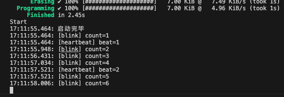

As shown above, 4 toggles execute one heartbeat! Running concurrently


## Serial Communication
#### Normal Mode
```rust
#![allow(clippy::empty_loop)]
#![deny(unsafe_code)]
#![no_main]
#![no_std]

use cortex_m::asm;
use cortex_m_rt::entry;
use nb::block;
use panic_halt as _;
use rtt_target::{rprintln, rtt_init_print};
use stm32f1xx_hal::{pac, prelude::*, rcc, serial::Config};

#[entry]
fn main() -> ! {
    rtt_init_print!();
    rprintln!("开始串口测试");
    let dp = pac::Peripherals::take().unwrap();
    let mut flash = dp.FLASH.constrain();

    let mut rcc = dp.RCC.freeze(
        rcc::Config::hse(8.MHz())
            .sysclk(72.MHz())
            .pclk1(36.MHz())
            .pclk2(72.MHz())
            .adcclk(14.MHz()),
        &mut flash.acr,
    );
    let mut gpiob = dp.GPIOB.split(&mut rcc);

    // === USART3 Pin Configuration (DKX Board) ===
    // TX: PB10 configured as alternate push-pull output
    // Alternate push-pull = GPIO controlled by hardware peripheral, not software
    let tx = gpiob.pb10.into_alternate_push_pull(&mut gpiob.crh);
    // RX: PB11 is floating input by default
    let rx = gpiob.pb11;

    // Create serial instance
    // USART3, baud rate 115200
    let mut serial = dp
        .USART3
        .serial((tx, rx), Config::default().baudrate(115200.bps()), &mut rcc);

    // === Method 1: Use serial object directly ===
    // let sent = b'X';
    // block!(serial.tx.write_u8(sent)).unwrap(); // Send byte
    // let received = block!(serial.rx.read()).unwrap(); // Receive byte
    // assert_eq!(received, sent); // Verify
    // rprintln!("{}",received);
    // asm::bkpt(); // Breakpoint, check with debugger

    // === Method 2: Split into separate TX/RX ===
    let sent = b'Y';
    let (mut tx, mut rx) = serial.split();
    block!(tx.write_u8(sent)).unwrap();
    // let received = block!(rx.read()).unwrap();
    // block!(tx.write_u8(received)).unwrap(); // Echo
    // asm::bkpt();

    // === Method 3: Use split TX/RX independently ===
    // stm32f1xx_hal Tx/Rx does not support reunite,
    // After split, can independently use tx.write_u8() and rx.read()
    // let sent = b'Z';
    // let (mut tx, mut rx) = serial.split();
    // block!(tx.write_u8(sent)).unwrap();


    loop {
        // Method 1
        // let received = block!(serial.rx.read()).unwrap(); // Receive byte
        // rprintln!("{}", received as char);
        // block!(serial.tx.write_u8(received)).unwrap(); // Echo

        // Method 2
        let received = block!(rx.read()).unwrap();
        block!(tx.write_u8(received)).unwrap(); // Echo
        rprintln!("{}",received as char);

        // Method 3
        // let received = block!(rx.read()).unwrap();
        // assert_eq!(received, sent);
        // block!(tx.write_u8(received)).unwrap(); // Echo
        // rprintln!("{}",received as char);
    }
}
```

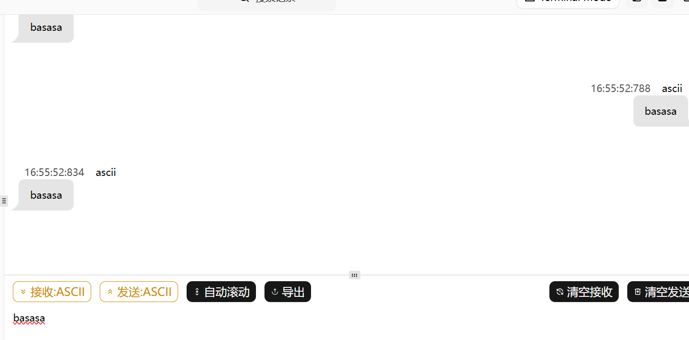

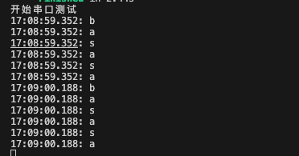

**Available Serial Port Pins (F103):**

| UART | TX Pin | RX Pin | Notes |
| --- | --- | --- | --- |
| USART1 | PA9 or PB6(remap) | PA10 or PB7(remap) | APB2 |
| USART2 | PA2 | PA3 | APB1 |
| USART3 | PB10 | PB11 | APB1 |


**Key Concepts:**

+ `into_alternate_push_pull()` — Alternate push-pull output, pin controlled by hardware
+ `Config::default().baudrate()` — Serial config (baud rate, data bits, stop bits, etc.)
+ `.split()` — Split into separate `Tx` and `Rx` objects
+ `.reunite()` — Reunite `Tx` and `Rx` back together


#### Serial Communication fmt Mode
```rust
#![deny(unsafe_code)]
#![allow(clippy::empty_loop)]
#![no_main]
#![no_std]

use panic_halt as _;
use rtt_target::{rprintln, rtt_init_print};
use cortex_m_rt::entry;
use stm32f1xx_hal::{
    pac,
    prelude::*,
    serial::{Config, Serial},
    rcc
};
use core::fmt::Write;  // Import Write trait

#[entry]
fn main() -> ! {
    rtt_init_print!();
    rprintln!("开始串口测试");
    let dp = pac::Peripherals::take().unwrap();
    let mut flash = dp.FLASH.constrain();

    let mut rcc = dp.RCC.freeze(
        rcc::Config::hse(8.MHz())
            .sysclk(72.MHz())
            .pclk1(36.MHz())
            .pclk2(72.MHz())
            .adcclk(14.MHz()),
        &mut flash.acr,
    );
    let mut gpiob = dp.GPIOB.split(&mut rcc);

    let tx = gpiob.pb10.into_alternate_push_pull(&mut gpiob.crh);
    let rx = gpiob.pb11;

    let serial = Serial::new(
        dp.USART3,
        (tx, rx),
        Config::default().baudrate(115200.bps()),
        &mut rcc,
    );

    let (mut tx, _rx) = serial.split();

    let mut number = 0;
    // Use write! macro for formatted output
    writeln!(tx, "Hello formatted string {}", number).unwrap();
    // Windows newline: write!(tx, "Hello formatted string {}\r\n", number)


    let mut delay = dp.TIM2.delay_us(&mut rcc); // Implemented using TIM2

    loop {
        writeln!(tx, "Hello formatted string {}", number).unwrap();
        delay.delay_ms(2_000_u16);
        number += 1;
        rprintln!("调试反馈:Hello formatted string {}",number);
    }
}
```

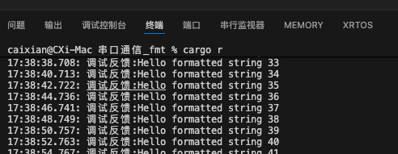

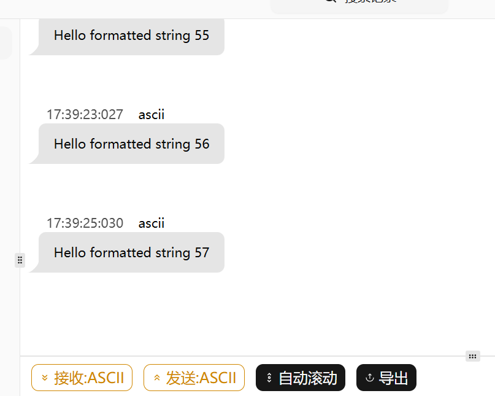

The above information seems quite perfect to me. The advantage of this language is that the framework is ready for AI to complete tasks!


#### Serial Interrupt Idle Detection
Mainly uses IDLE mode

```rust
// USART3 interrupt + IDLE detection — receive variable-length data and echo back
//
// Principle:
//   1. Each byte triggers RXNE interrupt, stored in BUFFER
//   2. Bus idle (no new bytes) triggers IDLE, indicating frame end
//   3. On IDLE, echo entire frame via TX
//
// Use Mutex<RefCell<>> instead of static mut, compatible with Rust 2024 edition

#![deny(unsafe_code)]
#![allow(clippy::empty_loop)]
#![no_main]
#![no_std]

use core::cell::RefCell;
use cortex_m::interrupt::Mutex;
use cortex_m_rt::entry;
use panic_halt as _;
use rtt_target::{rprintln, rtt_init_print};
use stm32f1xx_hal::{
    pac::{self, interrupt, USART3},
    prelude::*,
    serial::{Rx, Tx},
};

// Global shared state: wrapped in Mutex<RefCell<>>, safe between interrupt and main
static RX: Mutex<RefCell<Option<Rx<USART3>>>> = Mutex::new(RefCell::new(None));
static TX: Mutex<RefCell<Option<Tx<USART3>>>> = Mutex::new(RefCell::new(None));

const BUFFER_LEN: usize = 4096;
static BUFFER: Mutex<RefCell<[u8; BUFFER_LEN]>> = Mutex::new(RefCell::new([0; BUFFER_LEN]));
static WIDX: Mutex<RefCell<usize>> = Mutex::new(RefCell::new(0));

#[entry]
fn main() -> ! {
    rtt_init_print!();
    rprintln!("Serial Communication Interrupt IDLE");

    let p = pac::Peripherals::take().unwrap();
    let mut rcc = p.RCC.constrain();
    let mut afio = p.AFIO.constrain(&mut rcc);
    let mut gpiob = p.GPIOB.split(&mut rcc);

    // USART3 pins: PB10(TX), PB11(RX)
    let tx = gpiob.pb10.into_alternate_push_pull(&mut gpiob.crh);
    let rx = gpiob.pb11;

    // Init USART3, 115200 baud, split into TX/RX
    let (mut tx, mut rx) = p
        .USART3
        .remap(&mut afio.mapr)
        .serial((tx, rx), 115_200.bps(), &mut rcc)
        .split();

    // Enable three interrupt sources
    tx.listen();       // TXE — TX register empty interrupt (unused, keep enabled)
    rx.listen();       // RXNE — RX register not empty (per byte)
    rx.listen_idle();  // IDLE — bus idle detection (frame complete)

    // Store TX/RX in global statics in critical section for ISR use
    cortex_m::interrupt::free(|cs| {
        TX.borrow(cs).replace(Some(tx));
        RX.borrow(cs).replace(Some(rx));
    });

    // Enable USART3 interrupt to NVIC (only unsafe call in cortex-m)
    #[allow(unsafe_code)]
    unsafe {
        cortex_m::peripheral::NVIC::unmask(pac::Interrupt::USART3);
    }

    // Main loop: WFI sleep, wait for interrupt
    loop {
        cortex_m::asm::wfi()
    }
}

/// Send all bytes in buf via TX (blocking)
fn write(cs: &cortex_m::interrupt::CriticalSection, buf: &[u8]) {
    let mut tx_ref = TX.borrow(cs).borrow_mut();
    if let Some(tx) = tx_ref.as_mut() {
        buf.iter()
            .for_each(|w| if let Err(_err) = nb::block!(tx.write(*w)) {})
    }
}

/// USART3 interrupt handler
///
/// Two interrupt sources share one entry, distinguished by flags:
///   - RXNE (RX not empty): read byte-by-byte into BUFFER
///   - IDLE (bus idle): frame end, echo all received data
#[interrupt]
fn USART3() {
    cortex_m::interrupt::free(|cs| {
        let mut rx_ref = RX.borrow(cs).borrow_mut();
        if let Some(rx) = rx_ref.as_mut() {
            if rx.is_rx_not_empty() {
                // RXNE: received 1 byte, store in ring buffer
                if let Ok(w) = nb::block!(rx.read()) {
                    let widx = *WIDX.borrow(cs).borrow();
                    BUFFER.borrow(cs).borrow_mut()[widx] = w;
                    let new_widx = widx + 1;
                    if new_widx >= BUFFER_LEN - 1 {
                        // Buffer full: echo back entire block, reset write pointer
                        let buf = BUFFER.borrow(cs).borrow();
                        write(cs, &buf[..new_widx]);
                        drop(buf);
                        *WIDX.borrow(cs).borrow_mut() = 0;
                    } else {
                        *WIDX.borrow(cs).borrow_mut() = new_widx;
                    }
                }
                rx.listen_idle(); // Re-enable IDLE detection after each RXNE
            } else if rx.is_idle() {
                // IDLE: bus idle → frame complete, echo and clear buffer
                rx.unlisten_idle();
                let widx = *WIDX.borrow(cs).borrow();
                let buf = BUFFER.borrow(cs).borrow();
                write(cs, &buf[..widx]);
                drop(buf);
                *WIDX.borrow(cs).borrow_mut() = 0;
            }
        }
    })
}
```

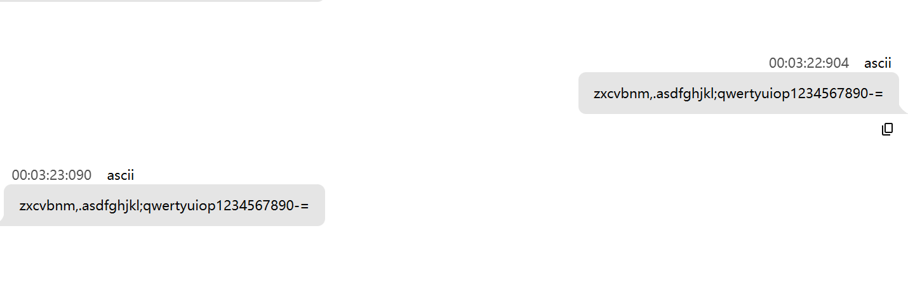


**9-bit data mode, using the 9th bit to mark address/data.**

```rust
// Configure as 9-bit data
let serial = p.USART3.serial::<PushPull>(
    (tx_pin, rx_pin),
    Config::default()
        .baudrate(9600.bps())
        .wordlength_9bits()    // 9-bit data
        .parity_none(),        // No parity
    &mut rcc,
);

// 9th bit = 1 means address byte
// 9th bit = 0 means data byte
block!(serial_tx.write(SLAVE_ADDR as u16 | 0x100)).unwrap();  // Send address
block!(serial_tx.write(data_byte)).unwrap();                   // Send data
```

**Usage:** Distinguishing address frames from data frames in multi-device communication.


#### Serial DMA Reception
```rust
#![deny(unsafe_code)]
#![allow(clippy::empty_loop)]
#![no_main]
#![no_std]

use panic_halt as _;
use rtt_target::{rprintln, rtt_init_print};
use cortex_m::singleton;
use cortex_m_rt::entry;
use stm32f1xx_hal::{
    pac,
    prelude::*,
    serial::{Config, Serial},
    rcc,
};

#[entry]
fn main() -> ! {
    rtt_init_print!();
    rprintln!("开始串口 DMA 测试");
    let dp = pac::Peripherals::take().unwrap();
    let mut flash = dp.FLASH.constrain();

    let mut rcc = dp.RCC.freeze(
        rcc::Config::hse(8.MHz())
            .sysclk(72.MHz())
            .pclk1(36.MHz())
            .pclk2(72.MHz())
            .adcclk(14.MHz()),
        &mut flash.acr,
    );

    // Split DMA1 channels (DMA1 has 7 channels)
    // USART3 TX -> DMA1 Channel 2
    // USART3 RX -> DMA1 Channel 3
    let channels = dp.DMA1.split(&mut rcc);

    let mut gpiob = dp.GPIOB.split(&mut rcc);

    let tx = gpiob.pb10.into_alternate_push_pull(&mut gpiob.crh);
    let rx = gpiob.pb11;

    let serial = Serial::new(
        dp.USART3,
        (tx, rx),
        Config::default().baudrate(115200.bps()),
        &mut rcc,
    );

    // Bind serial RX with DMA channel 3 (USART3 RX -> DMA1 Ch3)
    let rx_dma = serial.rx.with_dma(channels.3);
    // Bind serial TX with DMA channel 2 (USART3 TX -> DMA1 Ch2)
    let tx_dma = serial.tx.with_dma(channels.2);

    // singleton! macro: create unique instance in static memory
    // DMA needs static lifetime buffer
    let rx_buf = singleton!(: [u8; 8] = [0; 8]).unwrap();

    rprintln!("等待接收 8 字节数据...");
    // Start DMA reception (blocking wait for 8 bytes)
    let (buf, _rx) = rx_dma.read(rx_buf).wait();

    rprintln!("DMA 接收完成!");
    for (i, byte) in buf.iter().enumerate() {
        rprintln!("buf[{}] = 0x{:02X} -> {}", i, byte, *byte as char);
    }

    // DMA send example
    let tx_buf = singleton!(: [u8; 12] = *b"Hello DMA!\r\n").unwrap();
    let (_buf, _tx) = tx_dma.write(tx_buf).wait();

    rprintln!("DMA 发送完成!");

    loop {}
}
```

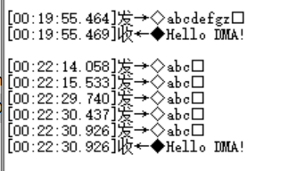

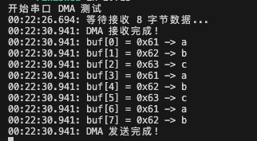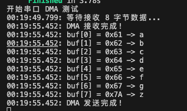

Explains how it triggers only after storing 8 bytes of data!


## ADC Acquisition
**ADC Key Parameters:**

+ Resolution: 12-bit (0-4095)
+ Conversion time: Depends on ADC clock
+ Reference voltage: VDDA (usually 3.3V)
+ Formula: `Voltage = Reading / 4095 * 3.3V`

**Available ADC Channels on DKX Board:**

| Pin | ADC Channel |
| --- | --- |
| PA0 | ADC1_IN0 |
| PA1 | ADC1_IN1 |
| PA2 | ADC1_IN2 |
| PA3 | ADC1_IN3 |
| PA4 | ADC1_IN4 |
| PA5 | ADC1_IN5 |
| PA6 | ADC1_IN6 |
| PA7 | ADC1_IN7 |
| PB0 | ADC1_IN8 |
| PB1 | ADC1_IN9 |


### External Voltage Acquisition
Acquire PB01 pin voltage

```rust
#![deny(unsafe_code)]
#![allow(clippy::empty_loop)]
#![no_main]
#![no_std]

use panic_halt as _;
use rtt_target::{rprintln, rtt_init_print};
use cortex_m::delay::Delay;
use cortex_m_rt::entry;
use stm32f1xx_hal::{
    adc,
    pac,
    prelude::*,
    rcc,
};

#[entry]
fn main() -> ! {
    rtt_init_print!();
    rprintln!("ADC 电压采集");
    let dp = pac::Peripherals::take().unwrap();
    let mut flash = dp.FLASH.constrain();

    // Configure clock: HSE 8MHz, SYSCLK 72MHz, ADCCLK 14MHz
    let mut rcc = dp.RCC.freeze(
        rcc::Config::hse(8.MHz())
            .sysclk(72.MHz())
            .pclk1(36.MHz())
            .pclk2(72.MHz())
            .adcclk(14.MHz()),
        &mut flash.acr,
    );
    rprintln!("adc freq: {}", rcc.clocks.adcclk());

    // Initialize ADC1
    let mut adc1 = adc::Adc::new(dp.ADC1, &mut rcc);

    // Configure PB0 as analog input
    let mut gpiob = dp.GPIOB.split(&mut rcc);
    let mut ch0 = gpiob.pb1.into_analog(&mut gpiob.crl);

    // Initialize SysTick delay
    let cp = cortex_m::Peripherals::take().unwrap();
    let mut delay = Delay::new(cp.SYST, rcc.clocks.sysclk().raw());

    loop {
        let data: u16 = adc1.read(&mut ch0).unwrap();
        // Reference voltage 3.3V, 12-bit ADC (0-4095)
        let voltage_mv = data as u32 * 3300 / 4095;
        let voltage_v = voltage_mv as f32 / 1000.0;
        rprintln!("adc1: {}  |  {}mV  |  {:.3}V", data, voltage_mv, voltage_v);
        delay.delay_ms(600u32);
    }
}
```

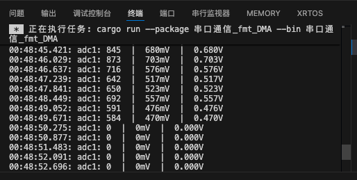

Connected to GND

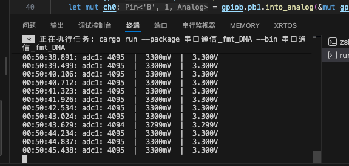

Connected to 3.3V

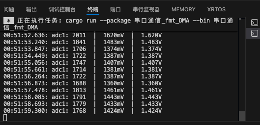

Midpoint voltage measured with two 1K resistors in series


### Internal ADC Temperature Acquisition
**Internal Temperature Sensor:**

+ Connected to ADC1 channel 16
+ Accuracy is not high (±1.5°C), suitable for rough monitoring
+ Conversion time needs to be above 17.1μs

```rust
#![deny(unsafe_code)]
#![allow(clippy::empty_loop)]
#![no_main]
#![no_std]

use panic_halt as _;
use rtt_target::{rprintln, rtt_init_print};
use cortex_m::delay::Delay;
use cortex_m_rt::entry;
use stm32f1xx_hal::{
    adc,
    pac,
    prelude::*,
    rcc,
};

#[entry]
fn main() -> ! {
    rtt_init_print!();
    rprintln!("内部 ADC 温度传感器测试");
    let dp = pac::Peripherals::take().unwrap();
    let mut flash = dp.FLASH.constrain();

    let mut rcc = dp.RCC.freeze(
        rcc::Config::hse(8.MHz())
            .sysclk(72.MHz())
            .pclk1(36.MHz())
            .pclk2(72.MHz())
            .adcclk(14.MHz()),
        &mut flash.acr,
    );
    rprintln!("sysclk freq: {}", rcc.clocks.sysclk());
    rprintln!("adc freq: {}", rcc.clocks.adcclk());

    let mut adc1 = adc::Adc::new(dp.ADC1, &mut rcc);

    let cp = cortex_m::Peripherals::take().unwrap();
    let mut delay = Delay::new(cp.SYST, rcc.clocks.sysclk().raw());

    loop {
        let temp = adc1.read_temp();
        rprintln!("temp: {} C", temp);
        delay.delay_ms(1000u32);
    }
}
```


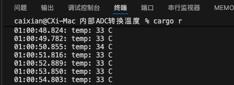


### ADC DMA Circular Acquisition
**Circular DMA Working Principle:**

```plain
     Buffer A            Buffer B
┌─────────────┐  ┌─────────────┐
│ [0] [1] ... │  │ [0] [1] ... │
│    [7]      │  │    [7]      │
└─────────────┘  └─────────────┘
       ↑ DMA Write     ↑ DMA Write
       └── Alternating ──┘

Half::First  → Buffer A readable
Half::Second → Buffer B readable
```


```rust
#![deny(unsafe_code)]
#![allow(clippy::empty_loop)]
#![no_main]
#![no_std]

use panic_halt as _;
use rtt_target::{rprintln, rtt_init_print};
use cortex_m::singleton;
use cortex_m_rt::entry;
use stm32f1xx_hal::{
    pac,
    prelude::*,
    adc,
    rcc,
    dma::Half,
};

#[entry]
fn main() -> ! {
    rtt_init_print!();
    rprintln!("ADC DMA 循环采集测试");

    let dp = pac::Peripherals::take().unwrap();
    let mut flash = dp.FLASH.constrain();

    let mut rcc = dp.RCC.freeze(
        rcc::Config::hse(8.MHz())
            .sysclk(72.MHz())
            .pclk1(36.MHz())
            .pclk2(72.MHz())
            .adcclk(14.MHz()),
        &mut flash.acr,
    );

    // Split DMA1 channel 1
    let dma_ch1 = dp.DMA1.split(&mut rcc).1;

    let adc1 = adc::Adc::new(dp.ADC1, &mut rcc);
    let mut gpioa = dp.GPIOA.split(&mut rcc);
    let adc_ch0 = gpioa.pa0.into_analog(&mut gpioa.crl);

    // Bind ADC with DMA
    let adc_dma = adc1.with_dma(adc_ch0, dma_ch1);

    // Create double buffer (circular mode needs two half buffers)
    // singleton! ensures buffer is in static memory
    let buf = singleton!(: [[u16; 8]; 2] = [[0; 8]; 2]).unwrap();

    // Start circular DMA read
    let mut circ_buffer = adc_dma.circ_read(buf);

    // Note: In DMA circular mode, do not insert time-consuming operations between readable_half() calls
    // Otherwise DMA may complete full circle, causing HTIF and TCIF both set → Overrun panic

    while circ_buffer.readable_half().unwrap() != Half::First {}
    let first_half = circ_buffer.peek(|half, _| *half).unwrap();

    while circ_buffer.readable_half().unwrap() != Half::Second {}
    let second_half = circ_buffer.peek(|half, _| *half).unwrap();

    rprintln!("第一半缓冲区: {:?}", first_half);
    rprintln!("第二半缓冲区: {:?}", second_half);

    let (_buf, adc_dma) = circ_buffer.stop();
    let (_adc1, _adc_ch0, _dma_ch1) = adc_dma.split();

    rprintln!("ADC DMA 循环采集完成");
    cortex_m::asm::bkpt();
    loop {}
}
```

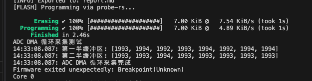


## SPI Protocol
**SPI Mode Details:**

| Mode | CPOL | CPHA | Clock Idle | Data Sample |
| --- | --- | --- | --- | --- |
| Mode 0 | 0 | 0 | Low | First edge |
| Mode 1 | 0 | 1 | Low | Second edge |
| Mode 2 | 1 | 0 | High | First edge |
| Mode 3 | 1 | 1 | High | Second edge |


**JLCPCB STM32F103C8T6 Board SPI1 Pins:** PA5(SCK), PA6(MISO), PA7(MOSI), PA4(CS)


### Light Up ST7789 Screen
240*240

**Hardware Pin Connection Table**

| Display Pin | MCU Pin | Function |
| :--- | :--- | :--- |
| SCL | PA5 | SPI Clock (SPI1_SCK) |
| SDA | PA7 | SPI data output (SPI1_MOSI) |
| DC | PA0 | Command/Data Select |
| RES | PA1 | Hardware Reset |
| CS | GND | Chip Select pulled low (always selected) |


> **说明**：表中 “SCL” 和 “SDA” 通常为 I²C 总线信号名，但此处连接的是 SPI 接口，实际对应 SPI 的 **SCK** 和 **MOSI**。这种命名常见于某些 LCD 模块，实际功能按引脚名称使用即可。CS connected to GND means the SPI device is always selected, no software chip select needed.
>

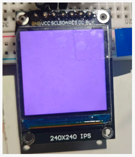

ST7789 driver code----src/st7789.rs

```rust
#![allow(dead_code)]

use stm32f1xx_hal::{
    pac,
    spi::{Spi, Error as SpiError},
    rcc::Clocks,
};

pub struct ST7789<DC, RST> {
    dc: DC,
    rst: RST,
    width: u16,
    height: u16,
}

impl<DC: embedded_hal::digital::OutputPin, RST: embedded_hal::digital::OutputPin> ST7789<DC, RST> {
    pub fn new(dc: DC, rst: RST) -> Self {
        ST7789 {
            dc,
            rst,
            width: 240,
            height: 240,
        }
    }

    pub fn init<PULL>(&mut self, spi: &mut Spi<pac::SPI1, u8, PULL>, clocks: &Clocks) -> Result<(), SpiError> {
        self.hard_reset(clocks);

        self.write_command(spi, 0x11)?;
        self.delay_ms(120, clocks);

        self.write_command(spi, 0x36)?;
        self.write_data(spi, &[0x00])?;

        self.write_command(spi, 0x3A)?;
        self.write_data(spi, &[0x05])?;

        self.write_command(spi, 0xB2)?;
        self.write_data(spi, &[0x0C, 0x0C, 0x00, 0x33, 0x33])?;

        self.write_command(spi, 0xB7)?;
        self.write_data(spi, &[0x35])?;

        self.write_command(spi, 0xBB)?;
        self.write_data(spi, &[0x19])?;

        self.write_command(spi, 0xC0)?;
        self.write_data(spi, &[0x2C])?;

        self.write_command(spi, 0xC2)?;
        self.write_data(spi, &[0x01])?;

        self.write_command(spi, 0xC3)?;
        self.write_data(spi, &[0x12])?;

        self.write_command(spi, 0xC4)?;
        self.write_data(spi, &[0x20])?;

        self.write_command(spi, 0xC6)?;
        self.write_data(spi, &[0x0F])?;

        self.write_command(spi, 0xD0)?;
        self.write_data(spi, &[0xA4, 0xA1])?;

        self.write_command(spi, 0xE0)?;
        self.write_data(spi, &[0xD0, 0x04, 0x0D, 0x11, 0x13, 0x2B, 0x3F, 0x54, 0x4C, 0x18, 0x0D, 0x0B, 0x1F, 0x23])?;

        self.write_command(spi, 0xE1)?;
        self.write_data(spi, &[0xD0, 0x04, 0x0C, 0x11, 0x13, 0x2C, 0x3F, 0x44, 0x51, 0x2F, 0x1F, 0x1F, 0x20, 0x23])?;

        self.write_command(spi, 0x21)?;

        self.write_command(spi, 0x29)?;
        self.delay_ms(20, clocks);

        Ok(())
    }

    fn delay_ms(&self, ms: u32, clocks: &Clocks) {
        let cycles = clocks.sysclk().raw() / 1000 * ms;
        cortex_m::asm::delay(cycles);
    }

    fn hard_reset(&mut self, clocks: &Clocks) {
        let _ = self.rst.set_low();
        self.delay_ms(10, clocks);
        let _ = self.rst.set_high();
        self.delay_ms(120, clocks);
    }

    fn write_command<PULL>(&mut self, spi: &mut Spi<pac::SPI1, u8, PULL>, cmd: u8) -> Result<(), SpiError> {
        let _ = self.dc.set_low();
        spi.write(&[cmd])
    }

    fn write_data<PULL>(&mut self, spi: &mut Spi<pac::SPI1, u8, PULL>, data: &[u8]) -> Result<(), SpiError> {
        let _ = self.dc.set_high();
        spi.write(data)
    }

    pub fn set_address_window<PULL>(&mut self, spi: &mut Spi<pac::SPI1, u8, PULL>, x0: u16, y0: u16, x1: u16, y1: u16) -> Result<(), SpiError> {
        self.write_command(spi, 0x2A)?;
        self.write_data(spi, &[
            (x0 >> 8) as u8,
            (x0 & 0xFF) as u8,
            (x1 >> 8) as u8,
            (x1 & 0xFF) as u8,
        ])?;

        self.write_command(spi, 0x2B)?;
        self.write_data(spi, &[
            (y0 >> 8) as u8,
            (y0 & 0xFF) as u8,
            (y1 >> 8) as u8,
            (y1 & 0xFF) as u8,
        ])?;

        self.write_command(spi, 0x2C)
    }

    pub fn fill_rect<PULL>(&mut self, spi: &mut Spi<pac::SPI1, u8, PULL>, x: u16, y: u16, w: u16, h: u16, color: u16) -> Result<(), SpiError> {
        if w == 0 || h == 0 {
            return Ok(());
        }

        self.set_address_window(spi, x, y, x + w - 1, y + h - 1)?;

        let hi = (color >> 8) as u8;
        let lo = (color & 0xFF) as u8;
        let pixel_pair = [hi, lo];
        let pixel_count = w as u32 * h as u32;

        let _ = self.dc.set_high();
        for _ in 0..pixel_count {
            spi.write(&pixel_pair)?;
        }

        Ok(())
    }

    pub fn fill_screen<PULL>(&mut self, spi: &mut Spi<pac::SPI1, u8, PULL>, color: u16) -> Result<(), SpiError> {
        self.fill_rect(spi, 0, 0, self.width, self.height, color)
    }

    pub fn set_pixel<PULL>(&mut self, spi: &mut Spi<pac::SPI1, u8, PULL>, x: u16, y: u16, color: u16) -> Result<(), SpiError> {
        self.fill_rect(spi, x, y, 1, 1, color)
    }
}
```

Main program

```rust
#![deny(unsafe_code)]
#![allow(clippy::empty_loop)]
#![no_main]
#![no_std]

mod st7789;

use panic_halt as _;
use rtt_target::{rprintln, rtt_init_print};
use cortex_m::asm;
use cortex_m_rt::entry;
use stm32f1xx_hal::{
    pac,
    prelude::*,
    rcc,
    spi::{Mode, Phase, Polarity},
};
use st7789::ST7789;

const SPI_MODE: Mode = Mode {
    phase: Phase::CaptureOnSecondTransition,
    polarity: Polarity::IdleHigh,
};

fn rgb565(r: u8, g: u8, b: u8) -> u16 {
    ((r as u16 & 0xF8) << 8) | ((g as u16 & 0xFC) << 3) | (b as u16 >> 3)
}

#[entry]
fn main() -> ! {
    rtt_init_print!();
    rprintln!("ST7789 240x240 驱动测试");

    let dp = pac::Peripherals::take().unwrap();
    let mut flash = dp.FLASH.constrain();

    let mut rcc = dp.RCC.freeze(
        rcc::Config::hse(8.MHz())
            .sysclk(72.MHz())
            .pclk1(36.MHz())
            .pclk2(72.MHz())
            .adcclk(14.MHz()),
        &mut flash.acr,
    );

    let clocks = rcc.clocks.clone();

    let mut gpioa = dp.GPIOA.split(&mut rcc);

    let sck = gpioa.pa5;
    let miso = gpioa.pa6;
    let mosi = gpioa.pa7;
    let dc = gpioa.pa0.into_push_pull_output(&mut gpioa.crl);
    let rst = gpioa.pa1.into_push_pull_output(&mut gpioa.crl);

    let mut spi = dp.SPI1.spi(
        (Some(sck), Some(miso), Some(mosi)),
        SPI_MODE,
        16.MHz(),
        &mut rcc,
    );

    rprintln!("SPI 初始化完成, 16MHz");

    let mut display = ST7789::new(dc, rst);

    rprintln!("ST7789 初始化中...");
    display.init(&mut spi, &clocks).unwrap();
    rprintln!("ST7789 初始化完成");

    let colors = [
        rgb565(255, 0, 0),
        rgb565(0, 255, 0),
        rgb565(0, 0, 255),
        rgb565(255, 255, 0),
        rgb565(0, 255, 255),
        rgb565(255, 0, 255),
        rgb565(255, 255, 255),
        rgb565(0, 0, 0),
    ];
    let color_names = ["红", "绿", "蓝", "黄", "青", "紫", "白", "黑"];

    let mut color_idx: usize = 0;

    loop {
        let c = colors[color_idx % colors.len()];
        rprintln!("填充颜色: {} #{:04X}", color_names[color_idx % color_names.len()], c);
        display.fill_screen(&mut spi, c).unwrap();
        delay_ms(2000, &clocks);
        color_idx += 1;
    }
}

fn delay_ms(ms: u32, clocks: &rcc::Clocks) {
    let cycles = clocks.sysclk().raw() / 1000 * ms;
    asm::delay(cycles);
}
```

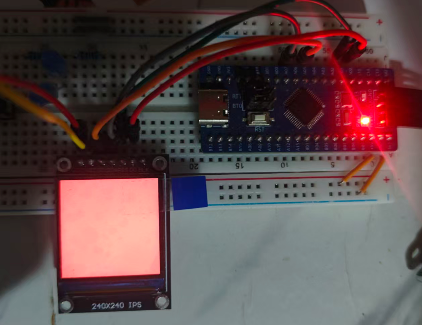

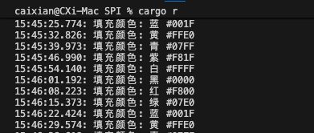


## I2C Communication
Using address scan as example!

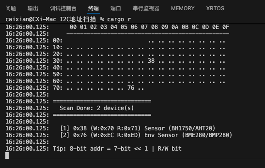

**Wiring**

| MCU | Device |
| --- | --- |
| PB6 | SCL |
| PB7 | SDA |


```rust
#![deny(unsafe_code)]
#![allow(clippy::empty_loop)]
#![no_main]
#![no_std]

use panic_halt as _;
use cortex_m_rt::entry;
use rtt_target::{rprint, rprintln, rtt_init_print};
use stm32f1xx_hal::{pac, prelude::*, rcc};

const SCAN_START: u8 = 0x08;
const SCAN_END: u8 = 0x78;

fn device_name(addr: u8) -> Option<&'static str> {
    match addr {
        0x03 => Some("General Call"),
        0x08..=0x0F => Some("HS-mode Master"),
        0x10 => Some("LED Driver (IS31FL3731)"),
        0x11 => Some("LED Driver (IS31FL3731)"),
        0x1C => Some("Accel (MMA845xQ/LIS3DH)"),
        0x1D => Some("Accel (ADXL345/MMA845xQ)"),
        0x1E => Some("Magnetometer (HMC5883L)"),
        0x20..=0x27 => Some("I/O Expander (PCF8574)"),
        0x28 => Some("IMU (MPU6050/BNO055)"),
        0x29 => Some("ToF (VL53L0X/VL53L1X)"),
        0x2A..=0x2F => Some("DAC (MCP4725)"),
        0x38 => Some("Sensor (BH1750/AHT20)"),
        0x39 => Some("Light (APDS-9960/TSL2561)"),
        0x3C => Some("OLED SSD1306 (128x32)"),
        0x3D => Some("OLED SSD1306 (128x64)"),
        0x40..=0x43 => Some("ADC/Temp (INA219/TMP102)"),
        0x44..=0x45 => Some("TH Sensor (SHT30/SHT31)"),
        0x48..=0x4B => Some("ADC (ADS1115/ADS1015)"),
        0x50..=0x57 => Some("EEPROM (AT24Cxx)"),
        0x5A => Some("IR Thermo (MLX90614)"),
        0x5C => Some("TH Sensor (AM2320/DHT12)"),
        0x60 => Some("Sensor (SGP30/SI1145)"),
        0x62 => Some("CO2 Sensor (SCD40/SCD41)"),
        0x68 => Some("RTC/IMU (DS3231/MPU6050)"),
        0x69 => Some("IMU (MPU6050 alt addr)"),
        0x6A..=0x6B => Some("IMU (LSM6DS3/LSM9DS1)"),
        0x76..=0x77 => Some("Env Sensor (BME280/BMP280)"),
        _ => None,
    }
}

#[entry]
fn main() -> ! {
    rtt_init_print!();

    let dp = pac::Peripherals::take().unwrap();
    let mut flash = dp.FLASH.constrain();

    let rcc_cfg = rcc::Config::hse(8.MHz())
        .sysclk(72.MHz())
        .pclk1(36.MHz())
        .pclk2(72.MHz())
        .adcclk(14.MHz());

    let mut rcc = dp.RCC.freeze(rcc_cfg, &mut flash.acr);

    cortex_m::peripheral::Peripherals::take()
        .unwrap()
        .DWT
        .enable_cycle_counter();

    let mut gpiob = dp.GPIOB.split(&mut rcc);

    let scl = gpiob.pb6.into_alternate_open_drain(&mut gpiob.crl);
    let sda = gpiob.pb7.into_alternate_open_drain(&mut gpiob.crl);

    let mut i2c = dp.I2C1.blocking_i2c(
        (scl, sda),
        stm32f1xx_hal::i2c::Mode::standard(100.kHz()),
        &mut rcc,
        1000,
        10,
        1000,
        1000,
    );
    rprint!("\r\n");
    rprintln!("=============================");
    rprintln!("  I2C Bus Scanner");
    rprintln!("  Range: 0x{:02X} - 0x{:02X}", SCAN_START, SCAN_END - 1);
    rprintln!("  Speed: 100kHz (Standard)");
    rprintln!("=============================");
    rprintln!();

    rprint!("     ");
    for col in 0..16u8 {
        rprint!("{:02X} ", col);
    }
    rprintln!();

    rprint!("    ");
    for _ in 0..16 {
        rprint!("---");
    }
    rprintln!();

    let mut found_count: u8 = 0;
    let mut found_addrs: [u8; 32] = [0u8; 32];

    for row in 0..8u8 {
        rprint!("{:02X}: ", row * 16);

        for col in 0..16u8 {
            let addr = row * 16 + col;

            if addr < SCAN_START || addr >= SCAN_END {
                rprint!("   ");
                continue;
            }

            let data: [u8; 1] = [0];
            match i2c.write(addr, &data) {
                Ok(_) => {
                    rprint!("{:02X}", addr);
                    if (found_count as usize) < found_addrs.len() {
                        found_addrs[found_count as usize] = addr;
                    }
                    found_count += 1;
                }
                Err(_) => {
                    rprint!("..");
                }
            }

            rprint!(" ");
        }
        rprintln!();
    }

    rprintln!();
    rprintln!("=============================");
    rprintln!("  Scan Done: {} device(s)", found_count);
    rprintln!("=============================");

    if found_count > 0 {
        rprintln!();
        for i in 0..found_count.min(32) {
            let addr = found_addrs[i as usize];
            rprint!("  [{}] 0x{:02X}", i + 1, addr);
            rprint!(" (W:0x{:02X} R:0x{:02X})", addr << 1, (addr << 1) | 1);
            if let Some(name) = device_name(addr) {
                rprint!(" {}", name);
            }
            rprintln!();
        }
    }

    rprintln!();
    rprintln!("Tip: 8-bit addr = 7-bit << 1 | R/W bit");

    loop {}
}
```

Wiring as shown

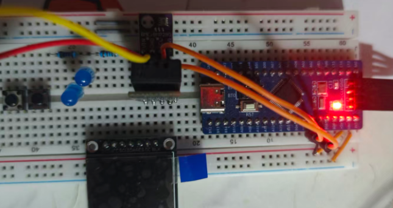


## PWM Signal
### Output
We explain using PWM to control a servo

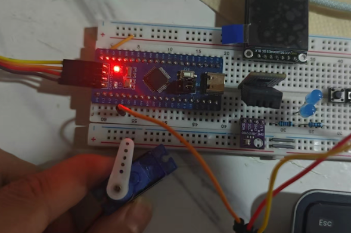

```rust
#![deny(unsafe_code)]
#![allow(clippy::empty_loop)]
#![no_main]
#![no_std]

use panic_halt as _;
use cortex_m::asm;
use cortex_m_rt::entry;
use rtt_target::{rprintln, rtt_init_print};
use stm32f1xx_hal::{
    pac,
    prelude::*,
    rcc,
    timer::{Channel, Tim2NoRemap},
};

#[entry]
fn main() -> ! {
    rtt_init_print!();
    rprintln!("\r\n舵机测试");
    let dp = pac::Peripherals::take().unwrap();
    let mut flash = dp.FLASH.constrain();

    let mut rcc = dp.RCC.freeze(
        rcc::Config::hse(8.MHz())
            .sysclk(72.MHz())
            .pclk1(36.MHz())
            .pclk2(72.MHz())
            .adcclk(14.MHz()),
        &mut flash.acr,
    );

    let mut afio = dp.AFIO.constrain(&mut rcc);
    let mut gpioa = dp.GPIOA.split(&mut rcc);

    // PA0 -> TIM2 CH1, 50Hz (servo standard frequency)
    let pins = gpioa.pa0.into_alternate_push_pull(&mut gpioa.crl);
    let mut pwm = dp.TIM2.pwm_hz::<Tim2NoRemap, _, _>(pins, &mut afio.mapr, 50.Hz(), &mut rcc);
    let max = pwm.get_max_duty();
    pwm.enable(Channel::C1);

    // Servo pulse width range: 0.5ms ~ 2.5ms (corresponding to 0° ~ 180°)
    // Period 20ms, duty cycle = pulse width / period
    // duty_0   = max * 0.5 / 20  = max / 40
    // duty_180 = max * 2.5 / 20  = max / 8
    let duty_min = max / 40;   // 0.5ms → 0°
    let duty_max = max / 8;    // 2.5ms → 180°
    let step = (duty_max - duty_min) / 180;  // Duty increment per degree

    let mut current_duty = duty_min;
    let mut direction_up = true;

    // 72MHz clock, ~5ms per step → servo ~0.7 seconds for 0→180
    let delay_cycles: u32 = 72_000 * 5;

    loop {
        pwm.set_duty(Channel::C1, current_duty);

        if direction_up {
            if current_duty >= duty_max {
                direction_up = false;
            } else {
                current_duty += step;
            }
        } else {
            if current_duty <= duty_min {
                direction_up = true;
            } else {
                current_duty -= step;
            }
        }
        rprintln!("--{:>3}度--",(current_duty-duty_min)/step);
        asm::delay(delay_cycles);
    }
}
```

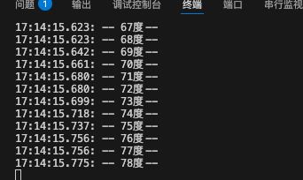


### Input
We explain using EC11 encoder

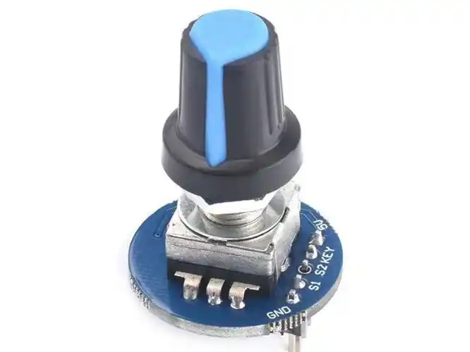

EC11 (with button)

**Wiring**

| MCU | Device |
| --- | --- |
| PB4 | S2 |
| PB5 | S2 |


```rust
#![deny(unsafe_code)]
#![allow(clippy::empty_loop)]
#![no_main]
#![no_std]

use panic_halt as _;
use rtt_target::{rprintln, rtt_init_print};
use cortex_m_rt::entry;
use stm32f1xx_hal::{
    pac,
    prelude::*,
    rcc::{self, BusTimerClock},
    timer::pwm_input::*,
};

#[entry]
fn main() -> ! {
    rtt_init_print!();
    rprintln!("PWM 输入检测启动");

    let dp = pac::Peripherals::take().unwrap();
    let mut flash = dp.FLASH.constrain();

    let mut rcc = dp.RCC.freeze(
        rcc::Config::hse(8.MHz())
            .sysclk(72.MHz())
            .pclk1(36.MHz())
            .pclk2(72.MHz()),
        &mut flash.acr,
    );

    let mut afio = dp.AFIO.constrain(&mut rcc);
    let mut dbg = dp.DBGMCU;

    let gpioa = dp.GPIOA.split(&mut rcc);
    let gpiob = dp.GPIOB.split(&mut rcc);

    // Disable JTAG to release PB4/PB5 (occupied by JTAG by default)
    let (_pa15, _pb3, pb4) = afio.mapr.disable_jtag(gpioa.pa15, gpiob.pb3, gpiob.pb4);
    let pb5 = gpiob.pb5;

    // Configure TIM3 as PWM input mode
    // PB4 = IC1 (rising edge capture, measure period)
    // PB5 = IC2 (falling edge capture, measure high time)
    let pwm_input = dp.TIM3.remap(&mut afio.mapr).pwm_input(
        (pb4, pb5),
        &mut dbg,
        Configuration::Frequency(10.kHz()),
        &mut rcc,
    );

    let timer_clk = pac::TIM3::timer_clock(&rcc.clocks);
    rprintln!("定时器时钟: {} Hz", timer_clk.raw());

    loop {
        match pwm_input.read_frequency(ReadMode::WaitForNextCapture, timer_clk) {
            Ok(freq) => {
                let freq_hz = freq.raw();
                match pwm_input.read_duty(ReadMode::Instant) {
                    Ok((high, period)) => {
                        let duty_pct = (high as f32 * 100.0) / period as f32;
                        rprintln!(
                            "频率: {} Hz | 占空比: {:.1}% ({}/{})",
                            freq_hz,
                            duty_pct,
                            high,
                            period,
                        );
                    }
                    Err(_) => {
                        rprintln!("频率: {} Hz | 占空比读取失败", freq_hz);
                    }
                }
            }
            Err(Error::FrequencyTooLow) => {
                rprintln!("信号频率过低或无信号");
            }
        }
    }
}
```


Rotary encoder detected data! No output when not rotating!

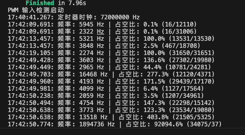

Output detection information


### EC11 Encoder Reading
**Wiring**

| MCU | Device |
| --- | --- |
| PB6 | S1 |
| PB7 | S2 |


**Usage:** Speed/position measurement for motor encoders, rotary knobs, and other quadrature encoder devices.


```rust
#![deny(unsafe_code)]
#![allow(clippy::empty_loop)]
#![no_main]
#![no_std]

use panic_halt as _;
use rtt_target::{rprintln, rtt_init_print};
use cortex_m_rt::entry;
use stm32f1xx_hal::{
    pac,
    prelude::*,
    rcc,
    timer::{pwm_input::QeiOptions, Timer},
};

#[entry]
fn main() -> ! {
    rtt_init_print!();
    rprintln!("EC11 编码器 QEI 测试");

    let dp = pac::Peripherals::take().unwrap();
    let cp = cortex_m::Peripherals::take().unwrap();
    let mut flash = dp.FLASH.constrain();

    let mut rcc = dp.RCC.freeze(
        rcc::Config::hse(8.MHz())
            .sysclk(72.MHz())
            .pclk1(36.MHz())
            .pclk2(72.MHz())
            .adcclk(14.MHz()),
        &mut flash.acr,
    );

    let gpiob = dp.GPIOB.split(&mut rcc);

    let c1 = gpiob.pb6;
    let c2 = gpiob.pb7;

    let qei = Timer::new(dp.TIM4, &mut rcc).qei((c1, c2), QeiOptions::default());
    let mut delay = cp.SYST.delay(&rcc.clocks);

    loop {
        let before = qei.count();
        delay.delay_ms(1_000_u16);
        let after = qei.count();

        let elapsed = after.wrapping_sub(before) as i16;
        rprintln!("脉冲: {} 方向: {:?}", elapsed, qei.direction());
    }
}
```


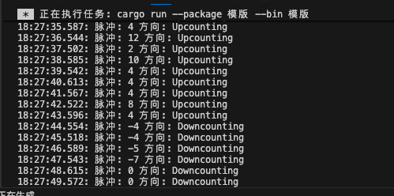


## CRC Check
**Usage:** Data integrity verification, CRC check for communication protocols.

```rust
#![deny(unsafe_code)]
#![allow(clippy::empty_loop)]
#![no_main]
#![no_std]

use panic_halt as _;
use rtt_target::{rprintln, rtt_init_print};
use cortex_m_rt::entry;
use stm32f1xx_hal::{pac, prelude::*, rcc};

#[entry]
fn main() -> ! {
    rtt_init_print!();
    rprintln!("CRC 校验 Demo 启动");

    let dp = pac::Peripherals::take().unwrap();
    let mut flash = dp.FLASH.constrain();

    let mut rcc = dp.RCC.freeze(
        rcc::Config::hse(8.MHz())
            .sysclk(72.MHz())
            .pclk1(36.MHz())
            .pclk2(72.MHz())
            .adcclk(14.MHz()),
        &mut flash.acr,
    );

    let mut crc = dp.CRC.new(&mut rcc);

    crc.reset();
    crc.write(0x12345678);
    let val = crc.read();
    rprintln!("单字 CRC: found={:08x}, expected={:08x}", val, 0xdf8a8a2b_u32);

    crc.reset();
    crc.write(0x00000001);
    crc.write(0x00000002);
    crc.write(0x00000003);
    let val = crc.read();
    rprintln!("多字 CRC: result={:08x}", val);

    crc.reset();
    let val = crc.read();
    rprintln!("复位后初始值: {:08x} (应为 ffffffff)", val);

    rprintln!("CRC 校验 Demo 完成");

    loop {}
}
```

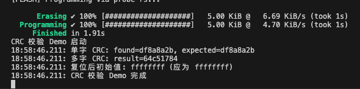


## DAC Digital-to-Analog Conversion
> Note: STM32F103C8T6 (DKX board) **has no DAC**, DAC is only available on high-density devices (STM32F103xC/D/E).
>

Note that C8T6 does not support DAC, so we choose STM32F103RCT6

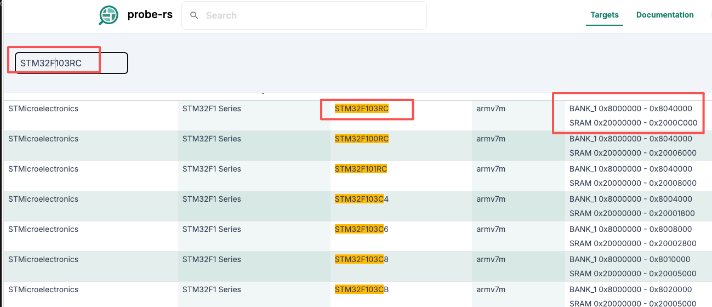

memory.x

```rust
/* Linker script for the STM32F103RCT6  https://probe.rs/targets/?q=&p=0 */
MEMORY
{
  FLASH : ORIGIN = 0x08000000, LENGTH = 256K
  RAM : ORIGIN = 0x20000000, LENGTH = 48K
}
```

Change the file configuration in config.toml

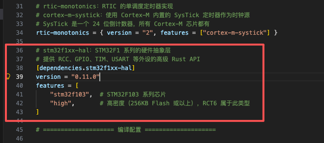

```rust
# stm32f1xx-hal: Hardware abstraction layer for STM32F1 series
# Provides high-level Rust API for RCC, GPIO, TIM, USART peripherals
[dependencies.stm32f1xx-hal]
version = "0.11.0"
features = [
    "stm32f103",  # STM32F103 series chip
    "high",       # High density (256KB Flash or above), RCT6 belongs to this type
]
```

The code is as follows

```rust
#![deny(unsafe_code)]
#![allow(clippy::empty_loop)]
#![no_main]
#![no_std]

use panic_halt as _;
use rtt_target::{rprintln, rtt_init_print};
use cortex_m_rt::entry;
use stm32f1xx_hal::{
    pac,
    prelude::*,
    dac::{DacExt, DacOut, DacPin},
    rcc,
};

#[entry]
fn main() -> ! {
    rtt_init_print!();
    rprintln!("DAC数模转换测试");

    let dp = pac::Peripherals::take().unwrap();
    let mut flash = dp.FLASH.constrain();

    let mut rcc = dp.RCC.freeze(
        rcc::Config::hse(8.MHz())
            .sysclk(72.MHz())
            .pclk1(36.MHz())
            .pclk2(72.MHz())
            .adcclk(14.MHz()),
        &mut flash.acr,
    );

    let mut gpioa = dp.GPIOA.split(&mut rcc);
    let pa4 = gpioa.pa4.into_analog(&mut gpioa.crl);
    let pa5 = gpioa.pa5.into_analog(&mut gpioa.crl);

    let (mut ch1, _ch2) = dp.DAC.constrain((pa4, pa5), &mut rcc);
    ch1.enable();

    let val_0_3v: u16 = (0.3_f32 / 3.3_f32 * 4095.0_f32) as u16;
    let val_1_6v: u16 = (1.6_f32 / 3.3_f32 * 4095.0_f32) as u16;
    let val_3_1v: u16 = (3.1_f32 / 3.3_f32 * 4095.0_f32) as u16;

    let delay_cycles: u32 = 72_000_000 * 3;

    loop {
        ch1.set_value(val_0_3v);
        rprintln!("DAC CH1: 0.3V (raw: {})", val_0_3v);
        cortex_m::asm::delay(delay_cycles);

        ch1.set_value(val_1_6v);
        rprintln!("DAC CH1: 1.6V (raw: {})", val_1_6v);
        cortex_m::asm::delay(delay_cycles);

        ch1.set_value(val_3_1v);
        rprintln!("DAC CH1: 3.1V (raw: {})", val_3_1v);
        cortex_m::asm::delay(delay_cycles);
    }
}
```

Results are as follows

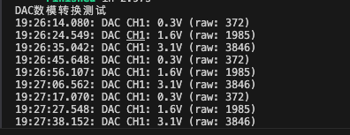

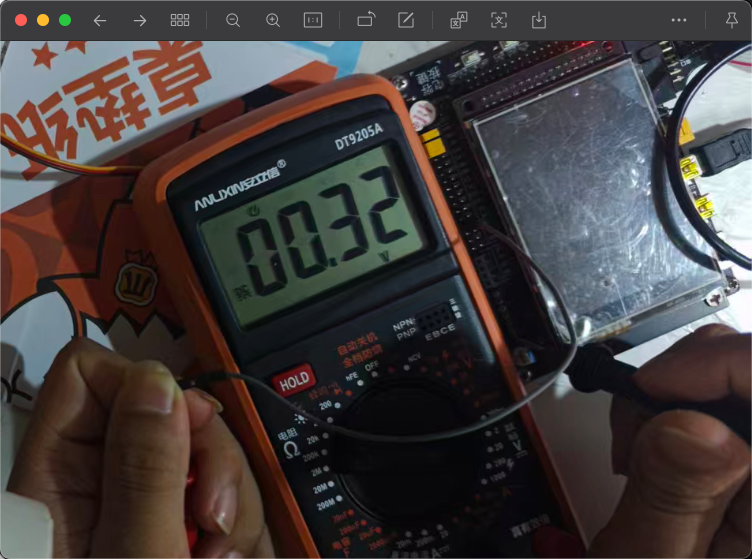

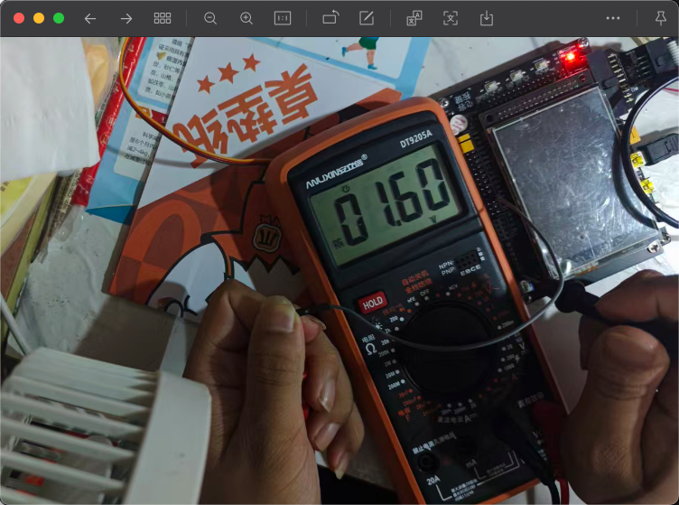

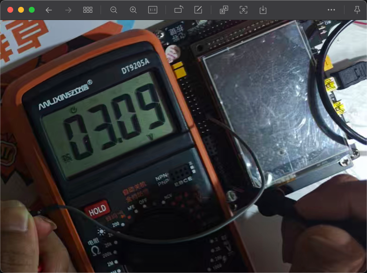

Measurement results are within acceptable error range


## CAN Bus (No device verification - not tested)
```markdown
use bxcan::Fifo;
use bxcan::filter::Mask32;

#[entry]
fn main() -> ! {
    let dp = pac::Peripherals::take().unwrap();
    let mut flash = dp.FLASH.constrain();

    // CAN needs external crystal for clock accuracy
    let mut rcc = dp.RCC.freeze(rcc::Config::hse(8.MHz()), &mut flash.acr);

    let mut can1 = {
        let gpioa = dp.GPIOA.split(&mut rcc);
        let rx = gpioa.pa11;  // CAN RX
        let tx = gpioa.pa12;  // CAN TX

        let can = dp.CAN.can(dp.USB, (tx, rx), &mut rcc);

        // Configure bit timing: 125kBit/s, sample point 87.5%
        bxcan::Can::builder(can)
            .set_bit_timing(0x001c_0003)
            .leave_disabled()
    };

    // Configure filter (receive all frames)
    let mut filters = can1.modify_filters();
    filters.enable_bank(0, Fifo::Fifo0, Mask32::accept_all());
    drop(filters);

    // Enable CAN
    let mut can = can1;
    block!(can.enable_non_blocking()).unwrap();

    // Loopback test: receive frame and send back immediately
    loop {
        if let Ok(frame) = block!(can.receive()) {
            block!(can.transmit(&frame)).unwrap();
        }
    }
}
```

**CAN Pins (DKX Board):** PA11(CAN RX), PA12(CAN TX) — Note: shared with USB pins


## USB Serial (No device verification - not tested)
### USB Polling Serial (No device verification - not tested)
```rust
#![no_std]
#![no_main]

extern crate panic_semihosting;

use cortex_m::asm::delay;
use cortex_m_rt::entry;
use stm32f1xx_hal::usb::{Peripheral, UsbBus};
use stm32f1xx_hal::{pac, prelude::*, rcc};
use usb_device::prelude::*;
use usbd_serial::{SerialPort, USB_CLASS_CDC};

#[entry]
fn main() -> ! {
    let dp = pac::Peripherals::take().unwrap();
    let mut flash = dp.FLASH.constrain();

    // USB must use 48MHz system clock
    let mut rcc = dp.RCC.freeze(
        rcc::Config::hse(8.MHz()).sysclk(48.MHz()).pclk1(24.MHz()),
        &mut flash.acr,
    );

    assert!(rcc.clocks.usbclk_valid());  // Verify USB clock valid

    let mut gpioc = dp.GPIOC.split(&mut rcc);
    let mut led = gpioc.pc13.into_push_pull_output(&mut gpioc.crh);
    led.set_high();  // Turn off LED

    let mut gpioa = dp.GPIOA.split(&mut rcc);

    // USB D+ line has pull-up resistor
    // Need to pull D+ low to trigger USB RESET during development
    let mut usb_dp = gpioa.pa12.into_push_pull_output(&mut gpioa.crh);
    usb_dp.set_low();                           // Pull D+ low
    delay(rcc.clocks.sysclk().raw() / 100);     // Brief delay

    // Configure USB peripheral
    let usb = Peripheral {
        usb: dp.USB,
        pin_dm: gpioa.pa11,                                  // USB DM = PA11
        pin_dp: usb_dp.into_floating_input(&mut gpioa.crh),  // USB DP = PA12
    };
    let usb_bus = UsbBus::new(usb);

    // Create CDC-ACM serial device
    let mut serial = SerialPort::new(&usb_bus);

    // Build USB device
    let mut usb_dev = UsbDeviceBuilder::new(&usb_bus, UsbVidPid(0x16c0, 0x27dd))
        .device_class(USB_CLASS_CDC)
        .strings(&[StringDescriptors::default()
            .manufacturer("Fake Company")
            .product("Serial port")
            .serial_number("TEST")])
        .unwrap()
        .build();

    loop {
        if !usb_dev.poll(&mut [&mut serial]) {
            continue;
        }

        let mut buf = [0u8; 64];
        match serial.read(&mut buf) {
            Ok(count) if count > 0 => {
                led.set_low();  // Turn on LED
                // Convert received characters to uppercase and echo
                for c in buf[0..count].iter_mut() {
                    if 0x61 <= *c && *c <= 0x7a {
                        *c &= !0x20;  // 'a'~'z' → 'A'~'Z'
                    }
                }
                // Write back (may need multiple writes)
                let mut write_offset = 0;
                while write_offset < count {
                    match serial.write(&buf[write_offset..count]) {
                        Ok(len) if len > 0 => {
                            write_offset += len;
                        }
                        _ => {}
                    }
                }
            }
            _ => {}
        }
        led.set_high();  // Turn off LED
    }
}
```

**USB Key Points:**

+ **Must use 48MHz system clock** (USB protocol requires precise clock)
+ PA11 = USB D-, PA12 = USB D+
+ Need to manually trigger USB RESET during development
+ VID/PID `0x16c0:0x27dd` is an informal test ID
+ Need release mode compilation (debug mode FLASH will overflow)

---

### USB Interrupt Serial (No device verification - not tested)
Handle USB communication using interrupts.

```rust
// Global USB objects
static mut USB_BUS: Option<UsbBusAllocator<UsbBusType>> = None;
static mut USB_SERIAL: Option<SerialPort<UsbBusType>> = None;
static mut USB_DEVICE: Option<UsbDevice<UsbBusType>> = None;

#[entry]
fn main() -> ! {
    // ... USB initialization code ...

    // Enable USB interrupt
    unsafe {
        NVIC::unmask(Interrupt::USB_HP_CAN_TX);   // High priority
        NVIC::unmask(Interrupt::USB_LP_CAN_RX0);  // Low priority
    }

    loop { wfi(); }  // All work done in interrupt
}

#[interrupt]
fn USB_HP_CAN_TX() {
    usb_interrupt();
}

#[interrupt]
fn USB_LP_CAN_RX0() {
    usb_interrupt();
}

fn usb_interrupt() {
    let usb_dev = unsafe { USB_DEVICE.as_mut().unwrap() };
    let serial = unsafe { USB_SERIAL.as_mut().unwrap() };

    if !usb_dev.poll(&mut [serial]) {
        return;
    }

    let mut buf = [0u8; 8];
    match serial.read(&mut buf) {
        Ok(count) if count > 0 => {
            // Process received data
            for c in buf[0..count].iter_mut() {
                if 0x61 <= *c && *c <= 0x7a {
                    *c &= !0x20;  // To uppercase
                }
            }
            serial.write(&buf[0..count]).ok();
        }
        _ => {}
    }
}
```

**Polling vs Interrupt:**

+ Polling: Simple, but CPU is always busy waiting
+ Interrupt: CPU can sleep, saving power


# Practical Projects
## DHT11
```rust
//! # DHT11 Temperature and Humidity Sensor Driver
//!
//! ## Pins That Can Use This Driver
//!
//! **Any GPIO pin** on STM32F103 can be used, including:
//!
//! | Port | Pin          | Description                   |
//! |------|-------------|-------------------------------|
//! | GPIOA | PA0~PA15   | Most commonly used, PA6 is default wiring |
//! | GPIOB | PB0~PB15   | Usable, PB3/PB4 need JTAG disabled |
//! | GPIOC | PC13~PC15  | Usable, PC13 usually connected to LED |
//! | GPIOD | PD0~PD15   | C8T6 only PD0~PD2 exposed |
//!
//! **Only limitation**: PA13/PA14 are SWD debug pins by default, PA15/PB3/PB4 are JTAG pins by default.
//! Using these pins requires disabling JTAG/SWD multiplexing (via AFIO).
//!
//! ## Why the Code is Written This Way
//!
//! ### 1. Push-Pull Output → Floating Input Switching
//!
//! DHT11 uses **single-wire protocol**, MCU and sensor drive the same line at different times:
//!
//! ```text
//! ┌─────────┐                    ┌─────────┐
//! │   MCU   │───── DATA ────────│  DHT11  │
//! └─────────┘    (pull-up resistor) └─────────┘
//! ```
//!
//! - **Start signal**: MCU must pull low 20ms → high 30us (needs push-pull output, can actively drive)
//! - **Data read**: DHT11 drives bus to send data (MCU must release bus → **floating input**, read-only)
//!
//! If using OpenDrain output, `set_high()` only releases bus (high impedance),
//! rising edge relies on pull-up resistor, slow speed, DHT11 may not detect start signal rising edge.
//!
//! ### 2. SysTick Hardware Timer
//!
//! `cortex_m::asm::delay(n)` is software loop counting, affected by **flash wait states**:
//! - STM32F103 flash has 2 wait cycles at 72MHz
//! - Each instruction in software loop actually needs 2~3 clock cycles
//! - `delay(72)` may actually take 2~3us instead of 1us
//!
//! SysTick is a 24-bit hardware down-counter in Cortex-M core, precisely timed by system clock,
//! **not affected by flash wait states**.
//!
//! ### 3. Keep High After Reading
//!
//! DHT11 bus idle state is high (maintained by external pull-up resistor).
//! If push-pull outputs low after reading, next start signal falling edge won't be recognized.
//!
//! ### 4. Const Generics
//!
//! `Pin<const P: char, const N: u8, MODE>` uses const generics:
//! - `P` = Port name ('A', 'B', 'C', 'D')
//! - `N` = Pin number (0~15)
//! - `MODE` = Mode type (Output<PushPull>, Input<Floating>, etc.)
//!
//! Compiler generates specialized code for each specific pin, **zero runtime overhead**.
//! Pin numbers 0~7 use CRL register, 8~15 use CRH register,
//! automatically selected by `HL` trait at compile time.

use cortex_m::peripheral::{syst::SystClkSource, SYST};
use stm32f1xx_hal::gpio::{Floating, HL, Input, Output, Pin, PinState, PushPull};

// ============================================================
//  SysTick Hardware Timer Delay
// ============================================================

pub struct Delay {
    syst: SYST,
}

impl Delay {
    pub fn new(mut syst: SYST) -> Self {
        syst.set_clock_source(SystClkSource::Core);
        Self { syst }
    }

    pub fn us(&mut self, us: u32) {
        if us == 0 {
            return;
        }
        // At 72MHz, 1us = 72 ticks; SysTick max 0xFFFFFF ≈ 233ms
        let ticks = us.saturating_mul(72);
        if ticks == 0 || ticks > 0x00FF_FFFF {
            return;
        }
        self.syst.set_reload(ticks);
        self.syst.clear_current();
        self.syst.enable_counter();
        while !self.syst.has_wrapped() {}
        self.syst.disable_counter();
    }

    pub fn ms(&mut self, ms: u32) {
        for _ in 0..ms {
            self.us(1000);
        }
    }
}

// ============================================================
//  DHT11 Error Types
// ============================================================

#[derive(Debug)]
#[allow(dead_code)]
pub enum Error {
    /// No response from DHT11 after start signal (low level response not detected)
    NoResponse,
    /// Data bit read timeout (abnormal bus state)
    ReadTimeout,
    /// Checksum mismatch
    Checksum { calc: u8, recv: u8 },
}

// ============================================================
//  DHT11 Driver
// ============================================================

pub struct Dht11;

impl Dht11 {
    /// Read temperature and humidity data from DHT11 once
    ///
    /// # Parameters
    /// - `pin` — Pin in push-pull output mode (idle high)
    /// - `cr` — Pin control register reference (CRL or CRH, compiler auto-deduces)
    /// - `delay` — SysTick delay
    ///
    /// # Returns
    /// - `(Ok((humidity, temperature)), pin)` — Success, humidity 0~99%RH, temperature 0~50°C
    /// - `(Err(e), pin)` — Failure
    ///
    /// Whether success or failure, `pin` is restored to push-pull output (high) and returned.
    ///
    /// # Type Constraint Notes
    ///
    /// `CR` is the associated type of `HL` trait, automatically determined by pin number:
    /// - Pins 0~7 → `Cr<P, false>` = CRL register
    /// - Pins 8~15 → `Cr<P, true>` = CRH register
    ///
    /// Two `where` constraints ensure `CR` type is consistent in Output and Input modes,
    /// so the same `&mut cr` can be shared during mode switching.
    #[allow(clippy::type_complexity)]
    pub fn read<const P: char, const N: u8, CR>(
        mut pin: Pin<P, N, Output<PushPull>>,
        cr: &mut CR,
        delay: &mut Delay,
    ) -> (Result<(u8, u8), Error>, Pin<P, N, Output<PushPull>>)
    where
        Pin<P, N, Output<PushPull>>: HL<Cr = CR>,
        Pin<P, N, Input<Floating>>: HL<Cr = CR>,
    {
        // ---- 1. Host start signal (push-pull output, active drive) ----
        pin.set_low();
        delay.ms(20); // Pull low 20ms (spec 18~30ms)
        pin.set_high();
        delay.us(30); // Pull high 30us (spec 10~35us)

        // ---- 2. Switch to floating input, read DHT11 data ----
        let in_pin = pin.into_floating_input(cr);

        let result = Self::read_data(&in_pin, delay);

        // ---- 3. Switch back to push-pull output, keep bus idle high ----
        let out_pin =
            in_pin.into_push_pull_output_with_state(cr, PinState::High);

        (result, out_pin)
    }

    // ---- Internal: wait for response + read 40-bit data ----

    fn read_data<const P: char, const N: u8>(
        pin: &Pin<P, N, Input<Floating>>,
        delay: &mut Delay,
    ) -> Result<(u8, u8), Error> {
        // DHT11 response: pull low ~80us first
        if !Self::wait_level(pin, false, 100, delay) {
            return Err(Error::NoResponse);
        }
        // DHT11 response: then pull high ~80us
        if !Self::wait_level(pin, true, 100, delay) {
            return Err(Error::NoResponse);
        }

        // Read 5 bytes (40 bit)
        // Byte0 = humidity integer  Byte1 = humidity decimal
        // Byte2 = temperature integer  Byte3 = temperature decimal  Byte4 = checksum
        let mut buf = [0u8; 5];
        for slot in &mut buf {
            *slot = Self::read_byte(pin, delay).ok_or(Error::ReadTimeout)?;
        }

        // Checksum: lower 8 bits of sum of first 4 bytes == 5th byte
        let sum = buf[0] as u32 + buf[1] as u32 + buf[2] as u32 + buf[3] as u32;
        if (sum & 0xFF) as u8 != buf[4] {
            return Err(Error::Checksum {
                calc: (sum & 0xFF) as u8,
                recv: buf[4],
            });
        }

        Ok((buf[0], buf[2])) // (humidity, temperature)
    }

    // ---- Internal: wait for pin to reach target level ----

    fn wait_level<const P: char, const N: u8>(
        pin: &Pin<P, N, Input<Floating>>,
        target_high: bool,
        timeout_us: u32,
        delay: &mut Delay,
    ) -> bool {
        for _ in 0..timeout_us {
            if pin.is_high() == target_high {
                return true;
            }
            delay.us(1);
        }
        false
    }

    // ---- Internal: read one byte (MSB first) ----
    //
    // Timing for each bit:
    //   ┌──── 50us ────┐┌── 28us(0) or 70us(1) ──┐
    //   │   Low level   ││      High level         │
    //   └───────────────┘└─────────────────────────┘
    //
    // Sampling strategy: wait for low→high transition, delay 40us, then sample
    //   "0": high ~28us → already low after 40us → read 0
    //   "1": high ~70us → still high after 40us → read 1

    fn read_byte<const P: char, const N: u8>(
        pin: &Pin<P, N, Input<Floating>>,
        delay: &mut Delay,
    ) -> Option<u8> {
        let mut byte: u8 = 0;
        for _ in 0..8 {
            byte <<= 1;
            // Wait for low (each bit starts with ~50us low)
            if !Self::wait_level(pin, false, 70, delay) {
                return None;
            }
            // Wait for high (DHT11 releases bus)
            if !Self::wait_level(pin, true, 70, delay) {
                return None;
            }
            // Sample after 40us delay
            delay.us(40);
            if pin.is_high() {
                byte |= 1;
            }
        }
        Some(byte)
    }
}
```

```rust
#![deny(unsafe_code)]
#![allow(clippy::empty_loop)]
#![no_main]
#![no_std]

mod dht11;

use panic_halt as _;
use rtt_target::{rprintln, rtt_init_print};
use cortex_m_rt::entry;
use stm32f1xx_hal::{pac, prelude::*, rcc};

use dht11::{Delay, Dht11};

#[entry]
fn main() -> ! {
    rtt_init_print!();
    rprintln!("DHT11 温湿度传感器 - PA6");

    let dp = pac::Peripherals::take().unwrap();
    let cp = cortex_m::Peripherals::take().unwrap();
    let mut flash = dp.FLASH.constrain();

    let mut rcc = dp.RCC.freeze(
        rcc::Config::hse(8.MHz())
            .sysclk(72.MHz())
            .pclk1(36.MHz())
            .pclk2(72.MHz())
            .adcclk(14.MHz()),
        &mut flash.acr,
    );

    let mut gpioa = dp.GPIOA.split(&mut rcc);
    let mut delay = Delay::new(cp.SYST);

    // PA6 push-pull output, initial high
    let mut pin = gpioa.pa6.into_push_pull_output_with_state(
        &mut gpioa.crl,
        stm32f1xx_hal::gpio::PinState::High,
    );

    delay.ms(1500);
    rprintln!("DHT11 初始化完成，开始采集...");

    loop {
        // Dht11::read takes push-pull output pin, returns push-pull output pin
        let (result, returned_pin) = Dht11::read(pin, &mut gpioa.crl, &mut delay);
        pin = returned_pin;

        match result {
            Ok((humi, temp)) => {
                rprintln!("湿度: {}%RH, 温度: {}C", humi, temp);
            }
            Err(e) => {
                rprintln!("DHT11 读取失败: {:?}", e);
            }
        }

        delay.ms(2000);
    }
}
```

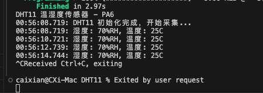


## DHT11+ST7789 LCD Thermometer
| Display & DHT11 | MCU Pin | Function |
| :--- | :--- | :--- |
| SCL | PA5 | SPI Clock (SPI1_SCK) |
| SDA | PA7 | SPI data output (SPI1_MOSI) |
| DC | PA0 | Command/Data Select |
| RES | PA1 | Hardware Reset |
| CS | GND | Chip Select pulled low (always selected) |
| DATA | PA6 | DHT11 Data Line |


Actual effect

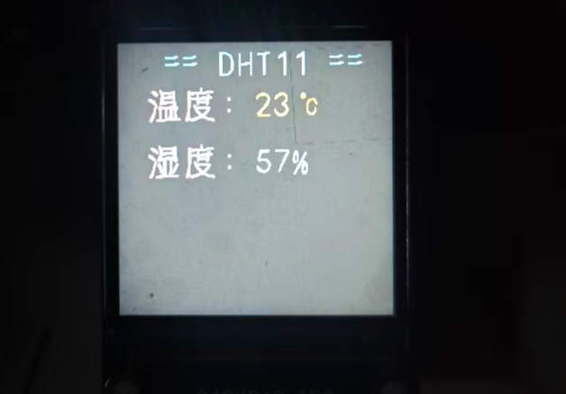

Project Structure Diagram

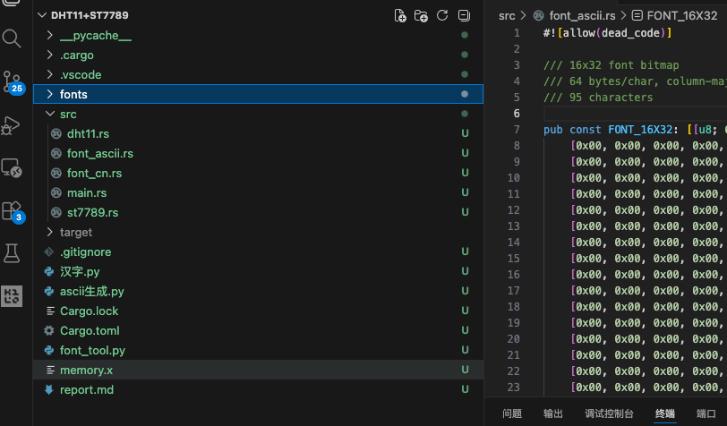


src/font_ascii.rs

```rust
#![allow(dead_code)]

/// 16x32 font bitmap
/// 64 bytes/char, column-major, LSB-first
/// 95 characters

pub const FONT_16X32: [[u8; 64]; 95] = [
    [0x00, 0x00, 0x00, 0x00, 0x00, 0x00, 0x00, 0x00, 0x00, 0x00, 0x00, 0x00, 0x00, 0x00, 0x00, 0x00, 0x00, 0x00, 0x00, 0x00, 0x00, 0x00, 0x00, 0x00, 0x00, 0x00, 0x00, 0x00, 0x00, 0x00, 0x00, 0x00, 0x00, 0x00, 0x00, 0x00, 0x00, 0x00, 0x00, 0x00, 0x00, 0x00, 0x00, 0x00, 0x00, 0x00, 0x00, 0x00, 0x00, 0x00, 0x00, 0x00, 0x00, 0x00, 0x00, 0x00, 0x00, 0x00, 0x00, 0x00, 0x00, 0x00, 0x00, 0x00], //  32 ' '
    [0x00, 0x00, 0x00, 0x00, 0x00, 0x00, 0x00, 0x00, 0x00, 0x00, 0x00, 0x00, 0x00, 0x00, 0x00, 0x00, 0x00, 0x00, 0x00, 0x00, 0x00, 0x00, 0x00, 0x00, 0x00, 0x00, 0x00, 0x00, 0x00, 0x00, 0x00, 0x00, 0x00, 0x00, 0x00, 0x00, 0x00, 0x00, 0x00, 0x00, 0x00, 0xC0, 0x0F, 0x03, 0xF0, 0xFF, 0x0F, 0x03, 0x00, 0x00, 0x00, 0x00, 0x00, 0x00, 0x00, 0x00, 0x00, 0x00, 0x00, 0x00, 0x00, 0x00, 0x00, 0x00], //  33 '!'
    [0x00, 0x00, 0x00, 0x00, 0x00, 0x00, 0x00, 0x00, 0x00, 0x00, 0x00, 0x00, 0x00, 0x00, 0x00, 0x00, 0x00, 0x00, 0x00, 0x00, 0x00, 0x00, 0x00, 0x00, 0xE0, 0x07, 0x00, 0x00, 0xC0, 0x03, 0x00, 0x00, 0x00, 0x00, 0x00, 0x00, 0x00, 0x00, 0x00, 0x00, 0x00, 0x00, 0x00, 0x00, 0xE0, 0x03, 0x00, 0x00, 0xC0, 0x00, 0x00, 0x00, 0x00, 0x00, 0x00, 0x00, 0x00, 0x00, 0x00, 0x00, 0x00, 0x00, 0x00, 0x00], //  34 '"'
    [0x00, 0x00, 0x00, 0x00, 0x00, 0x08, 0x08, 0x00, 0x00, 0x08, 0x08, 0x00, 0x00, 0x08, 0xC8, 0x01, 0x00, 0x08, 0xFF, 0x01, 0x00, 0xF8, 0x0F, 0x00, 0xE0, 0x3F, 0x08, 0x00, 0x60, 0x0C, 0x0C, 0x00, 0x00, 0x0C, 0x0C, 0x00, 0x00, 0x0C, 0x0C, 0x01, 0x00, 0x0C, 0xFC, 0x01, 0x00, 0xFC, 0x1F, 0x00, 0xE0, 0x7F, 0x04, 0x00, 0xE0, 0x07, 0x06, 0x00, 0x00, 0x04, 0x06, 0x00, 0x00, 0x00, 0x00, 0x00], //  35 '#'
    [0x00, 0x00, 0x00, 0x00, 0x00, 0x00, 0x00, 0x00, 0x00, 0x00, 0x00, 0x00, 0x00, 0x00, 0x1C, 0x00, 0x00, 0x03, 0x7C, 0x00, 0xC0, 0x0F, 0xC0, 0x00, 0x60, 0x18, 0x80, 0x00, 0x60, 0x30, 0x80, 0x00, 0xFC, 0xFF, 0xFF, 0x0F, 0x60, 0xC0, 0x80, 0x01, 0x60, 0xC0, 0x80, 0x00, 0xC0, 0x80, 0xC1, 0x00, 0x80, 0x01, 0x67, 0x00, 0x00, 0x01, 0x3E, 0x00, 0x00, 0x00, 0x00, 0x00, 0x00, 0x00, 0x00, 0x00], //  36 '$'
    [0x00, 0x00, 0x00, 0x00, 0x00, 0x20, 0x00, 0x00, 0x00, 0xFF, 0x00, 0x02, 0xC0, 0x81, 0x80, 0x03, 0xC0, 0x81, 0xE0, 0x00, 0x80, 0x7F, 0x38, 0x00, 0x00, 0x00, 0x1E, 0x00, 0x00, 0x00, 0x07, 0x00, 0x00, 0xC0, 0x01, 0x00, 0x00, 0x70, 0xFC, 0x01, 0x00, 0x9C, 0x9E, 0x03, 0x00, 0x87, 0x03, 0x02, 0x80, 0x01, 0x87, 0x03, 0x00, 0x00, 0xFE, 0x00, 0x00, 0x00, 0x00, 0x00, 0x00, 0x00, 0x00, 0x00], //  37 '%'
    [0x00, 0x00, 0x00, 0x00, 0x00, 0x00, 0x38, 0x00, 0x00, 0x00, 0xFE, 0x00, 0x00, 0x00, 0x87, 0x01, 0x80, 0xBF, 0x01, 0x01, 0xC0, 0xF0, 0x00, 0x02, 0x40, 0xE0, 0x01, 0x02, 0x40, 0x30, 0x07, 0x02, 0xC0, 0x1F, 0x0C, 0x02, 0x80, 0x07, 0x18, 0x01, 0x00, 0x00, 0xB0, 0x01, 0x00, 0x00, 0xE0, 0x00, 0x00, 0x00, 0xFC, 0x01, 0x00, 0x00, 0x8C, 0x01, 0x00, 0x00, 0x00, 0x00, 0x00, 0x00, 0x00, 0x00], //  38 '&'
    [0x00, 0x00, 0x00, 0x00, 0x00, 0x00, 0x00, 0x00, 0x00, 0x00, 0x00, 0x00, 0x00, 0x00, 0x00, 0x00, 0x00, 0x00, 0x00, 0x00, 0x00, 0x00, 0x00, 0x00, 0x00, 0x00, 0x00, 0x00, 0x00, 0x00, 0x00, 0x00, 0x00, 0x00, 0x00, 0x00, 0xE0, 0x03, 0x00, 0x00, 0xE0, 0x01, 0x00, 0x00, 0x00, 0x00, 0x00, 0x00, 0x00, 0x00, 0x00, 0x00, 0x00, 0x00, 0x00, 0x00, 0x00, 0x00, 0x00, 0x00, 0x00, 0x00, 0x00, 0x00], //  39 '''
    [0x00, 0x00, 0x00, 0x00, 0x00, 0x00, 0x00, 0x00, 0x00, 0x00, 0x00, 0x00, 0x00, 0x00, 0x00, 0x00, 0x00, 0x00, 0x00, 0x00, 0x00, 0x00, 0x00, 0x00, 0x00, 0x00, 0x00, 0x00, 0x00, 0xF8, 0x0F, 0x00, 0x00, 0xFE, 0x3F, 0x00, 0x80, 0x07, 0xF0, 0x00, 0xE0, 0x01, 0xC0, 0x01, 0x70, 0x00, 0x00, 0x03, 0x38, 0x00, 0x00, 0x06, 0x0C, 0x00, 0x00, 0x08, 0x00, 0x00, 0x00, 0x00, 0x00, 0x00, 0x00, 0x00], //  40 '('
    [0x00, 0x00, 0x00, 0x00, 0x00, 0x00, 0x00, 0x00, 0x00, 0x00, 0x00, 0x00, 0x00, 0x00, 0x00, 0x00, 0x00, 0x00, 0x00, 0x10, 0x18, 0x00, 0x00, 0x18, 0x30, 0x00, 0x00, 0x0E, 0xE0, 0x00, 0x00, 0x07, 0x80, 0x01, 0x80, 0x01, 0x00, 0x0F, 0xF0, 0x00, 0x00, 0xFC, 0x3F, 0x00, 0x00, 0x80, 0x03, 0x00, 0x00, 0x00, 0x00, 0x00, 0x00, 0x00, 0x00, 0x00, 0x00, 0x00, 0x00, 0x00, 0x00, 0x00, 0x00, 0x00], //  41 ')'
    [0x00, 0x00, 0x00, 0x00, 0x00, 0x00, 0x00, 0x00, 0x00, 0x86, 0x00, 0x00, 0x00, 0xC4, 0x00, 0x00, 0x00, 0x4C, 0x00, 0x00, 0x00, 0x68, 0x00, 0x00, 0x00, 0x78, 0x00, 0x00, 0x00, 0xF0, 0x0F, 0x00, 0xC0, 0xFF, 0x0F, 0x00, 0x00, 0x78, 0x00, 0x00, 0x00, 0x78, 0x00, 0x00, 0x00, 0x48, 0x00, 0x00, 0x00, 0xCC, 0x00, 0x00, 0x00, 0x86, 0x00, 0x00, 0x00, 0x02, 0x00, 0x00, 0x00, 0x00, 0x00, 0x00], //  42 '*'
    [0x00, 0x00, 0x00, 0x00, 0x00, 0x10, 0x00, 0x00, 0x00, 0x10, 0x00, 0x00, 0x00, 0x10, 0x00, 0x00, 0x00, 0x10, 0x00, 0x00, 0x00, 0x10, 0x00, 0x00, 0x00, 0x10, 0x02, 0x00, 0xC0, 0xFF, 0x03, 0x00, 0x00, 0x18, 0x00, 0x00, 0x00, 0x18, 0x00, 0x00, 0x00, 0x18, 0x00, 0x00, 0x00, 0x08, 0x00, 0x00, 0x00, 0x08, 0x00, 0x00, 0x00, 0x08, 0x00, 0x00, 0x00, 0x00, 0x00, 0x00, 0x00, 0x00, 0x00, 0x00], //  43 '+'
    [0x00, 0x00, 0x00, 0x00, 0x00, 0x00, 0x00, 0x00, 0x00, 0x00, 0x00, 0x00, 0x00, 0x00, 0x00, 0x00, 0x00, 0x00, 0x00, 0x00, 0x00, 0x00, 0x00, 0x00, 0x00, 0x00, 0x04, 0x00, 0x00, 0x30, 0x06, 0x00, 0x00, 0xE0, 0x07, 0x00, 0x00, 0xC0, 0x01, 0x00, 0x00, 0x00, 0x00, 0x00, 0x00, 0x00, 0x00, 0x00, 0x00, 0x00, 0x00, 0x00, 0x00, 0x00, 0x00, 0x00, 0x00, 0x00, 0x00, 0x00, 0x00, 0x00, 0x00, 0x00], //  44 ','
    [0x00, 0x00, 0x00, 0x00, 0x00, 0x00, 0x00, 0x00, 0x00, 0x00, 0x00, 0x00, 0x00, 0x00, 0x00, 0x00, 0x00, 0x00, 0x00, 0x00, 0x00, 0x04, 0x00, 0x00, 0x00, 0x04, 0x00, 0x00, 0x00, 0x04, 0x00, 0x00, 0x00, 0x04, 0x00, 0x00, 0x00, 0x04, 0x00, 0x00, 0x00, 0x04, 0x00, 0x00, 0x00, 0x04, 0x00, 0x00, 0x00, 0x02, 0x00, 0x00, 0x00, 0x00, 0x00, 0x00, 0x00, 0x00, 0x00, 0x00, 0x00, 0x00, 0x00, 0x00], //  45 '-'
    [0x00, 0x00, 0x00, 0x00, 0x00, 0x00, 0x00, 0x00, 0x00, 0x00, 0x00, 0x00, 0x00, 0x00, 0x00, 0x00, 0x00, 0x00, 0x00, 0x00, 0x00, 0x00, 0x00, 0x00, 0x00, 0x00, 0x00, 0x00, 0x00, 0x00, 0x00, 0x00, 0x00, 0xC0, 0x00, 0x00, 0x00, 0xC0, 0x00, 0x00, 0x00, 0x00, 0x00, 0x00, 0x00, 0x00, 0x00, 0x00, 0x00, 0x00, 0x00, 0x00, 0x00, 0x00, 0x00, 0x00, 0x00, 0x00, 0x00, 0x00, 0x00, 0x00, 0x00, 0x00], //  46 '.'
    [0x00, 0x00, 0x00, 0x00, 0x00, 0x00, 0x00, 0x06, 0x00, 0x00, 0x80, 0x03, 0x00, 0x00, 0xC0, 0x01, 0x00, 0x00, 0x70, 0x00, 0x00, 0x00, 0x18, 0x00, 0x00, 0x00, 0x0E, 0x00, 0x00, 0x80, 0x03, 0x00, 0x00, 0xC0, 0x01, 0x00, 0x00, 0x70, 0x00, 0x00, 0x00, 0x1C, 0x00, 0x00, 0x00, 0x07, 0x00, 0x00, 0x80, 0x03, 0x00, 0x00, 0xE0, 0x00, 0x00, 0x00, 0x30, 0x00, 0x00, 0x00, 0x00, 0x00, 0x00, 0x00], //  47 '/'
    [0x00, 0x00, 0x00, 0x00, 0x00, 0x00, 0x00, 0x00, 0x00, 0x00, 0x00, 0x00, 0x00, 0xF0, 0x1F, 0x00, 0x00, 0x3C, 0x78, 0x00, 0x00, 0x06, 0x80, 0x01, 0x00, 0x03, 0x00, 0x01, 0x80, 0x01, 0x00, 0x02, 0xC0, 0x00, 0x00, 0x02, 0xC0, 0x00, 0x00, 0x02, 0xC0, 0x00, 0x00, 0x03, 0x80, 0x01, 0x00, 0x01, 0x00, 0x0F, 0xC0, 0x00, 0x00, 0xFC, 0x7F, 0x00, 0x00, 0x00, 0x00, 0x00, 0x00, 0x00, 0x00, 0x00], //  48 '0'
    [0x00, 0x00, 0x00, 0x00, 0x00, 0x00, 0x00, 0x00, 0x00, 0x00, 0x00, 0x00, 0x00, 0x00, 0x00, 0x00, 0x00, 0x00, 0x00, 0x00, 0x00, 0x02, 0x00, 0x00, 0x00, 0x03, 0x00, 0x00, 0x80, 0x01, 0x00, 0x00, 0x80, 0x01, 0x00, 0x00, 0xC0, 0x00, 0x00, 0x00, 0xE0, 0xFF, 0xFF, 0x01, 0xE0, 0xFF, 0xFF, 0x01, 0x00, 0x00, 0x00, 0x00, 0x00, 0x00, 0x00, 0x00, 0x00, 0x00, 0x00, 0x00, 0x00, 0x00, 0x00, 0x00], //  49 '1'
    [0x00, 0x00, 0x00, 0x00, 0x00, 0x00, 0x00, 0x00, 0x00, 0x03, 0x00, 0x00, 0x80, 0x01, 0xC0, 0x00, 0xC0, 0x00, 0xE0, 0x01, 0x40, 0x00, 0x70, 0x01, 0x60, 0x00, 0x38, 0x01, 0x60, 0x00, 0x0C, 0x01, 0x60, 0x00, 0x06, 0x01, 0x60, 0x80, 0x03, 0x01, 0x40, 0xC0, 0x01, 0x01, 0xC0, 0xF0, 0x00, 0x01, 0x80, 0x3F, 0x00, 0x01, 0x00, 0x06, 0x00, 0x01, 0x00, 0x00, 0x00, 0x00, 0x00, 0x00, 0x00, 0x00], //  50 '2'
    [0x00, 0x00, 0x00, 0x00, 0x00, 0x00, 0x00, 0x00, 0x00, 0x02, 0x38, 0x00, 0x80, 0x03, 0x60, 0x00, 0x80, 0x01, 0xC0, 0x00, 0xC0, 0x00, 0x80, 0x01, 0x60, 0x00, 0x80, 0x01, 0x60, 0x00, 0x00, 0x01, 0x20, 0x40, 0x80, 0x01, 0x20, 0xE0, 0x80, 0x01, 0x60, 0xF0, 0xC0, 0x00, 0xC0, 0x98, 0xE3, 0x00, 0x80, 0x0F, 0x7F, 0x00, 0x00, 0x00, 0x1C, 0x00, 0x00, 0x00, 0x00, 0x00, 0x00, 0x00, 0x00, 0x00], //  51 '3'
    [0x00, 0x00, 0x00, 0x00, 0x00, 0x00, 0x00, 0x00, 0x00, 0x00, 0x0E, 0x00, 0x00, 0x80, 0x0B, 0x00, 0x00, 0xC0, 0x09, 0x00, 0x00, 0x70, 0x08, 0x00, 0x00, 0x38, 0x08, 0x00, 0x00, 0x0C, 0x08, 0x00, 0x00, 0x07, 0x08, 0x00, 0x80, 0x03, 0x08, 0x00, 0xE0, 0x00, 0x0C, 0x00, 0xE0, 0xFF, 0xFF, 0x00, 0x00, 0x00, 0x0C, 0x00, 0x00, 0x00, 0x0C, 0x00, 0x00, 0x00, 0x0C, 0x00, 0x00, 0x00, 0x00, 0x00], //  52 '4'
    [0x00, 0x00, 0x00, 0x00, 0x00, 0x00, 0x00, 0x00, 0x00, 0x00, 0x38, 0x00, 0x00, 0x38, 0x70, 0x00, 0xC0, 0x7F, 0xE0, 0x00, 0xE0, 0x21, 0xC0, 0x00, 0x60, 0x20, 0x80, 0x00, 0x60, 0x20, 0x80, 0x01, 0x60, 0x20, 0x80, 0x01, 0x60, 0x20, 0x80, 0x00, 0x60, 0x60, 0xC0, 0x00, 0x60, 0xC0, 0x60, 0x00, 0x20, 0x80, 0x3F, 0x00, 0x00, 0x00, 0x06, 0x00, 0x00, 0x00, 0x00, 0x00, 0x00, 0x00, 0x00, 0x00], //  53 '5'
    [0x00, 0x00, 0x00, 0x00, 0x00, 0x00, 0x00, 0x00, 0x00, 0x00, 0x3E, 0x00, 0x00, 0xE0, 0x7F, 0x00, 0x00, 0xE0, 0xC0, 0x00, 0x00, 0x38, 0x80, 0x00, 0x00, 0x3E, 0x00, 0x01, 0x00, 0x13, 0x00, 0x01, 0xC0, 0x11, 0x00, 0x01, 0x60, 0x30, 0x00, 0x01, 0x00, 0x20, 0x80, 0x00, 0x00, 0x60, 0xC0, 0x00, 0x00, 0xC0, 0x7F, 0x00, 0x00, 0x00, 0x1F, 0x00, 0x00, 0x00, 0x00, 0x00, 0x00, 0x00, 0x00, 0x00], //  54 '6'
    [0x00, 0x00, 0x00, 0x00, 0x00, 0x00, 0x00, 0x00, 0x20, 0x00, 0x00, 0x00, 0x20, 0x00, 0x00, 0x00, 0x20, 0x00, 0x00, 0x00, 0x20, 0x00, 0xC0, 0x00, 0x20, 0x00, 0x78, 0x00, 0x20, 0x00, 0x0E, 0x00, 0x20, 0xC0, 0x03, 0x00, 0x20, 0xF0, 0x00, 0x00, 0x20, 0x3C, 0x00, 0x00, 0x20, 0x0F, 0x00, 0x00, 0xA0, 0x03, 0x00, 0x00, 0xE0, 0x00, 0x00, 0x00, 0x00, 0x00, 0x00, 0x00, 0x00, 0x00, 0x00, 0x00], //  55 '7'
    [0x00, 0x00, 0x00, 0x00, 0x00, 0x00, 0x00, 0x00, 0x00, 0x00, 0x00, 0x00, 0x00, 0x00, 0x7E, 0x00, 0x00, 0x9E, 0xC3, 0x00, 0x00, 0xBF, 0x81, 0x00, 0x80, 0xE1, 0x00, 0x01, 0x80, 0xE0, 0x00, 0x01, 0xE0, 0xE0, 0x00, 0x01, 0x60, 0xA0, 0x00, 0x01, 0xC0, 0xB0, 0x01, 0x01, 0xC0, 0x1F, 0x83, 0x00, 0x00, 0x0F, 0xE6, 0x00, 0x00, 0x00, 0x3C, 0x00, 0x00, 0x00, 0x00, 0x00, 0x00, 0x00, 0x00, 0x00], //  56 '8'
    [0x00, 0x00, 0x00, 0x00, 0x00, 0x3F, 0x00, 0x00, 0x80, 0x63, 0x00, 0x00, 0xC0, 0x80, 0x00, 0x00, 0x60, 0x00, 0x01, 0x00, 0x20, 0x00, 0x81, 0x03, 0x20, 0x00, 0xE1, 0x00, 0x20, 0x00, 0x39, 0x00, 0x20, 0x80, 0x1F, 0x00, 0x60, 0x80, 0x07, 0x00, 0xC0, 0xE0, 0x01, 0x00, 0x80, 0x71, 0x00, 0x00, 0x00, 0x1F, 0x00, 0x00, 0x00, 0x0C, 0x00, 0x00, 0x00, 0x00, 0x00, 0x00, 0x00, 0x00, 0x00, 0x00], //  57 '9'
    [0x00, 0x00, 0x00, 0x00, 0x00, 0x00, 0x00, 0x00, 0x00, 0x00, 0x00, 0x00, 0x00, 0x00, 0x00, 0x00, 0x00, 0x00, 0x00, 0x00, 0x00, 0x00, 0x00, 0x00, 0x00, 0x00, 0x00, 0x00, 0x00, 0x00, 0x00, 0x00, 0x00, 0x00, 0x00, 0x00, 0x00, 0x06, 0x18, 0x00, 0x00, 0x06, 0x18, 0x00, 0x00, 0x00, 0x00, 0x00, 0x00, 0x00, 0x00, 0x00, 0x00, 0x00, 0x00, 0x00, 0x00, 0x00, 0x00, 0x00, 0x00, 0x00, 0x00, 0x00], //  58 ':'
    [0x00, 0x00, 0x00, 0x00, 0x00, 0x00, 0x00, 0x00, 0x00, 0x00, 0x00, 0x00, 0x00, 0x00, 0x00, 0x00, 0x00, 0x00, 0x00, 0x00, 0x00, 0x00, 0x00, 0x00, 0x00, 0x00, 0x00, 0x00, 0x00, 0x00, 0x40, 0x00, 0x00, 0x00, 0x60, 0x00, 0x80, 0x01, 0x66, 0x00, 0x80, 0x01, 0x3C, 0x00, 0x00, 0x00, 0x18, 0x00, 0x00, 0x00, 0x00, 0x00, 0x00, 0x00, 0x00, 0x00, 0x00, 0x00, 0x00, 0x00, 0x00, 0x00, 0x00, 0x00], //  59 ';'
    [0x00, 0x00, 0x00, 0x00, 0x00, 0x80, 0x00, 0x00, 0x00, 0xE0, 0x03, 0x00, 0x00, 0x60, 0x03, 0x00, 0x00, 0x30, 0x06, 0x00, 0x00, 0x18, 0x0C, 0x00, 0x00, 0x0C, 0x18, 0x00, 0x00, 0x06, 0x30, 0x00, 0x00, 0x07, 0x60, 0x00, 0x00, 0x03, 0xC0, 0x00, 0x80, 0x01, 0xC0, 0x00, 0xC0, 0x00, 0x80, 0x01, 0x60, 0x00, 0x00, 0x03, 0x20, 0x00, 0x00, 0x00, 0x00, 0x00, 0x00, 0x00, 0x00, 0x00, 0x00, 0x00], //  60 '<'
    [0x00, 0x00, 0x00, 0x00, 0x00, 0x00, 0x00, 0x00, 0x00, 0x82, 0x00, 0x00, 0x00, 0x82, 0x00, 0x00, 0x00, 0x82, 0x00, 0x00, 0x00, 0x82, 0x00, 0x00, 0x00, 0x82, 0x00, 0x00, 0x00, 0x82, 0x00, 0x00, 0x00, 0x82, 0x00, 0x00, 0x00, 0x82, 0x00, 0x00, 0x00, 0xC3, 0x00, 0x00, 0x00, 0xC1, 0x00, 0x00, 0x00, 0x41, 0x00, 0x00, 0x00, 0x40, 0x00, 0x00, 0x00, 0x00, 0x00, 0x00, 0x00, 0x00, 0x00, 0x00], //  61 '='
    [0x00, 0x00, 0x00, 0x00, 0x00, 0x00, 0x00, 0x02, 0x20, 0x00, 0x00, 0x03, 0x60, 0x00, 0x80, 0x01, 0xC0, 0x00, 0xC0, 0x00, 0x80, 0x01, 0x60, 0x00, 0x00, 0x03, 0x20, 0x00, 0x00, 0x06, 0x30, 0x00, 0x00, 0x0C, 0x18, 0x00, 0x00, 0x0C, 0x0C, 0x00, 0x00, 0x18, 0x06, 0x00, 0x00, 0x30, 0x03, 0x00, 0x00, 0xE0, 0x01, 0x00, 0x00, 0xC0, 0x00, 0x00, 0x00, 0x00, 0x00, 0x00, 0x00, 0x00, 0x00, 0x00], //  62 '>'
    [0x00, 0x00, 0x00, 0x00, 0x00, 0x00, 0x00, 0x00, 0x00, 0x00, 0x00, 0x00, 0x00, 0x07, 0x00, 0x00, 0x80, 0x03, 0x00, 0x00, 0xC0, 0x00, 0x00, 0x00, 0x60, 0x00, 0x00, 0x00, 0x60, 0x00, 0x83, 0x01, 0x20, 0xC0, 0x83, 0x01, 0x20, 0xC0, 0x00, 0x00, 0x60, 0x60, 0x00, 0x00, 0xE0, 0x38, 0x00, 0x00, 0xC0, 0x1F, 0x00, 0x00, 0x00, 0x07, 0x00, 0x00, 0x00, 0x00, 0x00, 0x00, 0x00, 0x00, 0x00, 0x00], //  63 '?'
    [0x00, 0x00, 0x00, 0x00, 0x00, 0xF8, 0x1F, 0x00, 0x00, 0x0F, 0x78, 0x00, 0x80, 0x01, 0xE0, 0x00, 0xC0, 0x00, 0x80, 0x00, 0x40, 0xC0, 0x8F, 0x01, 0x60, 0x70, 0x08, 0x01, 0x60, 0x18, 0x08, 0x01, 0x60, 0x18, 0x0E, 0x01, 0x60, 0xC8, 0x07, 0x01, 0x40, 0xF8, 0x87, 0x01, 0xC0, 0x01, 0x8C, 0x00, 0x00, 0x07, 0x07, 0x00, 0x00, 0xFE, 0x01, 0x00, 0x00, 0x00, 0x00, 0x00, 0x00, 0x00, 0x00, 0x00], //  64 '@'
    [0x00, 0x00, 0x00, 0x00, 0x00, 0x00, 0x00, 0x01, 0x00, 0x00, 0xF0, 0x01, 0x00, 0x00, 0x3E, 0x00, 0x00, 0xC0, 0x0F, 0x00, 0x00, 0xF8, 0x04, 0x00, 0x00, 0x1F, 0x04, 0x00, 0xE0, 0x03, 0x06, 0x00, 0xE0, 0x03, 0x06, 0x00, 0x00, 0x1F, 0x06, 0x00, 0x00, 0xF8, 0x03, 0x00, 0x00, 0xC0, 0x07, 0x00, 0x00, 0x00, 0x7C, 0x00, 0x00, 0x00, 0xE0, 0x01, 0x00, 0x00, 0x00, 0x00, 0x00, 0x00, 0x00, 0x00], //  65 'A'
    [0x00, 0x00, 0x00, 0x00, 0x00, 0x00, 0x00, 0x00, 0x00, 0x00, 0x00, 0x00, 0xE0, 0xFF, 0xFF, 0x01, 0x20, 0x40, 0x00, 0x01, 0x20, 0x40, 0x00, 0x01, 0x20, 0x40, 0x00, 0x01, 0x20, 0x40, 0x00, 0x01, 0x20, 0x40, 0x00, 0x01, 0x20, 0x40, 0x00, 0x01, 0x60, 0x40, 0x00, 0x01, 0x40, 0xE0, 0x80, 0x00, 0xC0, 0xB9, 0xC1, 0x00, 0x00, 0x0F, 0x73, 0x00, 0x00, 0x00, 0x3E, 0x00, 0x00, 0x00, 0x00, 0x00], //  66 'B'
    [0x00, 0x00, 0x00, 0x00, 0x00, 0x00, 0x02, 0x00, 0x00, 0xFE, 0x3F, 0x00, 0x00, 0x07, 0x70, 0x00, 0x80, 0x00, 0xC0, 0x00, 0x40, 0x00, 0x80, 0x01, 0x60, 0x00, 0x00, 0x01, 0x20, 0x00, 0x00, 0x01, 0x20, 0x00, 0x00, 0x01, 0x20, 0x00, 0x80, 0x01, 0x20, 0x00, 0x80, 0x00, 0x40, 0x00, 0x60, 0x00, 0x80, 0x01, 0x3E, 0x00, 0x00, 0x07, 0x06, 0x00, 0x00, 0x00, 0x00, 0x00, 0x00, 0x00, 0x00, 0x00], //  67 'C'
    [0x00, 0x00, 0x00, 0x00, 0x00, 0x00, 0x00, 0x00, 0xE0, 0xFF, 0xFF, 0x01, 0xE0, 0xFF, 0xFF, 0x01, 0x20, 0x00, 0x00, 0x01, 0x20, 0x00, 0x00, 0x01, 0x20, 0x00, 0x00, 0x01, 0x20, 0x00, 0x00, 0x01, 0x40, 0x00, 0x00, 0x01, 0x40, 0x00, 0x80, 0x00, 0x80, 0x00, 0xC0, 0x00, 0x80, 0x03, 0x60, 0x00, 0x00, 0xFE, 0x3F, 0x00, 0x00, 0xF0, 0x0F, 0x00, 0x00, 0x00, 0x00, 0x00, 0x00, 0x00, 0x00, 0x00], //  68 'D'
    [0x00, 0x00, 0x00, 0x00, 0x00, 0x00, 0x00, 0x00, 0x00, 0x00, 0x00, 0x00, 0xC0, 0xFF, 0xFF, 0x00, 0x40, 0x80, 0x80, 0x00, 0x40, 0xC0, 0x80, 0x00, 0x40, 0xC0, 0x80, 0x00, 0x40, 0xC0, 0x80, 0x00, 0x60, 0xC0, 0x80, 0x00, 0x60, 0x40, 0x80, 0x00, 0x60, 0x40, 0x80, 0x00, 0x20, 0x60, 0x80, 0x00, 0x20, 0x00, 0x80, 0x00, 0x00, 0x00, 0x80, 0x00, 0x00, 0x00, 0x00, 0x00, 0x00, 0x00, 0x00, 0x00], //  69 'E'
    [0x00, 0x00, 0x00, 0x00, 0x00, 0x00, 0x00, 0x00, 0x00, 0x00, 0x00, 0x00, 0xC0, 0xFF, 0xFF, 0x01, 0xC0, 0xFF, 0x01, 0x00, 0x40, 0x80, 0x01, 0x00, 0x40, 0x80, 0x00, 0x00, 0x40, 0x80, 0x00, 0x00, 0x40, 0xC0, 0x00, 0x00, 0x40, 0xC0, 0x00, 0x00, 0x60, 0xC0, 0x00, 0x00, 0x60, 0x40, 0x00, 0x00, 0x60, 0x00, 0x00, 0x00, 0x20, 0x00, 0x00, 0x00, 0x00, 0x00, 0x00, 0x00, 0x00, 0x00, 0x00, 0x00], //  70 'F'
    [0x00, 0x00, 0x00, 0x00, 0x00, 0xF8, 0x0F, 0x00, 0x00, 0xFF, 0x3F, 0x00, 0x80, 0x01, 0x60, 0x00, 0x40, 0x00, 0x80, 0x00, 0x60, 0x00, 0x80, 0x01, 0x20, 0x00, 0x00, 0x01, 0x20, 0x00, 0x00, 0x01, 0x20, 0x00, 0x01, 0x01, 0x20, 0x00, 0x81, 0x01, 0x40, 0x00, 0xC1, 0x00, 0xC0, 0x01, 0xE1, 0x00, 0x00, 0x0F, 0xFF, 0x01, 0x00, 0x00, 0x07, 0x00, 0x00, 0x00, 0x00, 0x00, 0x00, 0x00, 0x00, 0x00], //  71 'G'
    [0x00, 0x00, 0x00, 0x00, 0x00, 0x00, 0x00, 0x00, 0x00, 0x00, 0x00, 0x00, 0xC0, 0xFF, 0xFF, 0x01, 0x00, 0x80, 0x00, 0x00, 0x00, 0x80, 0x00, 0x00, 0x00, 0x80, 0x00, 0x00, 0x00, 0x80, 0x00, 0x00, 0x00, 0xC0, 0x00, 0x00, 0x00, 0xC0, 0x00, 0x00, 0x00, 0x40, 0x00, 0x00, 0x00, 0x40, 0x00, 0x00, 0x00, 0x40, 0x00, 0x00, 0xE0, 0xFF, 0xFF, 0x01, 0x00, 0x00, 0x00, 0x00, 0x00, 0x00, 0x00, 0x00], //  72 'H'
    [0x00, 0x00, 0x00, 0x00, 0x00, 0x00, 0x00, 0x00, 0x00, 0x00, 0x00, 0x00, 0x00, 0x00, 0x00, 0x00, 0x00, 0x00, 0x00, 0x00, 0x00, 0x00, 0x00, 0x00, 0x00, 0x00, 0x00, 0x00, 0x00, 0x00, 0x00, 0x00, 0x00, 0x00, 0x00, 0x00, 0x00, 0x00, 0x00, 0x00, 0xE0, 0xFF, 0xFF, 0x01, 0xC0, 0xFF, 0xFF, 0x00, 0x00, 0x00, 0x00, 0x00, 0x00, 0x00, 0x00, 0x00, 0x00, 0x00, 0x00, 0x00, 0x00, 0x00, 0x00, 0x00], //  73 'I'
    [0x00, 0x00, 0x00, 0x00, 0x00, 0x00, 0x00, 0x00, 0x00, 0x00, 0x3E, 0x00, 0x00, 0x00, 0x7C, 0x00, 0x00, 0x00, 0x80, 0x00, 0x00, 0x00, 0x80, 0x00, 0x00, 0x00, 0x00, 0x01, 0x00, 0x00, 0x00, 0x01, 0x00, 0x00, 0x00, 0x01, 0x00, 0x00, 0x00, 0x01, 0x00, 0x00, 0x80, 0x00, 0x00, 0x00, 0xC0, 0x00, 0x00, 0xE0, 0x7F, 0x00, 0xE0, 0xFF, 0x07, 0x00, 0x00, 0x00, 0x00, 0x00, 0x00, 0x00, 0x00, 0x00], //  74 'J'
    [0x00, 0x00, 0x00, 0x00, 0x00, 0x00, 0x00, 0x00, 0x00, 0x00, 0x00, 0x00, 0xE0, 0xFF, 0xFF, 0x01, 0x00, 0xC0, 0x00, 0x00, 0x00, 0x60, 0x00, 0x00, 0x00, 0x70, 0x00, 0x00, 0x00, 0xF8, 0x00, 0x00, 0x00, 0x8C, 0x01, 0x00, 0x00, 0x06, 0x07, 0x00, 0x00, 0x03, 0x1C, 0x00, 0x80, 0x01, 0x38, 0x00, 0xC0, 0x00, 0xE0, 0x00, 0x40, 0x00, 0x80, 0x01, 0x00, 0x00, 0x00, 0x00, 0x00, 0x00, 0x00, 0x00], //  75 'K'
    [0x00, 0x00, 0x00, 0x00, 0x00, 0x00, 0x00, 0x00, 0x00, 0x00, 0x00, 0x00, 0xE0, 0xFF, 0xFF, 0x01, 0x00, 0x00, 0x80, 0x01, 0x00, 0x00, 0x80, 0x01, 0x00, 0x00, 0x80, 0x01, 0x00, 0x00, 0x80, 0x01, 0x00, 0x00, 0x80, 0x01, 0x00, 0x00, 0x80, 0x01, 0x00, 0x00, 0x80, 0x01, 0x00, 0x00, 0x80, 0x01, 0x00, 0x00, 0x80, 0x01, 0x00, 0x00, 0x80, 0x00, 0x00, 0x00, 0x00, 0x00, 0x00, 0x00, 0x00, 0x00], //  76 'L'
    [0x00, 0x00, 0x00, 0x00, 0x00, 0x00, 0x00, 0x00, 0xE0, 0xFF, 0xFF, 0x00, 0xC0, 0x07, 0x00, 0x00, 0x00, 0x3E, 0x00, 0x00, 0x00, 0xF0, 0x01, 0x00, 0x00, 0xC0, 0x0F, 0x00, 0x00, 0x00, 0x1E, 0x00, 0x00, 0x00, 0x0E, 0x00, 0x00, 0xC0, 0x03, 0x00, 0x00, 0x7C, 0x00, 0x00, 0x00, 0x0F, 0x00, 0x00, 0xC0, 0x03, 0x00, 0x00, 0xC0, 0xFF, 0xFF, 0x01, 0x00, 0x00, 0x00, 0x00, 0x00, 0x00, 0x00, 0x00], //  77 'M'
    [0x00, 0x00, 0x00, 0x00, 0x00, 0x00, 0x00, 0x00, 0xE0, 0xFF, 0xFF, 0x01, 0xE0, 0xFF, 0x01, 0x00, 0x80, 0x03, 0x00, 0x00, 0x00, 0x07, 0x00, 0x00, 0x00, 0x1C, 0x00, 0x00, 0x00, 0x70, 0x00, 0x00, 0x00, 0xE0, 0x00, 0x00, 0x00, 0x80, 0x03, 0x00, 0x00, 0x00, 0x0F, 0x00, 0x00, 0x00, 0x1C, 0x00, 0x00, 0x00, 0x78, 0x00, 0xE0, 0xFF, 0x7F, 0x00, 0x00, 0x00, 0x00, 0x00, 0x00, 0x00, 0x00, 0x00], //  78 'N'
    [0x00, 0x00, 0x00, 0x00, 0x00, 0x00, 0x00, 0x00, 0x00, 0x00, 0x00, 0x00, 0x00, 0xF8, 0x1F, 0x00, 0x00, 0x1E, 0x78, 0x00, 0x00, 0x03, 0xC0, 0x00, 0x80, 0x01, 0x80, 0x00, 0x80, 0x00, 0x00, 0x01, 0xE0, 0x00, 0x00, 0x01, 0x60, 0x00, 0x00, 0x01, 0xC0, 0x00, 0x80, 0x01, 0x80, 0x01, 0xC0, 0x00, 0x00, 0x0F, 0x78, 0x00, 0x00, 0xFC, 0x1F, 0x00, 0x00, 0x00, 0x00, 0x00, 0x00, 0x00, 0x00, 0x00], //  79 'O'
    [0x00, 0x00, 0x00, 0x00, 0x00, 0x00, 0x00, 0x00, 0x00, 0x00, 0x00, 0x00, 0xE0, 0xFF, 0xFF, 0x00, 0x20, 0xC0, 0x00, 0x00, 0x20, 0xC0, 0x00, 0x00, 0x20, 0xC0, 0x00, 0x00, 0x20, 0xC0, 0x00, 0x00, 0x20, 0xC0, 0x00, 0x00, 0x20, 0xC0, 0x00, 0x00, 0x60, 0x40, 0x00, 0x00, 0x40, 0x60, 0x00, 0x00, 0xC0, 0x39, 0x00, 0x00, 0x80, 0x1F, 0x00, 0x00, 0x00, 0x00, 0x00, 0x00, 0x00, 0x00, 0x00, 0x00], //  80 'P'
    [0x00, 0x00, 0x00, 0x00, 0x00, 0xC0, 0x07, 0x00, 0x00, 0xFE, 0x3F, 0x00, 0x00, 0x07, 0x60, 0x00, 0x80, 0x01, 0xC0, 0x00, 0xC0, 0x00, 0x80, 0x01, 0x60, 0x00, 0x80, 0x01, 0x70, 0x00, 0x80, 0x01, 0x30, 0x00, 0x88, 0x01, 0x60, 0x00, 0xB8, 0x00, 0xC0, 0x00, 0xE0, 0x00, 0x80, 0x03, 0xF8, 0x03, 0x00, 0xFE, 0x1F, 0x00, 0x00, 0x00, 0x00, 0x00, 0x00, 0x00, 0x00, 0x00, 0x00, 0x00, 0x00, 0x00], //  81 'Q'
    [0x00, 0x00, 0x00, 0x00, 0x00, 0x00, 0x00, 0x00, 0x00, 0x00, 0x00, 0x00, 0xE0, 0xFF, 0xFF, 0x01, 0x20, 0x80, 0x00, 0x00, 0x20, 0xC0, 0x00, 0x00, 0x20, 0xC0, 0x00, 0x00, 0x20, 0xC0, 0x00, 0x00, 0x20, 0xC0, 0x00, 0x00, 0x20, 0xC0, 0x01, 0x00, 0x60, 0xC0, 0x07, 0x00, 0x40, 0x60, 0x1C, 0x00, 0x80, 0x3F, 0xF0, 0x00, 0x00, 0x1F, 0xC0, 0x01, 0x00, 0x00, 0x00, 0x00, 0x00, 0x00, 0x00, 0x00], //  82 'R'
    [0x00, 0x00, 0x00, 0x00, 0x00, 0x00, 0x08, 0x00, 0x00, 0x00, 0x3C, 0x00, 0x00, 0x0F, 0x60, 0x00, 0xC0, 0x1D, 0xC0, 0x00, 0x40, 0x30, 0x80, 0x01, 0x60, 0x20, 0x80, 0x01, 0x60, 0x60, 0x80, 0x01, 0x60, 0xC0, 0x80, 0x01, 0x60, 0xC0, 0x80, 0x01, 0x60, 0x80, 0x81, 0x00, 0xC0, 0x00, 0xC3, 0x00, 0x80, 0x03, 0x7E, 0x00, 0x00, 0x03, 0x10, 0x00, 0x00, 0x00, 0x00, 0x00, 0x00, 0x00, 0x00, 0x00], //  83 'S'
    [0x00, 0x00, 0x00, 0x00, 0x00, 0x00, 0x00, 0x00, 0x00, 0x00, 0x00, 0x00, 0x40, 0x00, 0x00, 0x00, 0x40, 0x00, 0x00, 0x00, 0x40, 0x00, 0x00, 0x00, 0x40, 0x00, 0x00, 0x00, 0x40, 0x00, 0x00, 0x00, 0xC0, 0xFF, 0xFF, 0x01, 0xC0, 0xFF, 0xFF, 0x00, 0x60, 0x00, 0x00, 0x00, 0x20, 0x00, 0x00, 0x00, 0x20, 0x00, 0x00, 0x00, 0x20, 0x00, 0x00, 0x00, 0x00, 0x00, 0x00, 0x00, 0x00, 0x00, 0x00, 0x00], //  84 'T'
    [0x00, 0x00, 0x00, 0x00, 0x00, 0x00, 0x00, 0x00, 0x00, 0x00, 0x00, 0x00, 0x00, 0x00, 0x00, 0x00, 0xC0, 0xFF, 0x3F, 0x00, 0x00, 0x00, 0xC0, 0x00, 0x00, 0x00, 0x80, 0x01, 0x00, 0x00, 0x00, 0x01, 0x00, 0x00, 0x00, 0x01, 0x00, 0x00, 0x00, 0x01, 0x00, 0x00, 0x00, 0x01, 0x00, 0x00, 0x80, 0x01, 0x00, 0x00, 0xF0, 0x00, 0xE0, 0xFF, 0x7F, 0x00, 0x00, 0x00, 0x00, 0x00, 0x00, 0x00, 0x00, 0x00], //  85 'U'
    [0x00, 0x00, 0x00, 0x00, 0x80, 0x01, 0x00, 0x00, 0x00, 0x0F, 0x00, 0x00, 0x00, 0x78, 0x00, 0x00, 0x00, 0xC0, 0x03, 0x00, 0x00, 0x00, 0x1E, 0x00, 0x00, 0x00, 0xF0, 0x00, 0x00, 0x00, 0x80, 0x01, 0x00, 0x00, 0xE0, 0x01, 0x00, 0x00, 0x7C, 0x00, 0x00, 0xC0, 0x07, 0x00, 0x00, 0xF8, 0x00, 0x00, 0x80, 0x0F, 0x00, 0x00, 0xE0, 0x01, 0x00, 0x00, 0x00, 0x00, 0x00, 0x00, 0x00, 0x00, 0x00, 0x00], //  86 'V'
    [0x00, 0x00, 0x00, 0x00, 0xC0, 0x0F, 0x00, 0x00, 0x00, 0xFF, 0x07, 0x00, 0x00, 0x80, 0xFF, 0x00, 0x00, 0x00, 0xE0, 0x01, 0x00, 0x00, 0xFF, 0x00, 0x00, 0xF8, 0x07, 0x00, 0x00, 0x1E, 0x00, 0x00, 0x00, 0x3E, 0x00, 0x00, 0x00, 0xF8, 0x07, 0x00, 0x00, 0x00, 0xFF, 0x00, 0x00, 0x00, 0xF8, 0x00, 0x00, 0xF8, 0x7F, 0x00, 0xE0, 0x7F, 0x00, 0x00, 0x60, 0x00, 0x00, 0x00, 0x00, 0x00, 0x00, 0x00], //  87 'W'
    [0x00, 0x00, 0x00, 0x00, 0x00, 0x00, 0x00, 0x00, 0x00, 0x00, 0x00, 0x01, 0x20, 0x00, 0xC0, 0x01, 0xE0, 0x00, 0x70, 0x00, 0x80, 0x03, 0x38, 0x00, 0x00, 0x1E, 0x0E, 0x00, 0x00, 0xF8, 0x03, 0x00, 0x00, 0xE0, 0x01, 0x00, 0x00, 0xB8, 0x07, 0x00, 0x00, 0x1E, 0x1E, 0x00, 0x00, 0x07, 0x38, 0x00, 0xC0, 0x01, 0xE0, 0x00, 0x60, 0x00, 0x80, 0x01, 0x00, 0x00, 0x00, 0x00, 0x00, 0x00, 0x00, 0x00], //  88 'X'
    [0x00, 0x00, 0x00, 0x00, 0x00, 0x00, 0x00, 0x00, 0x60, 0x00, 0x00, 0x00, 0xC0, 0x01, 0x00, 0x00, 0x80, 0x03, 0x00, 0x00, 0x00, 0x0E, 0x00, 0x00, 0x00, 0x38, 0x00, 0x00, 0x00, 0xE0, 0xFF, 0x00, 0x00, 0xE0, 0xFF, 0x00, 0x00, 0x38, 0x00, 0x00, 0x00, 0x0E, 0x00, 0x00, 0x00, 0x03, 0x00, 0x00, 0xC0, 0x01, 0x00, 0x00, 0x60, 0x00, 0x00, 0x00, 0x00, 0x00, 0x00, 0x00, 0x00, 0x00, 0x00, 0x00], //  89 'Y'
    [0x00, 0x00, 0x00, 0x00, 0x00, 0x00, 0x00, 0x00, 0x20, 0x00, 0xC0, 0x01, 0x20, 0x00, 0xE0, 0x01, 0x20, 0x00, 0x38, 0x01, 0x20, 0x00, 0x0E, 0x01, 0x20, 0x00, 0x07, 0x01, 0x20, 0xC0, 0x01, 0x01, 0x20, 0x70, 0x00, 0x01, 0x20, 0x3C, 0x00, 0x01, 0x20, 0x0E, 0x00, 0x01, 0xA0, 0x03, 0x00, 0x01, 0xE0, 0x01, 0x00, 0x01, 0x00, 0x00, 0x00, 0x01, 0x00, 0x00, 0x00, 0x00, 0x00, 0x00, 0x00, 0x00], //  90 'Z'
    [0x00, 0x00, 0x00, 0x00, 0x00, 0x00, 0x00, 0x00, 0x00, 0x00, 0x00, 0x00, 0x00, 0x00, 0x00, 0x00, 0x00, 0x00, 0x00, 0x00, 0x00, 0x00, 0x00, 0x00, 0x00, 0x00, 0x00, 0x00, 0xF0, 0xFF, 0xFF, 0x1F, 0x30, 0x00, 0x00, 0x10, 0x30, 0x00, 0x00, 0x10, 0x10, 0x00, 0x00, 0x10, 0x10, 0x00, 0x00, 0x10, 0x18, 0x00, 0x00, 0x10, 0x08, 0x00, 0x00, 0x00, 0x00, 0x00, 0x00, 0x00, 0x00, 0x00, 0x00, 0x00], //  91 '['
    [0x00, 0x00, 0x00, 0x00, 0x00, 0x00, 0x00, 0x00, 0x00, 0x00, 0x00, 0x00, 0x08, 0x00, 0x00, 0x00, 0x38, 0x00, 0x00, 0x00, 0xE0, 0x00, 0x00, 0x00, 0x80, 0x07, 0x00, 0x00, 0x00, 0x1E, 0x00, 0x00, 0x00, 0xF0, 0x00, 0x00, 0x00, 0xC0, 0x03, 0x00, 0x00, 0x00, 0x1E, 0x00, 0x00, 0x00, 0x78, 0x00, 0x00, 0x00, 0xC0, 0x01, 0x00, 0x00, 0x00, 0x07, 0x00, 0x00, 0x00, 0x00, 0x00, 0x00, 0x00, 0x00], //  92 '\u{5C}'
    [0x00, 0x00, 0x00, 0x00, 0x00, 0x00, 0x00, 0x00, 0x00, 0x00, 0x00, 0x00, 0x00, 0x00, 0x00, 0x00, 0x00, 0x00, 0x00, 0x00, 0x08, 0x00, 0x00, 0x10, 0x08, 0x00, 0x00, 0x10, 0x08, 0x00, 0x00, 0x10, 0x08, 0x00, 0x00, 0x18, 0x08, 0x00, 0x00, 0x08, 0x08, 0x00, 0x00, 0x08, 0xF8, 0xFF, 0xFF, 0x0F, 0x00, 0x00, 0x00, 0x00, 0x00, 0x00, 0x00, 0x00, 0x00, 0x00, 0x00, 0x00, 0x00, 0x00, 0x00, 0x00], //  93 ']'
    [0x00, 0x00, 0x00, 0x00, 0x00, 0x00, 0x00, 0x00, 0x00, 0x00, 0x00, 0x00, 0x00, 0x00, 0x00, 0x00, 0x00, 0x00, 0x00, 0x00, 0x00, 0x00, 0x00, 0x00, 0x60, 0x00, 0x00, 0x00, 0x30, 0x00, 0x00, 0x00, 0x18, 0x00, 0x00, 0x00, 0x08, 0x00, 0x00, 0x00, 0x18, 0x00, 0x00, 0x00, 0x30, 0x00, 0x00, 0x00, 0x20, 0x00, 0x00, 0x00, 0x00, 0x00, 0x00, 0x00, 0x00, 0x00, 0x00, 0x00, 0x00, 0x00, 0x00, 0x00], //  94 '^'
    [0x00, 0x00, 0x00, 0x00, 0x00, 0x00, 0x00, 0x00, 0x00, 0x00, 0x00, 0x00, 0x00, 0x00, 0x00, 0x00, 0x00, 0x00, 0x00, 0x00, 0x00, 0x00, 0x00, 0x00, 0x00, 0x00, 0x00, 0x00, 0x00, 0x00, 0x02, 0x00, 0x00, 0x00, 0x02, 0x00, 0x00, 0x00, 0x02, 0x00, 0x00, 0x00, 0x02, 0x00, 0x00, 0x00, 0x02, 0x00, 0x00, 0x00, 0x02, 0x00, 0x00, 0x00, 0x00, 0x00, 0x00, 0x00, 0x00, 0x00, 0x00, 0x00, 0x00, 0x00], //  95 '_'
    [0x00, 0x00, 0x00, 0x00, 0x00, 0x00, 0x00, 0x00, 0x00, 0x00, 0x00, 0x00, 0x00, 0x00, 0x00, 0x00, 0x00, 0x00, 0x00, 0x00, 0x00, 0x00, 0x00, 0x00, 0x00, 0x00, 0x00, 0x00, 0x00, 0x00, 0x00, 0x00, 0x18, 0x00, 0x00, 0x00, 0x30, 0x00, 0x00, 0x00, 0x60, 0x00, 0x00, 0x00, 0xC0, 0x00, 0x00, 0x00, 0x00, 0x00, 0x00, 0x00, 0x00, 0x00, 0x00, 0x00, 0x00, 0x00, 0x00, 0x00, 0x00, 0x00, 0x00, 0x00], //  96 '`'
    [0x00, 0x00, 0x00, 0x00, 0x00, 0x00, 0x00, 0x00, 0x00, 0x00, 0x00, 0x00, 0x00, 0x00, 0x1E, 0x00, 0x00, 0x18, 0x1F, 0x00, 0x00, 0x0C, 0x23, 0x00, 0x00, 0x86, 0x21, 0x00, 0x00, 0x86, 0x21, 0x00, 0x00, 0x86, 0x31, 0x00, 0x00, 0x86, 0x18, 0x00, 0x00, 0x86, 0x08, 0x00, 0x00, 0xC4, 0x0C, 0x00, 0x00, 0xFC, 0x1F, 0x00, 0x00, 0x00, 0x00, 0x00, 0x00, 0x00, 0x00, 0x00, 0x00, 0x00, 0x00, 0x00], //  97 'a'
    [0x00, 0x00, 0x00, 0x00, 0x00, 0x00, 0x00, 0x00, 0xE0, 0xFF, 0xFF, 0x01, 0xE0, 0xFF, 0x71, 0x00, 0x00, 0xC0, 0x60, 0x00, 0x00, 0xC0, 0xC0, 0x00, 0x00, 0x60, 0x80, 0x01, 0x00, 0x20, 0x80, 0x01, 0x00, 0x30, 0x00, 0x01, 0x00, 0x30, 0x00, 0x01, 0x00, 0x20, 0x80, 0x01, 0x00, 0x60, 0xC0, 0x00, 0x00, 0xC0, 0x71, 0x00, 0x00, 0x80, 0x3F, 0x00, 0x00, 0x00, 0x00, 0x00, 0x00, 0x00, 0x00, 0x00], //  98 'b'
    [0x00, 0x00, 0x00, 0x00, 0x00, 0x00, 0x00, 0x00, 0x00, 0xF0, 0x00, 0x00, 0x00, 0xFC, 0x03, 0x00, 0x00, 0x06, 0x0E, 0x00, 0x00, 0x02, 0x0C, 0x00, 0x00, 0x03, 0x18, 0x00, 0x00, 0x03, 0x18, 0x00, 0x00, 0x01, 0x18, 0x00, 0x00, 0x03, 0x18, 0x00, 0x00, 0x03, 0x0C, 0x00, 0x00, 0x06, 0x0E, 0x00, 0x00, 0x8C, 0x03, 0x00, 0x00, 0x08, 0x00, 0x00, 0x00, 0x00, 0x00, 0x00, 0x00, 0x00, 0x00, 0x00], //  99 'c'
    [0x00, 0x00, 0x00, 0x00, 0x00, 0x00, 0x00, 0x00, 0x00, 0x00, 0x00, 0x00, 0x00, 0x00, 0x7E, 0x00, 0x00, 0x80, 0xFF, 0x00, 0x00, 0xC0, 0x80, 0x01, 0x00, 0x60, 0x00, 0x03, 0x00, 0x60, 0x00, 0x02, 0x00, 0x60, 0x00, 0x02, 0x00, 0x60, 0x00, 0x02, 0x00, 0x40, 0x00, 0x01, 0x00, 0xC0, 0xC0, 0x01, 0x00, 0xC0, 0xE1, 0x01, 0xC0, 0xFF, 0xFF, 0x01, 0x00, 0x00, 0x00, 0x00, 0x00, 0x00, 0x00, 0x00], // 100 'd'
    [0x00, 0x00, 0x00, 0x00, 0x00, 0x00, 0x00, 0x00, 0x00, 0xF0, 0x01, 0x00, 0x00, 0xFC, 0x03, 0x00, 0x00, 0x26, 0x0E, 0x00, 0x00, 0x23, 0x08, 0x00, 0x00, 0x23, 0x10, 0x00, 0x00, 0x21, 0x10, 0x00, 0x00, 0x21, 0x10, 0x00, 0x00, 0x23, 0x10, 0x00, 0x00, 0x23, 0x08, 0x00, 0x00, 0x26, 0x0C, 0x00, 0x00, 0x3C, 0x07, 0x00, 0x00, 0x00, 0x01, 0x00, 0x00, 0x00, 0x00, 0x00, 0x00, 0x00, 0x00, 0x00], // 101 'e'
    [0x00, 0x00, 0x00, 0x00, 0x00, 0x20, 0x00, 0x00, 0x00, 0x20, 0x00, 0x00, 0x00, 0x20, 0x00, 0x00, 0x00, 0x20, 0x00, 0x00, 0x00, 0x20, 0x00, 0x00, 0x00, 0xF8, 0xFF, 0x01, 0x80, 0xFF, 0xFF, 0x01, 0xC0, 0x30, 0x00, 0x00, 0x60, 0x10, 0x00, 0x00, 0x60, 0x10, 0x00, 0x00, 0x60, 0x10, 0x00, 0x00, 0x60, 0x10, 0x00, 0x00, 0x40, 0x00, 0x00, 0x00, 0x40, 0x00, 0x00, 0x00, 0x00, 0x00, 0x00, 0x00], // 102 'f'
    [0x00, 0x00, 0x00, 0x00, 0x00, 0x00, 0x30, 0x00, 0x00, 0x00, 0x7C, 0x00, 0x00, 0xCC, 0x4F, 0x00, 0x00, 0xFF, 0x8C, 0x00, 0x00, 0x21, 0x88, 0x00, 0x00, 0x21, 0x88, 0x00, 0x80, 0x21, 0x88, 0x00, 0x80, 0x21, 0x88, 0x00, 0x00, 0x19, 0x88, 0x00, 0x00, 0x0F, 0x88, 0x00, 0x00, 0x01, 0x58, 0x00, 0x80, 0x01, 0x70, 0x00, 0x80, 0x00, 0x00, 0x00, 0x80, 0x00, 0x00, 0x00, 0x00, 0x00, 0x00, 0x00], // 103 'g'
    [0x00, 0x00, 0x00, 0x00, 0x00, 0x00, 0x00, 0x00, 0x00, 0x00, 0x00, 0x00, 0xE0, 0xFF, 0xFF, 0x01, 0x00, 0x80, 0x01, 0x00, 0x00, 0xC0, 0x00, 0x00, 0x00, 0x60, 0x00, 0x00, 0x00, 0x20, 0x00, 0x00, 0x00, 0x30, 0x00, 0x00, 0x00, 0x30, 0x00, 0x00, 0x00, 0x30, 0x00, 0x00, 0x00, 0x30, 0x00, 0x00, 0x00, 0xE0, 0x01, 0x00, 0x00, 0xC0, 0xFF, 0x01, 0x00, 0x00, 0x00, 0x00, 0x00, 0x00, 0x00, 0x00], // 104 'h'
    [0x00, 0x00, 0x00, 0x00, 0x00, 0x00, 0x00, 0x00, 0x00, 0x00, 0x00, 0x00, 0x00, 0x00, 0x00, 0x00, 0x00, 0x00, 0x00, 0x00, 0x00, 0x00, 0x00, 0x00, 0x00, 0x00, 0x00, 0x00, 0x00, 0x00, 0x00, 0x00, 0x00, 0x00, 0x00, 0x00, 0x60, 0x00, 0xF0, 0x01, 0x60, 0xE0, 0xFF, 0x01, 0x00, 0x00, 0x00, 0x00, 0x00, 0x00, 0x00, 0x00, 0x00, 0x00, 0x00, 0x00, 0x00, 0x00, 0x00, 0x00, 0x00, 0x00, 0x00, 0x00], // 105 'i'
    [0x00, 0x00, 0x00, 0x00, 0x00, 0x00, 0x00, 0x00, 0x00, 0x00, 0x00, 0x00, 0x00, 0x00, 0x00, 0x00, 0x00, 0x00, 0x00, 0x04, 0x00, 0x00, 0x00, 0x0C, 0x00, 0x00, 0x00, 0x08, 0x00, 0x00, 0x00, 0x08, 0x00, 0x00, 0x00, 0x08, 0x00, 0x00, 0x00, 0x08, 0x00, 0x00, 0x00, 0x0C, 0x18, 0xFC, 0xFF, 0x07, 0x10, 0xF8, 0xFF, 0x01, 0x00, 0x00, 0x00, 0x00, 0x00, 0x00, 0x00, 0x00, 0x00, 0x00, 0x00, 0x00], // 106 'j'
    [0x00, 0x00, 0x00, 0x00, 0x00, 0x00, 0x00, 0x00, 0x00, 0x00, 0x00, 0x00, 0x00, 0x00, 0x00, 0x00, 0xE0, 0xFF, 0xFF, 0x01, 0xC0, 0xFF, 0x0F, 0x00, 0x00, 0x00, 0x06, 0x00, 0x00, 0x00, 0x02, 0x00, 0x00, 0x00, 0x03, 0x00, 0x00, 0x80, 0x03, 0x00, 0x00, 0x80, 0x0C, 0x00, 0x00, 0xC0, 0x18, 0x00, 0x00, 0x60, 0x60, 0x00, 0x00, 0x30, 0xC0, 0x00, 0x00, 0x00, 0x00, 0x00, 0x00, 0x00, 0x00, 0x00], // 107 'k'
    [0x00, 0x00, 0x00, 0x00, 0x00, 0x00, 0x00, 0x00, 0x00, 0x00, 0x00, 0x00, 0x00, 0x00, 0x00, 0x00, 0x00, 0x00, 0x00, 0x00, 0x00, 0x00, 0x00, 0x00, 0x00, 0x00, 0x00, 0x00, 0x00, 0x00, 0x00, 0x00, 0x00, 0x00, 0x00, 0x00, 0xE0, 0xFF, 0xFF, 0x01, 0xC0, 0xFF, 0xFF, 0x01, 0x00, 0x00, 0x00, 0x00, 0x00, 0x00, 0x00, 0x00, 0x00, 0x00, 0x00, 0x00, 0x00, 0x00, 0x00, 0x00, 0x00, 0x00, 0x00, 0x00], // 108 'l'
    [0x00, 0x00, 0x00, 0x00, 0x00, 0xFE, 0x1F, 0x00, 0x00, 0x38, 0x00, 0x00, 0x00, 0x0C, 0x00, 0x00, 0x00, 0x0C, 0x00, 0x00, 0x00, 0x0C, 0x00, 0x00, 0x00, 0xF8, 0x0F, 0x00, 0x00, 0xF8, 0x0F, 0x00, 0x00, 0x18, 0x00, 0x00, 0x00, 0x0C, 0x00, 0x00, 0x00, 0x04, 0x00, 0x00, 0x00, 0x04, 0x00, 0x00, 0x00, 0x0C, 0x00, 0x00, 0x00, 0xF8, 0x3F, 0x00, 0x00, 0xC0, 0x1F, 0x00, 0x00, 0x00, 0x00, 0x00], // 109 'm'
    [0x00, 0x00, 0x00, 0x00, 0x00, 0x00, 0x00, 0x00, 0x00, 0x00, 0x00, 0x00, 0x00, 0xFC, 0x3F, 0x00, 0x00, 0xFC, 0x1F, 0x00, 0x00, 0x38, 0x00, 0x00, 0x00, 0x08, 0x00, 0x00, 0x00, 0x0C, 0x00, 0x00, 0x00, 0x04, 0x00, 0x00, 0x00, 0x06, 0x00, 0x00, 0x00, 0x06, 0x00, 0x00, 0x00, 0x06, 0x00, 0x00, 0x00, 0xFC, 0x3F, 0x00, 0x00, 0xF8, 0x3F, 0x00, 0x00, 0x00, 0x00, 0x00, 0x00, 0x00, 0x00, 0x00], // 110 'n'
    [0x00, 0x00, 0x00, 0x00, 0x00, 0x00, 0x00, 0x00, 0x00, 0x00, 0x00, 0x00, 0x00, 0x00, 0x00, 0x00, 0x00, 0xE0, 0x07, 0x00, 0x00, 0x38, 0x0C, 0x00, 0x00, 0x0C, 0x18, 0x00, 0x00, 0x0E, 0x10, 0x00, 0x00, 0x07, 0x10, 0x00, 0x00, 0x07, 0x10, 0x00, 0x00, 0x03, 0x10, 0x00, 0x00, 0x06, 0x08, 0x00, 0x00, 0x0E, 0x0C, 0x00, 0x00, 0xF8, 0x03, 0x00, 0x00, 0x00, 0x00, 0x00, 0x00, 0x00, 0x00, 0x00], // 111 'o'
    [0x00, 0x00, 0x00, 0x00, 0x00, 0x00, 0x00, 0x00, 0x00, 0x80, 0xFF, 0x00, 0x80, 0xFF, 0x03, 0x00, 0x00, 0x06, 0x03, 0x00, 0x00, 0x03, 0x06, 0x00, 0x00, 0x01, 0x04, 0x00, 0x80, 0x01, 0x0C, 0x00, 0x80, 0x01, 0x0C, 0x00, 0x80, 0x01, 0x0C, 0x00, 0x00, 0x01, 0x04, 0x00, 0x00, 0x03, 0x06, 0x00, 0x00, 0xFE, 0x03, 0x00, 0x00, 0xF8, 0x00, 0x00, 0x00, 0x00, 0x00, 0x00, 0x00, 0x00, 0x00, 0x00], // 112 'p'
    [0x00, 0x00, 0x00, 0x00, 0x00, 0x00, 0x00, 0x00, 0x00, 0xF8, 0x01, 0x00, 0x00, 0xFE, 0x03, 0x00, 0x00, 0x03, 0x04, 0x00, 0x80, 0x01, 0x0C, 0x00, 0x80, 0x01, 0x08, 0x00, 0x80, 0x01, 0x08, 0x00, 0x80, 0x01, 0x08, 0x00, 0x80, 0x01, 0x04, 0x00, 0x00, 0x03, 0x06, 0x00, 0x00, 0x03, 0x03, 0x00, 0x00, 0x86, 0xFF, 0x00, 0x80, 0xFF, 0xFF, 0x00, 0x00, 0x00, 0x00, 0x00, 0x00, 0x00, 0x00, 0x00], // 113 'q'
    [0x00, 0x00, 0x00, 0x00, 0x00, 0x00, 0x00, 0x00, 0x00, 0x00, 0x00, 0x00, 0x00, 0x00, 0x00, 0x00, 0x00, 0x00, 0x00, 0x00, 0x00, 0xC0, 0x1F, 0x00, 0x00, 0xFE, 0x0F, 0x00, 0x00, 0x18, 0x00, 0x00, 0x00, 0x0C, 0x00, 0x00, 0x00, 0x06, 0x00, 0x00, 0x00, 0x02, 0x00, 0x00, 0x00, 0x03, 0x00, 0x00, 0x00, 0x01, 0x00, 0x00, 0x00, 0x00, 0x00, 0x00, 0x00, 0x00, 0x00, 0x00, 0x00, 0x00, 0x00, 0x00], // 114 'r'
    [0x00, 0x00, 0x00, 0x00, 0x00, 0x00, 0x00, 0x00, 0x00, 0x00, 0x00, 0x00, 0x00, 0x00, 0x0E, 0x00, 0x00, 0x38, 0x18, 0x00, 0x00, 0x7C, 0x10, 0x00, 0x00, 0xC4, 0x20, 0x00, 0x00, 0xC6, 0x20, 0x00, 0x00, 0x86, 0x20, 0x00, 0x00, 0x86, 0x21, 0x00, 0x00, 0x86, 0x21, 0x00, 0x00, 0x84, 0x13, 0x00, 0x00, 0x0C, 0x1F, 0x00, 0x00, 0x08, 0x00, 0x00, 0x00, 0x00, 0x00, 0x00, 0x00, 0x00, 0x00, 0x00], // 115 's'
    [0x00, 0x00, 0x00, 0x00, 0x00, 0x00, 0x00, 0x00, 0x00, 0x08, 0x00, 0x00, 0x00, 0x08, 0x00, 0x00, 0x00, 0x08, 0x00, 0x00, 0x00, 0x08, 0x00, 0x00, 0x00, 0x08, 0x00, 0x00, 0xC0, 0xFF, 0x7F, 0x00, 0x80, 0x0F, 0x40, 0x00, 0x00, 0x0C, 0x80, 0x00, 0x00, 0x0C, 0x80, 0x00, 0x00, 0x0C, 0x80, 0x00, 0x00, 0x04, 0x80, 0x00, 0x00, 0x04, 0x80, 0x00, 0x00, 0x00, 0x00, 0x00, 0x00, 0x00, 0x00, 0x00], // 116 't'
    [0x00, 0x00, 0x00, 0x00, 0x00, 0x00, 0x00, 0x00, 0x00, 0x00, 0x00, 0x00, 0x00, 0xE0, 0x00, 0x00, 0x00, 0xFF, 0x07, 0x00, 0x00, 0x00, 0x0C, 0x00, 0x00, 0x00, 0x18, 0x00, 0x00, 0x00, 0x18, 0x00, 0x00, 0x00, 0x18, 0x00, 0x00, 0x00, 0x18, 0x00, 0x00, 0x00, 0x0C, 0x00, 0x00, 0x00, 0x07, 0x00, 0x00, 0xFE, 0x07, 0x00, 0x00, 0xFE, 0x0F, 0x00, 0x00, 0x00, 0x00, 0x00, 0x00, 0x00, 0x00, 0x00], // 117 'u'
    [0x00, 0x00, 0x00, 0x00, 0x00, 0x00, 0x00, 0x00, 0x00, 0x00, 0x00, 0x00, 0x00, 0x00, 0x00, 0x00, 0x00, 0x3C, 0x00, 0x00, 0x00, 0xF0, 0x00, 0x00, 0x00, 0x80, 0x03, 0x00, 0x00, 0x00, 0x1E, 0x00, 0x00, 0x00, 0x38, 0x00, 0x00, 0x00, 0x3C, 0x00, 0x00, 0x00, 0x0F, 0x00, 0x00, 0xE0, 0x01, 0x00, 0x00, 0x3C, 0x00, 0x00, 0x00, 0x0E, 0x00, 0x00, 0x00, 0x00, 0x00, 0x00, 0x00, 0x00, 0x00, 0x00], // 118 'v'
    [0x00, 0x00, 0x00, 0x00, 0x00, 0x1C, 0x00, 0x00, 0x00, 0xF0, 0x01, 0x00, 0x00, 0x80, 0x0F, 0x00, 0x00, 0x00, 0x1C, 0x00, 0x00, 0x00, 0x1E, 0x00, 0x00, 0xC0, 0x07, 0x00, 0x00, 0x70, 0x00, 0x00, 0x00, 0x70, 0x00, 0x00, 0x00, 0xE0, 0x03, 0x00, 0x00, 0x00, 0x1F, 0x00, 0x00, 0x00, 0x1E, 0x00, 0x00, 0xF0, 0x07, 0x00, 0x00, 0x7E, 0x00, 0x00, 0x00, 0x02, 0x00, 0x00, 0x00, 0x00, 0x00, 0x00], // 119 'w'
    [0x00, 0x00, 0x00, 0x00, 0x00, 0x00, 0x00, 0x00, 0x00, 0x00, 0x00, 0x00, 0x00, 0x00, 0x00, 0x00, 0x00, 0x02, 0x18, 0x00, 0x00, 0x0E, 0x0C, 0x00, 0x00, 0x1C, 0x06, 0x00, 0x00, 0x30, 0x03, 0x00, 0x00, 0xE0, 0x01, 0x00, 0x00, 0xE0, 0x01, 0x00, 0x00, 0x70, 0x03, 0x00, 0x00, 0x18, 0x0E, 0x00, 0x00, 0x0C, 0x1C, 0x00, 0x00, 0x06, 0x10, 0x00, 0x00, 0x00, 0x00, 0x00, 0x00, 0x00, 0x00, 0x00], // 120 'x'
    [0x00, 0x00, 0x00, 0x00, 0x00, 0x00, 0x00, 0x00, 0x80, 0x01, 0x80, 0x00, 0x00, 0x0F, 0x80, 0x00, 0x00, 0x7C, 0x80, 0x00, 0x00, 0xE0, 0xC3, 0x00, 0x00, 0x80, 0x6F, 0x00, 0x00, 0x00, 0x3E, 0x00, 0x00, 0x00, 0x07, 0x00, 0x00, 0xC0, 0x01, 0x00, 0x00, 0x70, 0x00, 0x00, 0x00, 0x1E, 0x00, 0x00, 0x80, 0x07, 0x00, 0x00, 0x80, 0x00, 0x00, 0x00, 0x00, 0x00, 0x00, 0x00, 0x00, 0x00, 0x00, 0x00], // 121 'y'
    [0x00, 0x00, 0x00, 0x00, 0x00, 0x00, 0x00, 0x00, 0x00, 0x00, 0x00, 0x00, 0x00, 0x00, 0x00, 0x00, 0x00, 0x02, 0x30, 0x00, 0x00, 0x02, 0x3C, 0x00, 0x00, 0x02, 0x2E, 0x00, 0x00, 0x02, 0x23, 0x00, 0x00, 0xC2, 0x21, 0x00, 0x00, 0xE2, 0x20, 0x00, 0x00, 0x32, 0x20, 0x00, 0x00, 0x1A, 0x20, 0x00, 0x00, 0x0E, 0x20, 0x00, 0x00, 0x00, 0x20, 0x00, 0x00, 0x00, 0x00, 0x00, 0x00, 0x00, 0x00, 0x00], // 122 'z'
    [0x00, 0x00, 0x00, 0x00, 0x00, 0x00, 0x00, 0x00, 0x00, 0x00, 0x00, 0x00, 0x00, 0x00, 0x00, 0x00, 0x00, 0x00, 0x00, 0x00, 0x00, 0x00, 0x00, 0x00, 0x00, 0x00, 0x00, 0x00, 0x00, 0x00, 0x00, 0x00, 0x00, 0x00, 0x00, 0x00, 0x00, 0xFE, 0xFF, 0x03, 0xF8, 0x3F, 0xFC, 0x07, 0x0C, 0x00, 0x00, 0x0C, 0x04, 0x00, 0x00, 0x08, 0x04, 0x00, 0x00, 0x00, 0x00, 0x00, 0x00, 0x00, 0x00, 0x00, 0x00, 0x00], // 123 '{'
    [0x00, 0x00, 0x00, 0x00, 0x00, 0x00, 0x00, 0x00, 0x00, 0x00, 0x00, 0x00, 0x00, 0x00, 0x00, 0x00, 0x00, 0x00, 0x00, 0x00, 0x00, 0x00, 0x00, 0x00, 0x00, 0x00, 0x00, 0x00, 0x00, 0x00, 0x00, 0x00, 0x00, 0x00, 0x00, 0x00, 0x00, 0x00, 0x00, 0x00, 0xFE, 0xFF, 0xFF, 0x0F, 0x00, 0x00, 0x00, 0x00, 0x00, 0x00, 0x00, 0x00, 0x00, 0x00, 0x00, 0x00, 0x00, 0x00, 0x00, 0x00, 0x00, 0x00, 0x00, 0x00], // 124 '|'
    [0x00, 0x00, 0x00, 0x00, 0x00, 0x00, 0x00, 0x00, 0x00, 0x00, 0x00, 0x00, 0x00, 0x00, 0x00, 0x00, 0x00, 0x00, 0x00, 0x00, 0x00, 0x00, 0x00, 0x00, 0x04, 0x00, 0x00, 0x08, 0x0C, 0x00, 0x00, 0x0C, 0x1C, 0x00, 0x00, 0x07, 0xF8, 0x7F, 0xFF, 0x03, 0x00, 0xE0, 0x01, 0x00, 0x00, 0x00, 0x00, 0x00, 0x00, 0x00, 0x00, 0x00, 0x00, 0x00, 0x00, 0x00, 0x00, 0x00, 0x00, 0x00, 0x00, 0x00, 0x00, 0x00], // 125 '}'
    [0x00, 0x00, 0x00, 0x00, 0x00, 0x00, 0x00, 0x00, 0x00, 0x00, 0x00, 0x00, 0xE0, 0x00, 0x00, 0x00, 0x30, 0x00, 0x00, 0x00, 0x10, 0x00, 0x00, 0x00, 0x10, 0x00, 0x00, 0x00, 0x10, 0x00, 0x00, 0x00, 0x30, 0x00, 0x00, 0x00, 0x20, 0x00, 0x00, 0x00, 0x60, 0x00, 0x00, 0x00, 0x60, 0x00, 0x00, 0x00, 0x30, 0x00, 0x00, 0x00, 0x18, 0x00, 0x00, 0x00, 0x00, 0x00, 0x00, 0x00, 0x00, 0x00, 0x00, 0x00], // 126 '~'
];

pub fn font_16x32(c: char) -> Option<&'static [u8; 64]>
{
    let idx = c as usize;
    if idx >= 32 && idx <= 126 {
        Some(&FONT_16X32[idx - 32])
    } else {
        None
    }
}
```


src/font_cn.rs

```rust
#![allow(dead_code)]

/// 32x32 font bitmap
/// 128 bytes/char, column-major, LSB-first
/// 4 characters

pub const FONT_32X32: &[(char, [u8; 128])] = &[
    ('\u{2103}', [0x00, 0x00, 0x00, 0x00, 0x00, 0x00, 0x00, 0x00, 0x00, 0x00, 0x00, 0x00, 0x00, 0x00, 0x00, 0x00, 0x00, 0x00, 0x00, 0x00, 0x00, 0x00, 0x00, 0x00, 0x00, 0x00, 0x00, 0x00, 0x00, 0x00, 0x00, 0x00, 0x00, 0x00, 0x00, 0x00, 0xC0, 0x01, 0x00, 0x00, 0xE0, 0x02, 0x00, 0x00, 0x60, 0x01, 0x00, 0x00, 0xC0, 0x01, 0x00, 0x00, 0x00, 0x00, 0x00, 0x00, 0x00, 0xE0, 0x3F, 0x00, 0x00, 0x38, 0x60, 0x00, 0x00, 0x08, 0xC0, 0x00, 0x00, 0x0C, 0x80, 0x00, 0x00, 0x04, 0x80, 0x00, 0x00, 0x04, 0xC0, 0x00, 0x00, 0x0C, 0x60, 0x00, 0x00, 0x38, 0x3C, 0x00, 0x00, 0x60, 0x00, 0x00, 0x00, 0x00, 0x00, 0x00, 0x00, 0x00, 0x00, 0x00, 0x00, 0x00, 0x00, 0x00, 0x00, 0x00, 0x00, 0x00, 0x00, 0x00, 0x00, 0x00, 0x00, 0x00, 0x00, 0x00, 0x00, 0x00, 0x00, 0x00, 0x00, 0x00, 0x00, 0x00, 0x00, 0x00, 0x00, 0x00]), // ℃
    ('\u{5EA6}', [0x00, 0x00, 0x00, 0x00, 0x00, 0x00, 0x00, 0x00, 0x00, 0x00, 0x00, 0x00, 0x00, 0x00, 0x00, 0x00, 0x00, 0x00, 0x00, 0x1C, 0x00, 0x00, 0xC0, 0x1F, 0xF8, 0xFF, 0xFF, 0x03, 0xF8, 0xFF, 0x01, 0x08, 0x00, 0x00, 0x00, 0x10, 0x30, 0x02, 0x00, 0x18, 0x30, 0x02, 0x00, 0x18, 0x10, 0x82, 0x01, 0x08, 0x10, 0x02, 0x07, 0x0C, 0x10, 0x02, 0x1C, 0x0C, 0xD0, 0x7F, 0x32, 0x04, 0x10, 0x12, 0x62, 0x06, 0x10, 0x12, 0xC2, 0x02, 0x17, 0x12, 0x82, 0x03, 0x10, 0x13, 0x02, 0x03, 0x10, 0x13, 0x82, 0x03, 0x10, 0x13, 0xC2, 0x02, 0x10, 0x11, 0x62, 0x04, 0x08, 0x7F, 0x32, 0x04, 0xC8, 0x3F, 0x1E, 0x08, 0x48, 0x01, 0x06, 0x08, 0x08, 0x01, 0x00, 0x08, 0x08, 0x01, 0x00, 0x08, 0x08, 0x00, 0x00, 0x18, 0x00, 0x00, 0x00, 0x10, 0x00, 0x00, 0x00, 0x00, 0x00, 0x00, 0x00, 0x00, 0x00, 0x00, 0x00, 0x00]), // 度
    ('\u{6E29}', [0x00, 0x00, 0x00, 0x00, 0x00, 0x00, 0x00, 0x00, 0x00, 0x00, 0x00, 0x00, 0x00, 0x04, 0x00, 0x00, 0x00, 0x0C, 0x00, 0x10, 0x00, 0x0C, 0x00, 0x3C, 0x08, 0x18, 0x00, 0x0F, 0x18, 0x38, 0xC0, 0x03, 0x38, 0x30, 0x7C, 0x00, 0x70, 0xC0, 0x03, 0x00, 0x60, 0x00, 0x00, 0x10, 0x00, 0x00, 0x00, 0x10, 0x00, 0x00, 0x07, 0x10, 0x0C, 0x20, 0xFE, 0x17, 0x38, 0x7F, 0x02, 0x10, 0xF0, 0x17, 0x02, 0x10, 0x10, 0x31, 0x02, 0x10, 0x10, 0x31, 0x02, 0x10, 0x10, 0x31, 0xFE, 0x0F, 0x10, 0x11, 0x02, 0x08, 0x90, 0x11, 0x02, 0x08, 0x90, 0x11, 0x02, 0x0A, 0x90, 0x11, 0xFF, 0x0F, 0x90, 0x11, 0xFF, 0x0F, 0x18, 0x10, 0x03, 0x08, 0xF8, 0x7F, 0x03, 0x08, 0x00, 0x70, 0xFF, 0x0F, 0x00, 0x00, 0x0F, 0x0F, 0x00, 0x00, 0x02, 0x08, 0x00, 0x00, 0x00, 0x08, 0x00, 0x00, 0x00, 0x08, 0x00, 0x00, 0x00, 0x00]), // 温
    ('\u{6E7F}', [0x00, 0x00, 0x00, 0x00, 0x00, 0x00, 0x00, 0x00, 0x00, 0x00, 0x00, 0x00, 0x00, 0x06, 0x00, 0x00, 0x00, 0x0C, 0x00, 0x18, 0x08, 0x0C, 0x00, 0x1E, 0x18, 0x18, 0x80, 0x07, 0x30, 0x30, 0x78, 0x00, 0x30, 0x20, 0x07, 0x00, 0x60, 0x80, 0x00, 0x10, 0xC0, 0x00, 0x00, 0x10, 0x00, 0x30, 0x06, 0x10, 0x0E, 0x7C, 0x1E, 0x18, 0xF8, 0x1F, 0xF8, 0x18, 0xE0, 0x31, 0xC0, 0x19, 0x08, 0x11, 0x00, 0x09, 0x88, 0xD1, 0xFF, 0x0F, 0x88, 0xD1, 0xFF, 0x0B, 0x88, 0x18, 0x00, 0x08, 0x88, 0x18, 0x00, 0x08, 0x88, 0x18, 0x00, 0x08, 0x88, 0x18, 0x00, 0x0B, 0x88, 0xD8, 0xFF, 0x0B, 0xC8, 0x18, 0x00, 0x08, 0x88, 0x18, 0x80, 0x09, 0xFC, 0x3F, 0xE0, 0x08, 0xFC, 0x7F, 0x38, 0x08, 0x00, 0x70, 0x0E, 0x08, 0x00, 0x00, 0x02, 0x08, 0x00, 0x00, 0x00, 0x00, 0x00, 0x00, 0x00, 0x00, 0x00, 0x00, 0x00, 0x00]), // 湿
];

pub fn font_32x32(c: char) -> Option<&'static [u8; 128]>
{
    FONT_32X32
        .iter()
        .find(|(ch, _)| *ch == c)
        .map(|(_, data)| data)
}
```


src/st7789.rs

```rust
#![allow(dead_code)]

use stm32f1xx_hal::{
    pac,
    spi::{Spi, Error as SpiError},
    rcc::Clocks,
};

pub struct ST7789<DC, RST> {
    dc: DC,
    rst: RST,
    width: u16,
    height: u16,
}

impl<DC: embedded_hal::digital::OutputPin, RST: embedded_hal::digital::OutputPin> ST7789<DC, RST> {
    pub fn new(dc: DC, rst: RST) -> Self {
        ST7789 {
            dc,
            rst,
            width: 240,
            height: 240,
        }
    }

    pub fn init<PULL>(&mut self, spi: &mut Spi<pac::SPI1, u8, PULL>, clocks: &Clocks) -> Result<(), SpiError> {
        self.hard_reset(clocks);

        self.write_command(spi, 0x11)?;
        self.delay_ms(120, clocks);

        self.write_command(spi, 0x36)?;
        self.write_data(spi, &[0x00])?;

        self.write_command(spi, 0x3A)?;
        self.write_data(spi, &[0x05])?;

        self.write_command(spi, 0xB2)?;
        self.write_data(spi, &[0x0C, 0x0C, 0x00, 0x33, 0x33])?;

        self.write_command(spi, 0xB7)?;
        self.write_data(spi, &[0x35])?;

        self.write_command(spi, 0xBB)?;
        self.write_data(spi, &[0x19])?;

        self.write_command(spi, 0xC0)?;
        self.write_data(spi, &[0x2C])?;

        self.write_command(spi, 0xC2)?;
        self.write_data(spi, &[0x01])?;

        self.write_command(spi, 0xC3)?;
        self.write_data(spi, &[0x12])?;

        self.write_command(spi, 0xC4)?;
        self.write_data(spi, &[0x20])?;

        self.write_command(spi, 0xC6)?;
        self.write_data(spi, &[0x0F])?;

        self.write_command(spi, 0xD0)?;
        self.write_data(spi, &[0xA4, 0xA1])?;

        self.write_command(spi, 0xE0)?;
        self.write_data(spi, &[0xD0, 0x04, 0x0D, 0x11, 0x13, 0x2B, 0x3F, 0x54, 0x4C, 0x18, 0x0D, 0x0B, 0x1F, 0x23])?;

        self.write_command(spi, 0xE1)?;
        self.write_data(spi, &[0xD0, 0x04, 0x0C, 0x11, 0x13, 0x2C, 0x3F, 0x44, 0x51, 0x2F, 0x1F, 0x1F, 0x20, 0x23])?;

        self.write_command(spi, 0x21)?;

        self.write_command(spi, 0x29)?;
        self.delay_ms(20, clocks);

        Ok(())
    }

    fn delay_ms(&self, ms: u32, clocks: &Clocks) {
        let cycles = clocks.sysclk().raw() / 1000 * ms;
        cortex_m::asm::delay(cycles);
    }

    fn hard_reset(&mut self, clocks: &Clocks) {
        let _ = self.rst.set_low();
        self.delay_ms(10, clocks);
        let _ = self.rst.set_high();
        self.delay_ms(120, clocks);
    }

    fn write_command<PULL>(&mut self, spi: &mut Spi<pac::SPI1, u8, PULL>, cmd: u8) -> Result<(), SpiError> {
        let _ = self.dc.set_low();
        spi.write(&[cmd])
    }

    fn write_data<PULL>(&mut self, spi: &mut Spi<pac::SPI1, u8, PULL>, data: &[u8]) -> Result<(), SpiError> {
        let _ = self.dc.set_high();
        spi.write(data)
    }

    pub fn set_address_window<PULL>(&mut self, spi: &mut Spi<pac::SPI1, u8, PULL>, x0: u16, y0: u16, x1: u16, y1: u16) -> Result<(), SpiError> {
        self.write_command(spi, 0x2A)?;
        self.write_data(spi, &[
            (x0 >> 8) as u8,
            (x0 & 0xFF) as u8,
            (x1 >> 8) as u8,
            (x1 & 0xFF) as u8,
        ])?;

        self.write_command(spi, 0x2B)?;
        self.write_data(spi, &[
            (y0 >> 8) as u8,
            (y0 & 0xFF) as u8,
            (y1 >> 8) as u8,
            (y1 & 0xFF) as u8,
        ])?;

        self.write_command(spi, 0x2C)
    }

    pub fn fill_rect<PULL>(&mut self, spi: &mut Spi<pac::SPI1, u8, PULL>, x: u16, y: u16, w: u16, h: u16, color: u16) -> Result<(), SpiError> {
        if w == 0 || h == 0 {
            return Ok(());
        }

        self.set_address_window(spi, x, y, x + w - 1, y + h - 1)?;

        let hi = (color >> 8) as u8;
        let lo = (color & 0xFF) as u8;
        let pixel_pair = [hi, lo];
        let pixel_count = w as u32 * h as u32;

        let _ = self.dc.set_high();
        for _ in 0..pixel_count {
            spi.write(&pixel_pair)?;
        }

        Ok(())
    }

    pub fn fill_screen<PULL>(&mut self, spi: &mut Spi<pac::SPI1, u8, PULL>, color: u16) -> Result<(), SpiError> {
        self.fill_rect(spi, 0, 0, self.width, self.height, color)
    }

    pub fn set_pixel<PULL>(&mut self, spi: &mut Spi<pac::SPI1, u8, PULL>, x: u16, y: u16, color: u16) -> Result<(), SpiError> {
        self.fill_rect(spi, x, y, 1, 1, color)
    }

    pub fn draw_bitmap<PULL>(
        &mut self,
        spi: &mut Spi<pac::SPI1, u8, PULL>,
        x: u16, y: u16,
        bitmap: &[u8],
        width: u16, height: u16,
        color: u16, bg_color: u16,
    ) -> Result<(), SpiError> {
        let bytes_per_col = ((height + 7) / 8) as usize;
        self.set_address_window(spi, x, y, x + width - 1, y + height - 1)?;
        let _ = self.dc.set_high();
        for row in 0..height {
            for col in 0..width {
                let byte_idx = col as usize * bytes_per_col + row as usize / 8;
                let bit_idx = row % 8;
                let px = if byte_idx < bitmap.len() && (bitmap[byte_idx] & (1 << bit_idx) != 0) {
                    color
                } else {
                    bg_color
                };
                spi.write(&[(px >> 8) as u8, (px & 0xFF) as u8])?;
            }
        }
        Ok(())
    }

    pub fn draw_bitmap_scaled2x<PULL>(
        &mut self,
        spi: &mut Spi<pac::SPI1, u8, PULL>,
        x: u16, y: u16,
        bitmap: &[u8],
        width: u16, height: u16,
        color: u16, bg_color: u16,
    ) -> Result<(), SpiError> {
        let sw = width * 2;
        let sh = height * 2;
        let bytes_per_col = ((height + 7) / 8) as usize;
        self.set_address_window(spi, x, y, x + sw - 1, y + sh - 1)?;
        let _ = self.dc.set_high();
        let hi_c = (color >> 8) as u8;
        let lo_c = (color & 0xFF) as u8;
        let hi_b = (bg_color >> 8) as u8;
        let lo_b = (bg_color & 0xFF) as u8;
        for row in 0..height {
            let mut row_buf = [0u8; 8];
            for col in 0..width {
                let byte_idx = col as usize * bytes_per_col + row as usize / 8;
                let bit_idx = row % 8;
                let on = byte_idx < bitmap.len()
                    && (bitmap[byte_idx] & (1 << bit_idx) != 0);
                let (hi, lo) = if on { (hi_c, lo_c) } else { (hi_b, lo_b) };
                let ci = col as usize * 4;
                row_buf[ci % 8] = hi;
                row_buf[ci % 8 + 1] = lo;
                row_buf[ci % 8 + 2] = hi;
                row_buf[ci % 8 + 3] = lo;
            }
            for _ in 0..2 {
                for col in 0..width {
                    let ci = (col as usize * 4) % 8;
                    spi.write(&row_buf[ci..ci + 4])?;
                }
            }
        }
        Ok(())
    }
}
```


src/main.rs

```rust
#![deny(unsafe_code)]
#![allow(clippy::empty_loop)]
#![no_main]
#![no_std]

mod dht11;
mod font_ascii;
mod font_cn;
mod st7789;

use cortex_m_rt::entry;
use panic_halt as _;
use rtt_target::{rprintln, rtt_init_print};
use stm32f1xx_hal::{
    gpio,
    pac,
    prelude::*,
    rcc,
    spi::{self, Mode, Phase, Polarity},
};

const SPI_MODE: Mode = Mode {
    phase: Phase::CaptureOnSecondTransition,
    polarity: Polarity::IdleHigh,
};

type Display = st7789::ST7789<
    gpio::Pin<'A', 0, gpio::Output<gpio::PushPull>>,
    gpio::Pin<'A', 1, gpio::Output<gpio::PushPull>>,
>;
type Spi1 = spi::Spi<pac::SPI1, u8, gpio::Floating>;

const BG: u16 = 0x0000;
const FG: u16 = 0xFFFF;
const C_TEMP: u16 = 0xFFE0;
const C_HUMI: u16 = 0x07FF;
const C_TITLE: u16 = 0x07FF;
const C_ERR: u16 = 0xF800;

const LABEL_X: u16 = 24;
const CN_W: u16 = 32;
const ASC_W: u16 = 16;
const H: u16 = 32;
const TEMP_Y: u16 = 40;
const HUMI_Y: u16 = 90;
const VAL_X: u16 = 120;
const VAL_W: u16 = 32;

fn draw_cn32(
    d: &mut Display, s: &mut Spi1,
    x: u16, y: u16, c: char, color: u16,
) -> Result<(), spi::Error> {
    if let Some(g) = font_cn::font_32x32(c) {
        d.draw_bitmap(s, x, y, g, 32, 32, color, BG)?;
    }
    Ok(())
}

fn draw_asc(
    d: &mut Display, s: &mut Spi1,
    x: u16, y: u16, c: char, color: u16,
) -> Result<(), spi::Error> {
    let code = c as usize;
    if code < 32 || code > 126 { return Ok(()); }
    let glyph = &font_ascii::FONT_16X32[code - 32];
    d.draw_bitmap(s, x, y, glyph, 16, 32, color, BG)
}

fn draw_str8(
    d: &mut Display, s: &mut Spi1,
    mut x: u16, y: u16, text: &str, color: u16,
) -> Result<(), spi::Error> {
    for ch in text.chars() {
        if (ch as u32) >= 32 && (ch as u32) <= 126 {
            let glyph = &font_ascii::FONT_16X32[ch as usize - 32];
            d.draw_bitmap(s, x, y, glyph, 16, 32, color, BG)?;
            x += 16;
        }
    }
    Ok(())
}

fn draw_u8(
    d: &mut Display, s: &mut Spi1,
    x: u16, y: u16, val: u8, color: u16,
) -> Result<(), spi::Error> {
    draw_asc(d, s, x, y, (b'0' + val / 10) as char, color)?;
    draw_asc(d, s, x + ASC_W, y, (b'0' + val % 10) as char, color)
}

fn clear_val(d: &mut Display, s: &mut Spi1, y: u16) -> Result<(), spi::Error> {
    d.fill_rect(s, VAL_X, y, VAL_W, H, BG)
}

fn draw_layout(d: &mut Display, s: &mut Spi1) -> Result<(), spi::Error> {
    d.fill_screen(s, BG)?;
    draw_str8(d, s, 40, 4, "== DHT11 ==", C_TITLE)?;
    draw_cn32(d, s, LABEL_X, TEMP_Y, '\u{6E29}', FG)?;
    draw_cn32(d, s, LABEL_X + CN_W, TEMP_Y, '\u{5EA6}', FG)?;
    draw_asc(d, s, LABEL_X + CN_W * 2, TEMP_Y, ':', FG)?;
    draw_cn32(d, s, VAL_X + VAL_W, TEMP_Y, '\u{2103}', C_TEMP)?;
    draw_cn32(d, s, LABEL_X, HUMI_Y, '\u{6E7F}', FG)?;
    draw_cn32(d, s, LABEL_X + CN_W, HUMI_Y, '\u{5EA6}', FG)?;
    draw_asc(d, s, LABEL_X + CN_W * 2, HUMI_Y, ':', FG)?;
    draw_asc(d, s, VAL_X + VAL_W, HUMI_Y, '%', C_HUMI)
}

fn draw_err_msg(d: &mut Display, s: &mut Spi1) -> Result<(), spi::Error> {
    d.fill_rect(s, 24, 22, 192, 16, BG)?;
    draw_str8(d, s, 24, 22, "Sensor Error!", C_ERR)
}

fn clear_err_msg(d: &mut Display, s: &mut Spi1) -> Result<(), spi::Error> {
    d.fill_rect(s, 24, 22, 192, 16, BG)
}

#[allow(dead_code)]
enum Ui {
    Fresh,
    Data { t: u8, h: u8 },
    Err { t: u8, h: u8 },
}

#[entry]
fn main() -> ! {
    rtt_init_print!();
    rprintln!("DHT11 + ST7789 32x32");

    let dp = pac::Peripherals::take().unwrap();
    let cp = cortex_m::Peripherals::take().unwrap();
    let mut flash = dp.FLASH.constrain();

    let mut rcc_cfg = dp.RCC.freeze(
        rcc::Config::hse(8.MHz())
            .sysclk(72.MHz())
            .pclk1(36.MHz())
            .pclk2(72.MHz())
            .adcclk(14.MHz()),
        &mut flash.acr,
    );
    let clocks = rcc_cfg.clocks.clone();
    let mut gpioa = dp.GPIOA.split(&mut rcc_cfg);

    let dc = gpioa.pa0.into_push_pull_output(&mut gpioa.crl);
    let res = gpioa.pa1.into_push_pull_output(&mut gpioa.crl);
    let mut spi = dp.SPI1.spi(
        (Some(gpioa.pa5), pac::SPI1::NoMiso, Some(gpioa.pa7)),
        SPI_MODE, 16.MHz(), &mut rcc_cfg,
    );
    let mut display = st7789::ST7789::new(dc, res);
    display.init(&mut spi, &clocks).unwrap();

    let mut delay = dht11::Delay::new(cp.SYST);
    let mut dht11_pin = gpioa.pa6.into_push_pull_output(&mut gpioa.crl);
    dht11_pin.set_high();

    display.fill_screen(&mut spi, BG).unwrap();
    let _ = draw_str8(&mut display, &mut spi, 24, 100, "DHT11 32x32 Demo", C_TITLE);
    let _ = draw_str8(&mut display, &mut spi, 56, 140, "Wait 2s...", 0x8410);
    delay.ms(2000);

    let mut ui = Ui::Fresh;

    loop {
        let mut res = Err(dht11::Error::NoResponse);
        for attempt in 0u8..3 {
            let (r, pin) = dht11::Dht11::read(dht11_pin, &mut gpioa.crl, &mut delay);
            dht11_pin = pin;
            match r {
                Ok((h, t)) => { res = Ok((h, t)); break; }
                Err(e) => { rprintln!("try{}: {:?}", attempt + 1, e); delay.ms(1500); }
            }
        }

        match (&ui, &res) {
            (Ui::Fresh, Ok((h, t))) => {
                let _ = draw_layout(&mut display, &mut spi);
                let _ = draw_u8(&mut display, &mut spi, VAL_X, TEMP_Y, *t, C_TEMP);
                let _ = draw_u8(&mut display, &mut spi, VAL_X, HUMI_Y, *h, C_HUMI);
                ui = Ui::Data { t: *t, h: *h };
                rprintln!("T:{}C H:{}%", t, h);
            }
            (Ui::Fresh, Err(_)) => {
                let _ = draw_layout(&mut display, &mut spi);
                let _ = draw_err_msg(&mut display, &mut spi);
                ui = Ui::Err { t: 0, h: 0 };
            }
            (Ui::Data { t, h }, Ok((nh, nt))) => {
                if *nt != *t {
                    let _ = clear_val(&mut display, &mut spi, TEMP_Y);
                    let _ = draw_u8(&mut display, &mut spi, VAL_X, TEMP_Y, *nt, C_TEMP);
                }
                if *nh != *h {
                    let _ = clear_val(&mut display, &mut spi, HUMI_Y);
                    let _ = draw_u8(&mut display, &mut spi, VAL_X, HUMI_Y, *nh, C_HUMI);
                }
                ui = Ui::Data { t: *nt, h: *nh };
                rprintln!("T:{}C H:{}%", nt, nh);
            }
            (Ui::Data { t, h }, Err(_)) => {
                let _ = draw_err_msg(&mut display, &mut spi);
                let _ = clear_val(&mut display, &mut spi, TEMP_Y);
                let _ = draw_u8(&mut display, &mut spi, VAL_X, TEMP_Y, *t, C_TEMP);
                let _ = clear_val(&mut display, &mut spi, HUMI_Y);
                let _ = draw_u8(&mut display, &mut spi, VAL_X, HUMI_Y, *h, C_HUMI);
                ui = Ui::Err { t: *t, h: *h };
            }
            (Ui::Err { .. }, Ok((h, t))) => {
                let _ = clear_err_msg(&mut display, &mut spi);
                let _ = clear_val(&mut display, &mut spi, TEMP_Y);
                let _ = draw_u8(&mut display, &mut spi, VAL_X, TEMP_Y, *t, C_TEMP);
                let _ = clear_val(&mut display, &mut spi, HUMI_Y);
                let _ = draw_u8(&mut display, &mut spi, VAL_X, HUMI_Y, *h, C_HUMI);
                ui = Ui::Data { t: *t, h: *h };
                rprintln!("T:{}C H:{}%", t, h);
            }
            (Ui::Err { .. }, Err(_)) => {}
        }

        delay.ms(2000);
    }
}
```


font_tool.py

```python
#!/usr/bin/env python3
"""
Font Bitmap Generator — PyQt5 GUI
Supports TTF/OTF font loading, configurable sizes, i18n (zh_CN / en)
Generates Rust-compatible byte arrays for embedded displays.

Usage:
    python font_tool.py
"""

import sys
import os
from PIL import Image, ImageDraw, ImageFont
from PyQt5.QtWidgets import (
    QApplication, QMainWindow, QWidget, QVBoxLayout, QHBoxLayout,
    QGridLayout, QLabel, QPushButton, QComboBox, QLineEdit,
    QSpinBox, QTextEdit, QFileDialog, QGroupBox,
    QMessageBox, QScrollArea, QSizePolicy, QDialog,
)
from PyQt5.QtCore import Qt, pyqtSignal
from PyQt5.QtGui import QPainter, QColor, QFont, QPalette

# ============================================================
#  i18n
# ============================================================

TRANS = {
    "zh_CN": {
        "app_title": "字模生成器",
        "lang_label": "语言",
        "group_font": "字体设置",
        "font_file": "字体文件",
        "browse": "浏览...",
        "bitmap_size": "点阵尺寸 (WxH)",
        "font_pt": "字号 (pt)",
        "group_chars": "字符设置",
        "preset": "预设",
        "preset_ascii_print": "可打印 ASCII (32~126)",
        "preset_ascii_digits": "数字 0-9",
        "preset_ascii_upper": "大写字母 A-Z",
        "preset_ascii_lower": "小写字母 a-z",
        "preset_ascii_hex": "十六进制 0-9A-F",
        "preset_custom": "自定义",
        "custom_chars": "自定义字符",
        "custom_hint": "输入要生成字模的字符（支持汉字/日韩/符号等任意Unicode）...",
        "group_options": "生成选项",
        "bit_order": "比特序",
        "lsb_first": "LSB 在上 (嵌入式常用)",
        "msb_first": "MSB 在上",
        "layout": "排列方式",
        "col_major": "列优先 (每字节一列)",
        "row_major": "行优先 (每字节一行)",
        "var_name": "变量名",
        "generate": "生成字模",
        "group_preview": "预览",
        "group_code": "Rust 代码",
        "copy": "复制代码",
        "save": "保存文件",
        "clear": "清空",
        "char_info": "字符信息",
        "status_ready": "就绪",
        "status_generated": "已生成 {n} 个字符, 共 {b} 字节",
        "status_copied": "代码已复制到剪贴板",
        "status_saved": "已保存到 {path}",
        "err_no_font": "请先选择字体文件",
        "err_no_chars": "请输入至少一个字符",
        "err_font_not_found": "字体文件不存在: {path}",
        "preview_click": "点击字符查看详细位图",
        "bytes_per_char": "每字符字节数",
        "total_chars": "总字符数",
        "total_bytes": "总字节数",
        "hex_preview": "十六进制预览",
        "bitmap_detail": "位图详情",
        "preview_btn": "预览字模",
        "preview_title": "字模预览",
        "no_data": "请先点击「生成字模」",
        "draw_btn": "涂鸦字模",
        "draw_title": "涂鸦编辑器",
        "draw_char": "字符",
        "draw_char_hint": "输入字符 或 Unicode码 (如: A / U+0041)",
        "draw_add": "添加到字模",
        "draw_clear_grid": "清除画布",
        "draw_close": "关闭",
        "draw_info": "左键画点 | 右键擦除 | 拖动连续绘制",
        "draw_no_char": "请先输入字符",
        "draw_added": "已添加字符 '{ch}'",
        "draw_preview": "实时预览",
    },
    "en": {
        "app_title": "Font Bitmap Generator",
        "lang_label": "Language",
        "group_font": "Font Settings",
        "font_file": "Font File",
        "browse": "Browse...",
        "bitmap_size": "Bitmap Size (WxH)",
        "font_pt": "Font Size (pt)",
        "group_chars": "Character Settings",
        "preset": "Preset",
        "preset_ascii_print": "Printable ASCII (32~126)",
        "preset_ascii_digits": "Digits 0-9",
        "preset_ascii_upper": "Uppercase A-Z",
        "preset_ascii_lower": "Lowercase a-z",
        "preset_ascii_hex": "Hexadecimal 0-9A-F",
        "preset_custom": "Custom",
        "custom_chars": "Custom Characters",
        "custom_hint": "Enter characters (CJK, symbols, any Unicode)...",
        "group_options": "Generation Options",
        "bit_order": "Bit Order",
        "lsb_first": "LSB First (embedded common)",
        "msb_first": "MSB First",
        "layout": "Layout",
        "col_major": "Column-major (byte per column)",
        "row_major": "Row-major (byte per row)",
        "var_name": "Variable Name",
        "generate": "Generate",
        "group_preview": "Preview",
        "group_code": "Rust Code",
        "copy": "Copy Code",
        "save": "Save File",
        "clear": "Clear",
        "char_info": "Char Info",
        "status_ready": "Ready",
        "status_generated": "Generated {n} chars, {b} bytes total",
        "status_copied": "Code copied to clipboard",
        "status_saved": "Saved to {path}",
        "err_no_font": "Please select a font file first",
        "err_no_chars": "Please enter at least one character",
        "err_font_not_found": "Font file not found: {path}",
        "preview_click": "Click a character to view detail",
        "bytes_per_char": "Bytes/char",
        "total_chars": "Total chars",
        "total_bytes": "Total bytes",
        "hex_preview": "Hex Preview",
        "bitmap_detail": "Bitmap Detail",
        "preview_btn": "Preview",
        "preview_title": "Font Preview",
        "no_data": "Click 'Generate' first",
        "draw_btn": "Pixel Draw",
        "draw_title": "Pixel Editor",
        "draw_char": "Character",
        "draw_char_hint": "Enter char or Unicode (e.g. A / U+0041)",
        "draw_add": "Add to Data",
        "draw_clear_grid": "Clear Canvas",
        "draw_close": "Close",
        "draw_info": "Left: paint | Right: erase | Drag to draw",
        "draw_no_char": "Please enter a character first",
        "draw_added": "Added character '{ch}'",
        "draw_preview": "Live Preview",
    },
}

PRESETS = {
    "preset_ascii_print": (32, 127),
    "preset_ascii_digits": (ord("0"), ord("9") + 1),
    "preset_ascii_upper": (ord("A"), ord("Z") + 1),
    "preset_ascii_lower": (ord("a"), ord("z") + 1),
    "preset_ascii_hex": None,
}


class I18n:
    def __init__(self, lang="zh_CN"):
        self.lang = lang

    def t(self, key, **kw):
        txt = TRANS.get(self.lang, TRANS["en"]).get(key, key)
        for k, v in kw.items():
            txt = txt.replace("{" + k + "}", str(v))
        return txt

    def set_lang(self, lang):
        self.lang = lang


i18n = I18n("zh_CN")

# ============================================================
#  Bitmap generation core
# ============================================================


def generate_bitmaps(
    text: str,
    font_path: str,
    width: int,
    height: int,
    font_size: int,
    lsb_first: bool = True,
    col_major: bool = True,
) -> list:
    """
    Generate bitmap data for each character.

    Returns: list of (char, [u8, ...])
    """
    try:
        font = ImageFont.truetype(font_path, font_size)
    except Exception:
        font = ImageFont.load_default()

    results = []
    seen = set()
    bytes_per_col = (height + 7) // 8

    for ch in text:
        if ch in seen:
            continue
        seen.add(ch)

        img = Image.new("1", (width, height), 0)
        draw = ImageDraw.Draw(img)

        bbox = draw.textbbox((0, 0), ch, font=font)
        tw = bbox[2] - bbox[0]
        th = bbox[3] - bbox[1]
        x = (width - tw) // 2 - bbox[0]
        y = (height - th) // 2 - bbox[1]
        draw.text((x, y), ch, fill=1, font=font)

        pixels = list(img.getdata())
        byte_data = []

        if col_major:
            for col in range(width):
                for bi in range(bytes_per_col):
                    val = 0
                    for bit in range(8):
                        row = bi * 8 + bit
                        if row < height:
                            if pixels[row * width + col]:
                                val |= 1 << bit
                    byte_data.append(val)
        else:
            bytes_per_row = (width + 7) // 8
            for row in range(height):
                for bi in range(bytes_per_row):
                    val = 0
                    for bit in range(8):
                        col = bi * 8 + bit
                        if col < width:
                            if pixels[row * width + col]:
                                if lsb_first:
                                    val |= 1 << bit
                                else:
                                    val |= 1 << (7 - bit)
                    byte_data.append(val)

        results.append((ch, byte_data))

    return results


def format_rust_code(
    data: list,
    width: int,
    height: int,
    var_name: str,
    lsb_first: bool,
    col_major: bool,
) -> str:
    """Format bitmap data as Rust const array."""
    if not data:
        return "// No data"

    bpc = len(data[0][1])
    is_ascii = all(32 <= ord(c) <= 126 for c, _ in data)

    lines = []
    lines.append("#![allow(dead_code)]")
    lines.append("")

    bit_desc = "LSB在上" if lsb_first else "MSB在上"
    layout_desc = "列优先" if col_major else "行优先"
    bit_desc_en = "LSB-first" if lsb_first else "MSB-first"
    layout_desc_en = "column-major" if col_major else "row-major"

    lines.append(f"/// {width}x{height} font bitmap")
    lines.append(f"/// {bpc} bytes/char, {layout_desc_en}, {bit_desc_en}")
    lines.append(f"/// {len(data)} characters")
    lines.append("")

    if is_ascii and len(data) > 1:
        sorted_data = sorted(data, key=lambda x: ord(x[0]))
        start = ord(sorted_data[0][0])
        end = ord(sorted_data[-1][0])
        arr_name = f"{var_name}_{width}X{height}"
        lines.append(
            f"pub const {arr_name}: [[u8; {bpc}]; {len(sorted_data)}] = ["
        )
        for ch, byte_data in sorted_data:
            code = ord(ch)
            hex_str = ", ".join(f"0x{b:02X}" for b in byte_data)
            display = ch if ch.isprintable() and ch != "\\" else f"\\u{{{code:X}}}"
            lines.append(f"    [{hex_str}], // {code:3d} '{display}'")
        lines.append("];")

        lines.append("")
        lines.append(
            f"pub fn {arr_name.lower()}(c: char) -> Option<&'static [u8; {bpc}]>"
        )
        lines.append("{")
        lines.append(f"    let idx = c as usize;")
        lines.append(f"    if idx >= {start} && idx <= {end} {{")
        lines.append(
            f"        Some(&{arr_name}[idx - {start}])"
        )
        lines.append("    } else {")
        lines.append("        None")
        lines.append("    }")
        lines.append("}")
    else:
        arr_name = f"{var_name}_{width}X{height}"
        lines.append(f"pub const {arr_name}: &[(char, [u8; {bpc}])] = &[")
        for ch, byte_data in sorted(data, key=lambda x: ord(x[0])):
            code = ord(ch)
            hex_str = ", ".join(f"0x{b:02X}" for b in byte_data)
            lines.append(f"    ('\\u{{{code:X}}}', [{hex_str}]), // {ch}")
        lines.append("];")

        lines.append("")
        lines.append(
            f"pub fn {arr_name.lower()}(c: char) -> Option<&'static [u8; {bpc}]>"
        )
        lines.append("{")
        lines.append(f"    {arr_name}")
        lines.append("        .iter()")
        lines.append("        .find(|(ch, _)| *ch == c)")
        lines.append("        .map(|(_, data)| data)")
        lines.append("}")

    return "\n".join(lines)


# ============================================================
#  Preview widget
# ============================================================


class CharPreviewWidget(QWidget):
    """Grid preview of all generated character bitmaps."""

    char_clicked = pyqtSignal(str)

    def __init__(self, parent=None):
        super().__init__(parent)
        self.chars = []
        self.char_w = 8
        self.char_h = 16
        self.scale = 2
        self.setMinimumHeight(80)
        self.setSizePolicy(QSizePolicy.Expanding, QSizePolicy.Preferred)

    def set_data(self, data, width, height, scale=2):
        self.chars = data
        self.char_w = width
        self.char_h = height
        self.scale = scale
        cols = max(1, 400 // (width * scale + 4))
        rows = (len(data) + cols - 1) // cols
        h = max(80, rows * (height * scale + 20) + 20)
        self.setMinimumHeight(h)
        self.update()

    def paintEvent(self, event):
        if not self.chars:
            return
        painter = QPainter(self)
        painter.setRenderHint(QPainter.Antialiasing, False)

        cell_w = self.char_w * self.scale + 4
        cell_h = self.char_h * self.scale + 20
        cols = max(1, self.width() // cell_w)
        margin = 4

        for i, (ch, byte_data) in enumerate(self.chars):
            col = i % cols
            row = i // cols
            ox = margin + col * cell_w
            oy = margin + row * cell_h

            for py in range(self.char_h):
                for px in range(self.char_w):
                    bpc = (self.char_h + 7) // 8
                    byte_idx = px * bpc + py // 8
                    bit_idx = py % 8
                    on = False
                    if byte_idx < len(byte_data):
                        on = byte_data[byte_idx] & (1 << bit_idx) != 0
                    color = QColor(0, 200, 100) if on else QColor(30, 30, 30)
                    painter.fillRect(
                        ox + px * self.scale,
                        oy + py * self.scale,
                        self.scale,
                        self.scale,
                        color,
                    )

            painter.setPen(QColor(180, 180, 180))
            display = ch if ch.isprintable() else "?"
            painter.drawText(
                ox, oy + self.char_h * self.scale + 12, display
            )

        painter.end()

    def mousePressEvent(self, event):
        if not self.chars:
            return
        cell_w = self.char_w * self.scale + 4
        cols = max(1, self.width() // cell_w)
        margin = 4
        col = (event.x() - margin) // cell_w
        row = (event.y() - margin) // (self.char_h * self.scale + 20)
        idx = row * cols + col
        if 0 <= idx < len(self.chars):
            self.char_clicked.emit(self.chars[idx][0])


class BitmapDetailWidget(QWidget):
    """Detailed bitmap view for a single character."""

    def __init__(self, parent=None):
        super().__init__(parent)
        self.char = None
        self.byte_data = []
        self.bmp_w = 8
        self.bmp_h = 16
        self.scale = 8
        self.setMinimumSize(200, 200)
        self.setSizePolicy(QSizePolicy.Fixed, QSizePolicy.Fixed)

    def set_char(self, ch, byte_data, width, height):
        self.char = ch
        self.byte_data = byte_data
        self.bmp_w = width
        self.bmp_h = height
        self.scale = max(4, min(16, 200 // max(width, height)))
        self.setFixedSize(
            width * self.scale + 60,
            max(height * self.scale + 20, 160),
        )
        self.update()

    def paintEvent(self, event):
        if not self.char:
            return
        painter = QPainter(self)
        painter.setRenderHint(QPainter.Antialiasing, False)
        bpc = (self.bmp_h + 7) // 8
        ox, oy = 10, 10

        for py in range(self.bmp_h):
            for px in range(self.bmp_w):
                byte_idx = px * bpc + py // 8
                bit_idx = py % 8
                on = False
                if byte_idx < len(self.byte_data):
                    on = self.byte_data[byte_idx] & (1 << bit_idx) != 0
                color = QColor(0, 220, 120) if on else QColor(25, 25, 25)
                painter.fillRect(
                    ox + px * self.scale,
                    oy + py * self.scale,
                    self.scale - 1,
                    self.scale - 1,
                    color,
                )

        info_x = ox + self.bmp_w * self.scale + 10
        info_y = 20
        painter.setPen(QColor(200, 200, 200))
        painter.setFont(QFont("monospace", 9))

        display = self.char if self.char.isprintable() else f"U+{ord(self.char):04X}"
        painter.drawText(info_x, info_y, f"Char: {display}")
        info_y += 18
        painter.drawText(info_x, info_y, f"U+{ord(self.char):04X}")
        info_y += 18
        painter.drawText(info_x, info_y, f"{self.bmp_w}x{self.bmp_h}")
        info_y += 26

        painter.drawText(info_x, info_y, i18n.t("hex_preview") + ":")
        info_y += 18
        hex_str = " ".join(f"{b:02X}" for b in self.byte_data)
        for i in range(0, len(hex_str), 24):
            painter.drawText(info_x, info_y, hex_str[i : i + 24])
            info_y += 16

        painter.end()


# ============================================================
#  Preview dialog
# ============================================================


class PreviewDialog(QDialog):
    """Standalone preview window opened by a button."""

    def __init__(self, data, width, height, parent=None):
        super().__init__(parent)
        self.setWindowTitle(i18n.t("preview_title"))
        self.setMinimumSize(640, 500)
        self.resize(720, 600)

        layout = QVBoxLayout(self)

        hint = QLabel(i18n.t("preview_click"))
        hint.setStyleSheet("color: #888; font-size: 11px;")
        layout.addWidget(hint)

        self.scroll = QScrollArea()
        self.scroll.setWidgetResizable(True)
        self.char_preview = CharPreviewWidget()
        self.char_preview.char_clicked.connect(self._on_char_clicked)
        self.scroll.setWidget(self.char_preview)
        layout.addWidget(self.scroll, 1)

        self.detail = BitmapDetailWidget()
        layout.addWidget(self.detail)

        scale = max(1, min(4, 200 // max(width, height)))
        self.char_w = width
        self.char_h = height
        self.char_preview.set_data(data, width, height, scale)

    def _on_char_clicked(self, ch):
        for c, byte_data in self.char_preview.chars:
            if c == ch:
                self.detail.set_char(ch, byte_data, self.char_w, self.char_h)
                break


# ============================================================
#  Pixel editor widget
# ============================================================


class PixelEditorWidget(QWidget):
    """Grid for hand-drawing bitmaps pixel by pixel."""

    pixel_changed = pyqtSignal()

    def __init__(self, grid_w, grid_h, parent=None):
        super().__init__(parent)
        self.grid_w = grid_w
        self.grid_h = grid_h
        self.cell_size = min(28, max(12, 380 // max(grid_w, grid_h)))
        self.pixels = [[False] * grid_w for _ in range(grid_h)]
        self.drawing = False
        self.draw_val = True
        w = grid_w * self.cell_size + 1
        h = grid_h * self.cell_size + 1
        self.setFixedSize(w, h)

    def clear(self):
        self.pixels = [[False] * self.grid_w for _ in range(self.grid_h)]
        self.update()
        self.pixel_changed.emit()

    def set_pixels_from_bytes(self, byte_data, col_major=True):
        bpc = (self.grid_h + 7) // 8
        for row in range(self.grid_h):
            for col in range(self.grid_w):
                if col_major:
                    idx = col * bpc + row // 8
                    bit = row % 8
                else:
                    bpr = (self.grid_w + 7) // 8
                    idx = row * bpr + col // 8
                    bit = col % 8
                self.pixels[row][col] = (
                    idx < len(byte_data) and (byte_data[idx] & (1 << bit)) != 0
                )
        self.update()
        self.pixel_changed.emit()

    def get_byte_data(self, col_major=True, lsb_first=True):
        data = []
        bpc = (self.grid_h + 7) // 8
        if col_major:
            for col in range(self.grid_w):
                for bi in range(bpc):
                    val = 0
                    for bit in range(8):
                        row = bi * 8 + bit
                        if row < self.grid_h and self.pixels[row][col]:
                            val |= 1 << bit
                    data.append(val)
        else:
            bpr = (self.grid_w + 7) // 8
            for row in range(self.grid_h):
                for bi in range(bpr):
                    val = 0
                    for bit in range(8):
                        col = bi * 8 + bit
                        if col < self.grid_w and self.pixels[row][col]:
                            if lsb_first:
                                val |= 1 << bit
                            else:
                                val |= 1 << (7 - bit)
                    data.append(val)
        return data

    def _hit(self, x, y):
        c = x // self.cell_size
        r = y // self.cell_size
        if 0 <= c < self.grid_w and 0 <= r < self.grid_h:
            return (c, r)
        return None

    def mousePressEvent(self, e):
        pos = self._hit(e.x(), e.y())
        if pos is None:
            return
        c, r = pos
        if e.button() == Qt.LeftButton:
            self.drawing = True
            self.draw_val = not self.pixels[r][c]
            self.pixels[r][c] = self.draw_val
        elif e.button() == Qt.RightButton:
            self.pixels[r][c] = False
        self.update()
        self.pixel_changed.emit()

    def mouseMoveEvent(self, e):
        if not self.drawing:
            return
        pos = self._hit(e.x(), e.y())
        if pos is None:
            return
        c, r = pos
        self.pixels[r][c] = self.draw_val
        self.update()
        self.pixel_changed.emit()

    def mouseReleaseEvent(self, e):
        self.drawing = False

    def paintEvent(self, e):
        p = QPainter(self)
        p.setRenderHint(QPainter.Antialiasing, False)
        cs = self.cell_size
        for r in range(self.grid_h):
            for c in range(self.grid_w):
                color = QColor(0, 200, 100) if self.pixels[r][c] else QColor(30, 30, 30)
                p.fillRect(c * cs, r * cs, cs - 1, cs - 1, color)
        p.setPen(QColor(55, 55, 55))
        for r in range(self.grid_h + 1):
            p.drawLine(0, r * cs, self.grid_w * cs, r * cs)
        for c in range(self.grid_w + 1):
            p.drawLine(c * cs, 0, c * cs, self.grid_h * cs)
        p.end()


class DrawPreviewWidget(QWidget):
    """Tiny real-time preview of the drawn bitmap."""

    def __init__(self, parent=None):
        super().__init__(parent)
        self.byte_data = []
        self.bmp_w = 8
        self.bmp_h = 16
        self.scale = 4
        self.setFixedSize(200, 200)

    def update_data(self, byte_data, w, h):
        self.byte_data = byte_data
        self.bmp_w = w
        self.bmp_h = h
        self.scale = max(2, min(12, 180 // max(w, h)))
        self.setFixedSize(w * self.scale + 2, h * self.scale + 2)
        self.update()

    def paintEvent(self, e):
        if not self.byte_data:
            return
        p = QPainter(self)
        p.setRenderHint(QPainter.Antialiasing, False)
        bpc = (self.bmp_h + 7) // 8
        s = self.scale
        for r in range(self.bmp_h):
            for c in range(self.bmp_w):
                idx = c * bpc + r // 8
                bit = r % 8
                on = idx < len(self.byte_data) and (self.byte_data[idx] & (1 << bit)) != 0
                color = QColor(0, 220, 120) if on else QColor(20, 20, 20)
                p.fillRect(c * s, r * s, s, s, color)
        p.end()


class PixelEditorDialog(QDialog):
    """Dialog for hand-drawing a character bitmap."""

    def __init__(self, grid_w, grid_h, col_major, lsb_first, parent=None):
        super().__init__(parent)
        self.grid_w = grid_w
        self.grid_h = grid_h
        self.col_major = col_major
        self.lsb_first = lsb_first
        self.added_data = []
        self.setWindowTitle(f"{i18n.t('draw_title')} — {grid_w}x{grid_h}")
        self.setMinimumSize(560, 460)
        self._build()

    def _build(self):
        lay = QVBoxLayout(self)

        top = QHBoxLayout()
        top.addWidget(QLabel(i18n.t("draw_char")))
        self.txt_char = QLineEdit()
        self.txt_char.setPlaceholderText(i18n.t("draw_char_hint"))
        self.txt_char.setMaximumWidth(260)
        top.addWidget(self.txt_char)
        top.addStretch()
        lay.addLayout(top)

        mid = QHBoxLayout()
        self.editor = PixelEditorWidget(self.grid_w, self.grid_h)
        self.editor.pixel_changed.connect(self._on_pixel_changed)
        mid.addWidget(self.editor, 0, Qt.AlignTop)

        right = QVBoxLayout()
        right.addWidget(QLabel(i18n.t("draw_preview")))
        self.preview = DrawPreviewWidget()
        right.addWidget(self.preview, 0, Qt.AlignTop)

        self.lbl_hex = QLabel()
        self.lbl_hex.setWordWrap(True)
        self.lbl_hex.setFont(QFont("Menlo", 9))
        self.lbl_hex.setStyleSheet("color: #aaa;")
        self.lbl_hex.setMinimumWidth(180)
        self.lbl_hex.setMaximumWidth(220)
        right.addWidget(self.lbl_hex)
        right.addStretch()
        mid.addLayout(right)
        lay.addLayout(mid)

        info = QLabel(i18n.t("draw_info"))
        info.setStyleSheet("color: #666; font-size: 11px;")
        lay.addWidget(info)

        btns = QHBoxLayout()
        btns.addStretch()
        b_clear = QPushButton(i18n.t("draw_clear_grid"))
        b_clear.clicked.connect(self.editor.clear)
        btns.addWidget(b_clear)
        self.b_add = QPushButton(i18n.t("draw_add"))
        self.b_add.setStyleSheet(
            "QPushButton{background:#1a6b3a;}QPushButton:hover{background:#228b4a;}"
        )
        self.b_add.clicked.connect(self._add_char)
        btns.addWidget(self.b_add)
        b_close = QPushButton(i18n.t("draw_close"))
        b_close.clicked.connect(self.close)
        btns.addWidget(b_close)
        lay.addLayout(btns)

        self._on_pixel_changed()

    def _parse_char(self):
        txt = self.txt_char.text().strip()
        if not txt:
            return None
        if txt.upper().startswith("U+"):
            try:
                return chr(int(txt[2:], 16))
            except ValueError:
                return None
        if txt.upper().startswith("0X") and len(txt) > 2:
            try:
                return chr(int(txt[2:], 16))
            except ValueError:
                return None
        return txt[0]

    def _on_pixel_changed(self):
        data = self.editor.get_byte_data(self.col_major, self.lsb_first)
        self.preview.update_data(data, self.grid_w, self.grid_h)
        hex_str = " ".join(f"{b:02X}" for b in data)
        bpc = len(data)
        self.lbl_hex.setText(
            f"{i18n.t('bytes_per_char')}: {bpc}\n\n{hex_str}"
        )

    def _add_char(self):
        ch = self._parse_char()
        if ch is None:
            QMessageBox.warning(self, "", i18n.t("draw_no_char"))
            return
        data = self.editor.get_byte_data(self.col_major, self.lsb_first)
        self.added_data.append((ch, data))
        QMessageBox.information(self, "", i18n.t("draw_added", ch=ch))


# ============================================================
#  Main window
# ============================================================


class MainWindow(QMainWindow):
    def __init__(self):
        super().__init__()
        self.generated_data = []
        self.rust_code = ""
        self._build_ui()
        self._retranslate()

    def _build_ui(self):
        self.setMinimumSize(680, 560)

        central = QWidget()
        self.setCentralWidget(central)
        main_layout = QVBoxLayout(central)
        main_layout.setSpacing(6)

        # --- Top bar: language ---
        top_bar = QHBoxLayout()
        top_bar.addStretch()
        top_bar.addWidget(QLabel())
        self.lbl_lang = QLabel()
        top_bar.addWidget(self.lbl_lang)
        self.cmb_lang = QComboBox()
        self.cmb_lang.addItem("简体中文", "zh_CN")
        self.cmb_lang.addItem("English", "en")
        self.cmb_lang.currentIndexChanged.connect(self._on_lang_changed)
        top_bar.addWidget(self.cmb_lang)
        main_layout.addLayout(top_bar)

        # --- Font settings ---
        grp_font = QGroupBox()
        self.grp_font = grp_font
        font_grid = QGridLayout(grp_font)

        self.lbl_font_file = QLabel()
        font_grid.addWidget(self.lbl_font_file, 0, 0)
        self.txt_font = QLineEdit()
        self.txt_font.setPlaceholderText("")
        font_grid.addWidget(self.txt_font, 0, 1)
        self.btn_browse = QPushButton()
        self.btn_browse.clicked.connect(self._browse_font)
        font_grid.addWidget(self.btn_browse, 0, 2)

        self.lbl_size = QLabel()
        font_grid.addWidget(self.lbl_size, 1, 0)
        size_layout = QHBoxLayout()
        self.spn_w = QSpinBox()
        self.spn_w.setRange(1, 256)
        self.spn_w.setValue(8)
        size_layout.addWidget(self.spn_w)
        size_layout.addWidget(QLabel("x"))
        self.spn_h = QSpinBox()
        self.spn_h.setRange(1, 256)
        self.spn_h.setValue(16)
        size_layout.addWidget(self.spn_h)
        size_layout.addStretch()
        font_grid.addLayout(size_layout, 1, 1)

        self.lbl_pt = QLabel()
        font_grid.addWidget(self.lbl_pt, 2, 0)
        self.spn_pt = QSpinBox()
        self.spn_pt.setRange(1, 512)
        self.spn_pt.setValue(16)
        font_grid.addWidget(self.spn_pt, 2, 1)

        main_layout.addWidget(grp_font)

        # --- Character settings ---
        grp_chars = QGroupBox()
        self.grp_chars = grp_chars
        chars_grid = QGridLayout(grp_chars)

        self.lbl_preset = QLabel()
        chars_grid.addWidget(self.lbl_preset, 0, 0)
        self.cmb_preset = QComboBox()
        self.cmb_preset.currentIndexChanged.connect(self._on_preset_changed)
        chars_grid.addWidget(self.cmb_preset, 0, 1)

        self.lbl_custom = QLabel()
        chars_grid.addWidget(self.lbl_custom, 1, 0)
        self.txt_chars = QLineEdit()
        chars_grid.addWidget(self.txt_chars, 1, 1)

        main_layout.addWidget(grp_chars)

        # --- Options ---
        grp_opts = QGroupBox()
        self.grp_opts = grp_opts
        opts_grid = QGridLayout(grp_opts)

        self.lbl_bit = QLabel()
        opts_grid.addWidget(self.lbl_bit, 0, 0)
        self.cmb_bit = QComboBox()
        opts_grid.addWidget(self.cmb_bit, 0, 1)

        self.lbl_layout = QLabel()
        opts_grid.addWidget(self.lbl_layout, 1, 0)
        self.cmb_layout = QComboBox()
        opts_grid.addWidget(self.cmb_layout, 1, 1)

        self.lbl_var = QLabel()
        opts_grid.addWidget(self.lbl_var, 2, 0)
        self.txt_var = QLineEdit("FONT")
        opts_grid.addWidget(self.txt_var, 2, 1)

        main_layout.addWidget(grp_opts)

        # --- Action buttons ---
        btn_layout = QHBoxLayout()
        btn_layout.addStretch()
        self.btn_gen = QPushButton()
        self.btn_gen.setMinimumSize(120, 36)
        self.btn_gen.clicked.connect(self._generate)
        btn_layout.addWidget(self.btn_gen)
        self.btn_draw = QPushButton()
        self.btn_draw.setMinimumSize(120, 36)
        self.btn_draw.clicked.connect(self._open_pixel_editor)
        btn_layout.addWidget(self.btn_draw)
        self.btn_preview = QPushButton()
        self.btn_preview.setMinimumSize(140, 36)
        self.btn_preview.clicked.connect(self._open_preview)
        btn_layout.addWidget(self.btn_preview)
        btn_layout.addStretch()
        main_layout.addLayout(btn_layout)

        # --- Code area ---
        code_group = QGroupBox()
        self.grp_code = code_group
        code_layout = QVBoxLayout(code_group)

        self.txt_code = QTextEdit()
        self.txt_code.setReadOnly(True)
        self.txt_code.setFont(QFont("Menlo", 11))
        self.txt_code.setMinimumHeight(120)
        code_layout.addWidget(self.txt_code)

        code_btn_layout = QHBoxLayout()
        self.btn_copy = QPushButton()
        self.btn_copy.clicked.connect(self._copy_code)
        code_btn_layout.addWidget(self.btn_copy)
        self.btn_save = QPushButton()
        self.btn_save.clicked.connect(self._save_code)
        code_btn_layout.addWidget(self.btn_save)
        self.btn_clear = QPushButton()
        self.btn_clear.clicked.connect(self._clear_all)
        code_btn_layout.addWidget(self.btn_clear)
        code_btn_layout.addStretch()
        code_layout.addLayout(code_btn_layout)

        main_layout.addWidget(code_group)

        # Status bar
        self.statusBar().showMessage("")

        self._default_font_path()

    def _default_font_path(self):
        candidates = [
            "/System/Library/Fonts/Menlo.ttc",
            "/System/Library/Fonts/Courier.dfont",
            "/usr/share/fonts/truetype/dejavu/DejaVuSansMono.ttf",
            "C:/Windows/Fonts/consola.ttf",
        ]
        for p in candidates:
            if os.path.exists(p):
                self.txt_font.setText(p)
                break

    def _browse_font(self):
        path, _ = QFileDialog.getOpenFileName(
            self,
            i18n.t("browse"),
            "",
            "Fonts (*.ttf *.otf *.ttc *.dfont);;All (*)",
        )
        if path:
            self.txt_font.setText(path)

    def _on_preset_changed(self, idx):
        key = self.cmb_preset.currentData()
        if key == "preset_ascii_print":
            self.txt_chars.setText(
                "".join(chr(c) for c in range(32, 127))
            )
        elif key == "preset_ascii_digits":
            self.txt_chars.setText("0123456789")
        elif key == "preset_ascii_upper":
            self.txt_chars.setText(
                "".join(chr(c) for c in range(ord("A"), ord("Z") + 1))
            )
        elif key == "preset_ascii_lower":
            self.txt_chars.setText(
                "".join(chr(c) for c in range(ord("a"), ord("z") + 1))
            )
        elif key == "preset_ascii_hex":
            self.txt_chars.setText("0123456789ABCDEF")
        elif key == "preset_custom":
            self.txt_chars.clear()
            self.txt_chars.setFocus()

    def _on_lang_changed(self, idx):
        lang = self.cmb_lang.currentData()
        i18n.set_lang(lang)
        self._retranslate()

    def _open_preview(self):
        if not self.generated_data:
            QMessageBox.information(self, "", i18n.t("no_data"))
            return
        dlg = PreviewDialog(
            self.generated_data,
            self.spn_w.value(),
            self.spn_h.value(),
            self,
        )
        dlg.exec_()

    def _open_pixel_editor(self):
        w = self.spn_w.value()
        h = self.spn_h.value()
        col = self.cmb_layout.currentIndex() == 0
        lsb = self.cmb_bit.currentIndex() == 0
        dlg = PixelEditorDialog(w, h, col, lsb, self)
        dlg.exec_()
        if dlg.added_data:
            for ch, byte_data in dlg.added_data:
                exists = False
                for i, (c, _) in enumerate(self.generated_data):
                    if c == ch:
                        self.generated_data[i] = (ch, byte_data)
                        exists = True
                        break
                if not exists:
                    self.generated_data.append((ch, byte_data))
            self._regenerate_code()
            self.statusBar().showMessage(
                i18n.t("status_generated", n=len(self.generated_data), b=0)
            )

    def _regenerate_code(self):
        if not self.generated_data:
            self.txt_code.clear()
            self.rust_code = ""
            return
        w = self.spn_w.value()
        h = self.spn_h.value()
        lsb = self.cmb_bit.currentIndex() == 0
        col = self.cmb_layout.currentIndex() == 0
        var = self.txt_var.text().strip() or "FONT"
        self.rust_code = format_rust_code(self.generated_data, w, h, var, lsb, col)
        self.txt_code.setPlainText(self.rust_code)

    def _generate(self):
        font_path = self.txt_font.text().strip()
        if not font_path or not os.path.exists(font_path):
            QMessageBox.warning(self, "", i18n.t("err_no_font"))
            return

        chars = self.txt_chars.text()
        if not chars:
            QMessageBox.warning(self, "", i18n.t("err_no_chars"))
            return

        w = self.spn_w.value()
        h = self.spn_h.value()
        pt = self.spn_pt.value()
        lsb = self.cmb_bit.currentIndex() == 0
        col = self.cmb_layout.currentIndex() == 0
        var = self.txt_var.text().strip() or "FONT"

        self.generated_data = generate_bitmaps(
            chars, font_path, w, h, pt, lsb, col
        )
        self.rust_code = format_rust_code(
            self.generated_data, w, h, var, lsb, col
        )

        scale = max(1, min(4, 200 // max(w, h)))
        self.txt_code.setPlainText(self.rust_code)

        total_bytes = len(self.generated_data) * len(self.generated_data[0][1])
        self.statusBar().showMessage(
            i18n.t(
                "status_generated",
                n=len(self.generated_data),
                b=total_bytes,
            )
        )

    def _copy_code(self):
        if self.rust_code:
            QApplication.clipboard().setText(self.rust_code)
            self.statusBar().showMessage(i18n.t("status_copied"))

    def _save_code(self):
        if not self.rust_code:
            return
        path, _ = QFileDialog.getSaveFileName(
            self, i18n.t("save"), "font_data.rs", "Rust (*.rs);;All (*)"
        )
        if path:
            with open(path, "w", encoding="utf-8") as f:
                f.write(self.rust_code)
            self.statusBar().showMessage(i18n.t("status_saved", path=path))

    def _clear_all(self):
        self.generated_data = []
        self.rust_code = ""
        self.txt_code.clear()
        self.statusBar().showMessage(i18n.t("status_ready"))

    def _retranslate(self):
        self.setWindowTitle(i18n.t("app_title"))
        self.lbl_lang.setText(i18n.t("lang_label"))
        self.grp_font.setTitle(i18n.t("group_font"))
        self.lbl_font_file.setText(i18n.t("font_file"))
        self.btn_browse.setText(i18n.t("browse"))
        self.lbl_size.setText(i18n.t("bitmap_size"))
        self.lbl_pt.setText(i18n.t("font_pt"))
        self.grp_chars.setTitle(i18n.t("group_chars"))
        self.lbl_preset.setText(i18n.t("preset"))
        self.lbl_custom.setText(i18n.t("custom_chars"))
        self.txt_chars.setPlaceholderText(i18n.t("custom_hint"))
        self.grp_opts.setTitle(i18n.t("group_options"))
        self.lbl_bit.setText(i18n.t("bit_order"))
        self.lbl_layout.setText(i18n.t("layout"))
        self.lbl_var.setText(i18n.t("var_name"))
        self.btn_gen.setText(i18n.t("generate"))
        self.btn_draw.setText(i18n.t("draw_btn"))
        self.btn_preview.setText(i18n.t("preview_btn"))
        self.grp_code.setTitle(i18n.t("group_code"))
        self.btn_copy.setText(i18n.t("copy"))
        self.btn_save.setText(i18n.t("save"))
        self.btn_clear.setText(i18n.t("clear"))

        self.cmb_bit.clear()
        self.cmb_bit.addItem(i18n.t("lsb_first"))
        self.cmb_bit.addItem(i18n.t("msb_first"))

        self.cmb_layout.clear()
        self.cmb_layout.addItem(i18n.t("col_major"))
        self.cmb_layout.addItem(i18n.t("row_major"))

        cur_preset = self.cmb_preset.currentIndex()
        self.cmb_preset.blockSignals(True)
        self.cmb_preset.clear()
        for key in [
            "preset_ascii_print",
            "preset_ascii_digits",
            "preset_ascii_upper",
            "preset_ascii_lower",
            "preset_ascii_hex",
            "preset_custom",
        ]:
            self.cmb_preset.addItem(i18n.t(key), key)
        self.cmb_preset.setCurrentIndex(
            min(cur_preset, self.cmb_preset.count() - 1)
        )
        self.cmb_preset.blockSignals(False)


# ============================================================
#  Entry
# ============================================================


def main():
    app = QApplication(sys.argv)
    app.setStyle("Fusion")

    dark_palette = QPalette()
    dark_palette.setColor(QPalette.Window, QColor(45, 45, 48))
    dark_palette.setColor(QPalette.WindowText, QColor(220, 220, 220))
    dark_palette.setColor(QPalette.Base, QColor(30, 30, 30))
    dark_palette.setColor(QPalette.AlternateBase, QColor(45, 45, 48))
    dark_palette.setColor(QPalette.Text, QColor(220, 220, 220))
    dark_palette.setColor(QPalette.Button, QColor(55, 55, 58))
    dark_palette.setColor(QPalette.ButtonText, QColor(220, 220, 220))
    dark_palette.setColor(QPalette.Highlight, QColor(0, 120, 215))
    dark_palette.setColor(QPalette.HighlightedText, QColor(255, 255, 255))
    dark_palette.setColor(QPalette.Disabled, QPalette.Text, QColor(128, 128, 128))
    dark_palette.setColor(QPalette.Disabled, QPalette.ButtonText, QColor(128, 128, 128))
    app.setPalette(dark_palette)

    app.setStyleSheet("""
        QGroupBox {
            font-weight: bold;
            border: 1px solid #555;
            border-radius: 4px;
            margin-top: 8px;
            padding-top: 14px;
        }
        QGroupBox::title {
            subcontrol-origin: margin;
            left: 10px;
            padding: 0 4px;
        }
        QPushButton {
            padding: 6px 16px;
            border-radius: 3px;
            border: 1px solid #666;
            background: #3a3a3d;
        }
        QPushButton:hover {
            background: #4a4a4d;
        }
        QPushButton:pressed {
            background: #2a2a2d;
        }
        QLineEdit, QSpinBox, QComboBox {
            padding: 4px;
            border: 1px solid #555;
            border-radius: 3px;
            background: #1e1e1e;
        }
        QTextEdit {
            border: 1px solid #555;
            border-radius: 3px;
            background: #1a1a1a;
        }
        QScrollArea {
            border: 1px solid #444;
            border-radius: 3px;
        }
    """)

    win = MainWindow()
    win.show()
    sys.exit(app.exec_())


if __name__ == "__main__":
    main()
```

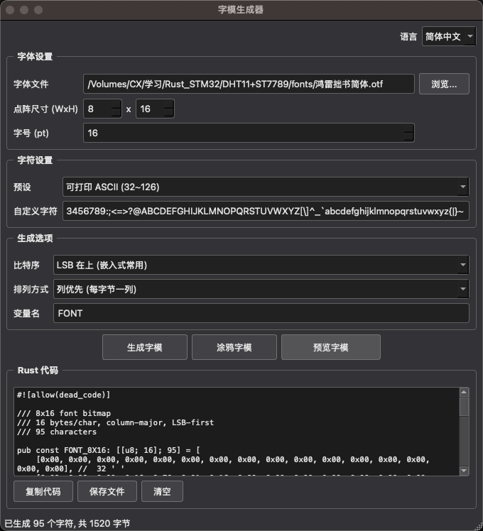

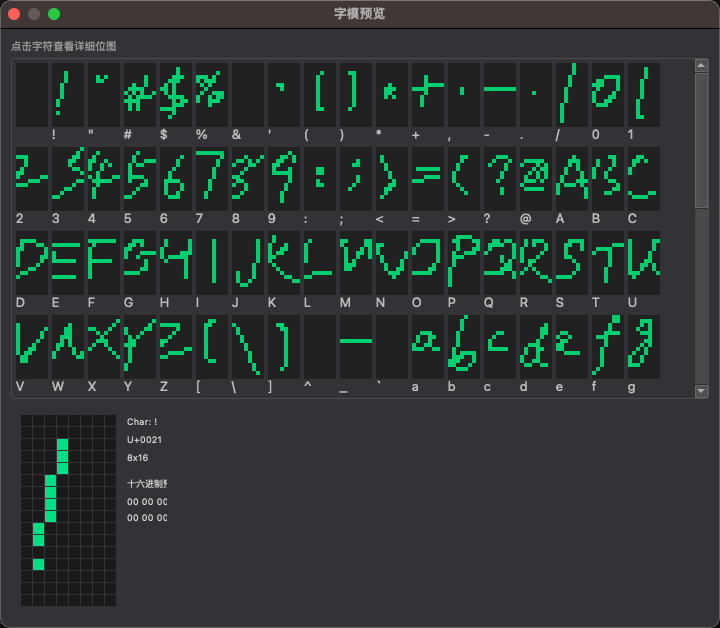

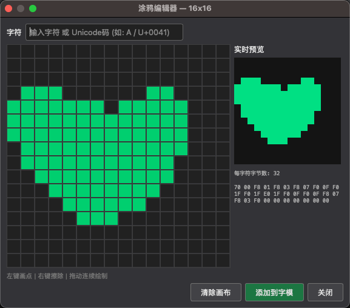

Don't ask me why I use Python, because it's fast!


## DHT20+ST7789 LCD Thermometer
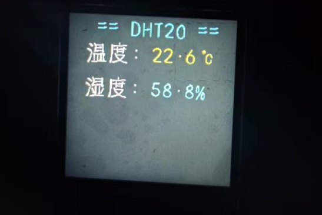

| Display & DHT20 | MCU Pin | Function |
| :--- | :--- | :--- |
| SCL (Display) | PA5 | SPI Clock (SPI1_SCK) |
| SDA (Display) | PA7 | SPI data output (SPI1_MOSI) |
| DC | PA0 | Command/Data Select |
| RES | PA1 | Hardware Reset |
| CS | GND | Chip Select pulled low (always selected) |
| SCL (DHT20) | PB7 | DHT20 Clock Line |
| SDA (DHT20) | PB6 | DHT20 Data Line |


src/dht20.rs

```rust
#![allow(dead_code)]

use embedded_hal::i2c::I2c;
use stm32f1xx_hal::rcc::Clocks;

const ADDR: u8 = 0x38;

#[derive(Debug)]
pub enum Error {
    I2c,
    Crc,
    NotReady,
}

pub struct Dht20<I2C> {
    i2c: I2C,
}

impl<I2C: I2c> Dht20<I2C> {
    pub fn new(i2c: I2C) -> Self {
        Self { i2c }
    }

    pub fn init(&mut self, clocks: &Clocks) -> Result<(), Error> {
        Self::delay_ms(100, clocks);

        let mut status = [0u8; 1];
        self.i2c
            .write_read(ADDR, &[0x71], &mut status)
            .map_err(|_| Error::I2c)?;

        if status[0] & 0x80 != 0 {
            self.i2c
                .write(ADDR, &[0x1B, 0x1C, 0x0E, 0x09])
                .map_err(|_| Error::I2c)?;
            Self::delay_ms(10, clocks);
            self.i2c
                .write(ADDR, &[0x1B, 0x1C, 0x0E, 0x09])
                .map_err(|_| Error::I2c)?;
            Self::delay_ms(10, clocks);
            self.i2c
                .write(ADDR, &[0x1B, 0x1C, 0x0E, 0x09])
                .map_err(|_| Error::I2c)?;
            Self::delay_ms(10, clocks);
        }

        Ok(())
    }

    pub fn read(&mut self, clocks: &Clocks) -> Result<(u16, u16), Error> {
        self.i2c
            .write(ADDR, &[0xAC, 0x33, 0x00])
            .map_err(|_| Error::I2c)?;

        Self::delay_ms(80, clocks);

        let mut buf = [0u8; 7];
        self.i2c.read(ADDR, &mut buf).map_err(|_| Error::I2c)?;

        if buf[0] & 0x80 != 0 {
            return Err(Error::NotReady);
        }

        if Self::crc8(&buf[..6]) != buf[6] {
            return Err(Error::Crc);
        }

        let raw_h = ((buf[1] as u32) << 12)
            | ((buf[2] as u32) << 4)
            | ((buf[3] as u32) >> 4);
        let humidity = (raw_h * 1000 / 1048576) as u16;

        let raw_t = (((buf[3] & 0x0F) as u32) << 16)
            | ((buf[4] as u32) << 8)
            | (buf[5] as u32);
        let temp_i = (raw_t * 2000 / 1048576) as i32 - 500;
        let temperature = if temp_i < 0 { 0u16 } else { temp_i as u16 };

        Ok((humidity, temperature))
    }

    fn delay_ms(ms: u32, clocks: &Clocks) {
        let cycles = clocks.sysclk().raw() / 1000 * ms;
        cortex_m::asm::delay(cycles);
    }

    fn crc8(data: &[u8]) -> u8 {
        let mut crc: u8 = 0xFF;
        for &byte in data {
            crc ^= byte;
            for _ in 0..8 {
                if crc & 0x80 != 0 {
                    crc = (crc << 1) ^ 0x31;
                } else {
                    crc <<= 1;
                }
            }
        }
        crc
    }
}
```


src/main.rs

```rust
#![deny(unsafe_code)]
#![allow(clippy::empty_loop)]
#![no_main]
#![no_std]

mod dht20;
mod font_ascii;
mod font_cn;
mod st7789;

use cortex_m_rt::entry;
use panic_halt as _;
use rtt_target::{rprintln, rtt_init_print};
use stm32f1xx_hal::{
    gpio,
    i2c,
    pac,
    prelude::*,
    rcc,
    spi::{self, Mode, Phase, Polarity},
};

const SPI_MODE: Mode = Mode {
    phase: Phase::CaptureOnSecondTransition,
    polarity: Polarity::IdleHigh,
};

type Display = st7789::ST7789<
    gpio::Pin<'A', 0, gpio::Output<gpio::PushPull>>,
    gpio::Pin<'A', 1, gpio::Output<gpio::PushPull>>,
>;
type Spi1 = spi::Spi<pac::SPI1, u8, gpio::Floating>;

const BG: u16 = 0x0000;
const FG: u16 = 0xFFFF;
const C_TEMP: u16 = 0xFFE0;
const C_HUMI: u16 = 0x07FF;
const C_TITLE: u16 = 0x07FF;
const C_ERR: u16 = 0xF800;

const LABEL_X: u16 = 24;
const CN_W: u16 = 32;
const ASC_W: u16 = 16;
const H: u16 = 32;
const TEMP_Y: u16 = 40;
const HUMI_Y: u16 = 90;
const VAL_X: u16 = 120;
const VAL_W: u16 = 64;

fn draw_cn32(
    d: &mut Display, s: &mut Spi1,
    x: u16, y: u16, c: char, color: u16,
) -> Result<(), spi::Error> {
    if let Some(g) = font_cn::font_32x32(c) {
        d.draw_bitmap(s, x, y, g, 32, 32, color, BG)?;
    }
    Ok(())
}

fn draw_asc(
    d: &mut Display, s: &mut Spi1,
    x: u16, y: u16, c: char, color: u16,
) -> Result<(), spi::Error> {
    let code = c as usize;
    if code < 32 || code > 126 { return Ok(()); }
    let glyph = &font_ascii::FONT_16X32[code - 32];
    d.draw_bitmap(s, x, y, glyph, 16, 32, color, BG)
}

fn draw_str8(
    d: &mut Display, s: &mut Spi1,
    mut x: u16, y: u16, text: &str, color: u16,
) -> Result<(), spi::Error> {
    for ch in text.chars() {
        if (ch as u32) >= 32 && (ch as u32) <= 126 {
            let glyph = &font_ascii::FONT_16X32[ch as usize - 32];
            d.draw_bitmap(s, x, y, glyph, 16, 32, color, BG)?;
            x += 16;
        }
    }
    Ok(())
}

fn draw_decimal(
    d: &mut Display, s: &mut Spi1,
    x: u16, y: u16, val_x10: u16, color: u16,
) -> Result<(), spi::Error> {
    let v = if val_x10 > 999 { 999 } else { val_x10 };
    let int_part = v / 10;
    let dec_part = v % 10;
    draw_asc(d, s, x, y, (b'0' + (int_part / 10) as u8) as char, color)?;
    draw_asc(d, s, x + ASC_W, y, (b'0' + (int_part % 10) as u8) as char, color)?;
    draw_asc(d, s, x + ASC_W * 2, y, '.', color)?;
    draw_asc(d, s, x + ASC_W * 3, y, (b'0' + dec_part as u8) as char, color)
}

fn clear_val(d: &mut Display, s: &mut Spi1, y: u16) -> Result<(), spi::Error> {
    d.fill_rect(s, VAL_X, y, VAL_W, H, BG)
}

fn draw_layout(d: &mut Display, s: &mut Spi1) -> Result<(), spi::Error> {
    d.fill_screen(s, BG)?;
    draw_str8(d, s, 40, 4, "== DHT20 ==", C_TITLE)?;
    draw_cn32(d, s, LABEL_X, TEMP_Y, '温', FG)?;
    draw_cn32(d, s, LABEL_X + CN_W, TEMP_Y, '\u{5EA6}', FG)?;
    draw_asc(d, s, LABEL_X + CN_W * 2, TEMP_Y, ':', FG)?;
    draw_cn32(d, s, VAL_X + VAL_W, TEMP_Y, '\u{2103}', C_TEMP)?;
    draw_cn32(d, s, LABEL_X, HUMI_Y, '湿', FG)?;
    draw_cn32(d, s, LABEL_X + CN_W, HUMI_Y, '\u{5EA6}', FG)?;
    draw_asc(d, s, LABEL_X + CN_W * 2, HUMI_Y, ':', FG)?;
    draw_asc(d, s, VAL_X + VAL_W, HUMI_Y, '%', C_HUMI)
}

fn draw_err_msg(d: &mut Display, s: &mut Spi1) -> Result<(), spi::Error> {
    d.fill_rect(s, 24, 22, 192, 16, BG)?;
    draw_str8(d, s, 24, 22, "Sensor Error!", C_ERR)
}

fn clear_err_msg(d: &mut Display, s: &mut Spi1) -> Result<(), spi::Error> {
    d.fill_rect(s, 24, 22, 192, 16, BG)
}

#[allow(dead_code)]
enum Ui {
    Fresh,
    Data { t: u16, h: u16 },
    Err { t: u16, h: u16 },
}

#[entry]
fn main() -> ! {
    rtt_init_print!();
    rprintln!("DHT20 + ST7789 32x32");

    let dp = pac::Peripherals::take().unwrap();
    let _cp = cortex_m::Peripherals::take().unwrap();
    let mut flash = dp.FLASH.constrain();

    let mut rcc_cfg = dp.RCC.freeze(
        rcc::Config::hse(8.MHz())
            .sysclk(72.MHz())
            .pclk1(36.MHz())
            .pclk2(72.MHz())
            .adcclk(14.MHz()),
        &mut flash.acr,
    );
    let clocks = rcc_cfg.clocks.clone();
    let mut gpioa = dp.GPIOA.split(&mut rcc_cfg);

    let dc = gpioa.pa0.into_push_pull_output(&mut gpioa.crl);
    let res = gpioa.pa1.into_push_pull_output(&mut gpioa.crl);
    let mut spi = dp.SPI1.spi(
        (Some(gpioa.pa5), pac::SPI1::NoMiso, Some(gpioa.pa7)),
        SPI_MODE, 16.MHz(), &mut rcc_cfg,
    );
    let mut display = st7789::ST7789::new(dc, res);
    display.init(&mut spi, &clocks).unwrap();

    let mut gpiob = dp.GPIOB.split(&mut rcc_cfg);
    let scl = gpiob.pb6.into_alternate_open_drain(&mut gpiob.crl);
    let sda = gpiob.pb7.into_alternate_open_drain(&mut gpiob.crl);

    let i2c_bus = dp.I2C1.i2c(
        (scl, sda),
        i2c::Mode::standard(100_000.Hz()),
        &mut rcc_cfg,
    ).blocking(1000, 10, 1000, 1000, &clocks);

    let mut dht20_sensor = dht20::Dht20::new(i2c_bus);

    display.fill_screen(&mut spi, BG).unwrap();
    let _ = draw_str8(&mut display, &mut spi, 24, 100, "DHT20 32x32 Demo", C_TITLE);
    let _ = draw_str8(&mut display, &mut spi, 56, 140, "Wait...", 0x8410);
    if let Err(e) = dht20_sensor.init(&clocks) {
        rprintln!("DHT20 init: {:?}", e);
    }

    let mut ui = Ui::Fresh;

    loop {
        let mut res = Err(dht20::Error::I2c);
        for attempt in 0u8..3 {
            match dht20_sensor.read(&clocks) {
                Ok((h, t)) => { res = Ok((h, t)); break; }
                Err(e) => {
                    rprintln!("try{}: {:?}", attempt + 1, e);
                    cortex_m::asm::delay(clocks.sysclk().raw() / 1000 * 1500);
                }
            }
        }

        match (&ui, &res) {
            (Ui::Fresh, Ok((h, t))) => {
                let _ = draw_layout(&mut display, &mut spi);
                let _ = draw_decimal(&mut display, &mut spi, VAL_X, TEMP_Y, *t, C_TEMP);
                let _ = draw_decimal(&mut display, &mut spi, VAL_X, HUMI_Y, *h, C_HUMI);
                ui = Ui::Data { t: *t, h: *h };
                rprintln!("T:{}.{}C H:{}.{}%", t / 10, t % 10, h / 10, h % 10);
            }
            (Ui::Fresh, Err(_)) => {
                let _ = draw_layout(&mut display, &mut spi);
                let _ = draw_err_msg(&mut display, &mut spi);
                ui = Ui::Err { t: 0, h: 0 };
            }
            (Ui::Data { t, h }, Ok((nh, nt))) => {
                if *nt != *t {
                    let _ = clear_val(&mut display, &mut spi, TEMP_Y);
                    let _ = draw_decimal(&mut display, &mut spi, VAL_X, TEMP_Y, *nt, C_TEMP);
                }
                if *nh != *h {
                    let _ = clear_val(&mut display, &mut spi, HUMI_Y);
                    let _ = draw_decimal(&mut display, &mut spi, VAL_X, HUMI_Y, *nh, C_HUMI);
                }
                ui = Ui::Data { t: *nt, h: *nh };
                rprintln!("T:{}.{}C H:{}.{}%", nt / 10, nt % 10, nh / 10, nh % 10);
            }
            (Ui::Data { t, h }, Err(_)) => {
                let _ = draw_err_msg(&mut display, &mut spi);
                let _ = clear_val(&mut display, &mut spi, TEMP_Y);
                let _ = draw_decimal(&mut display, &mut spi, VAL_X, TEMP_Y, *t, C_TEMP);
                let _ = clear_val(&mut display, &mut spi, HUMI_Y);
                let _ = draw_decimal(&mut display, &mut spi, VAL_X, HUMI_Y, *h, C_HUMI);
                ui = Ui::Err { t: *t, h: *h };
            }
            (Ui::Err { .. }, Ok((h, t))) => {
                let _ = clear_err_msg(&mut display, &mut spi);
                let _ = clear_val(&mut display, &mut spi, TEMP_Y);
                let _ = draw_decimal(&mut display, &mut spi, VAL_X, TEMP_Y, *t, C_TEMP);
                let _ = clear_val(&mut display, &mut spi, HUMI_Y);
                let _ = draw_decimal(&mut display, &mut spi, VAL_X, HUMI_Y, *h, C_HUMI);
                ui = Ui::Data { t: *t, h: *h };
                rprintln!("T:{}.{}C H:{}.{}%", t / 10, t % 10, h / 10, h % 10);
            }
            (Ui::Err { .. }, Err(_)) => {}
        }

        cortex_m::asm::delay(clocks.sysclk().raw() / 1000 * 2000);
    }
}
```

Author email: pycx0@qq.com
The author actually completed this project during their senior year before graduation, due to the huge employment pressure in China. Currently job hunting, and if it doesn't work out, I might go work in a factory on a two-shift schedule!
Future updates will be in the original link! Looking forward to finding a good job!


> Updated: 2026-05-30 18:41:48  
> Original: <https://www.yuque.com/xianwei-37i3i/xxssga/oibnx39qnlvokmhg>